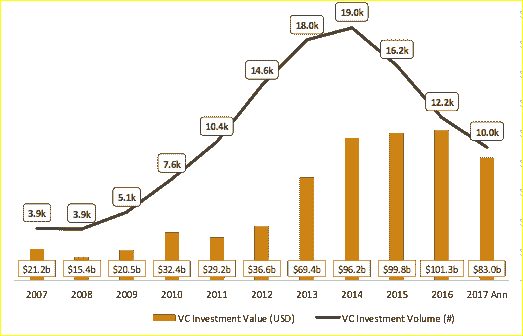

# 早期风险投资资金出现内爆，但没人谈论它 

> 原文：<https://web.archive.org/web/https://techcrunch.com/2017/11/30/theres-an-implosion-of-early-stage-vc-funding-and-no-ones-talking-about-it/>

# 早期风险投资资金出现内爆，但没有人谈论它

More posts by this contributor

在全球风险投资筹集的创纪录资金量和价值超过 10 亿美元的私人“独角兽”数量急剧增加的同时，全球早期风险投资活动出现了一场安静的、几乎没有人注意到的内爆。

下面的图表既生动又准确。根据 PitchBook 的数据，自 2014 年以来，全球科技公司的风投轮次减少了近一半，从 1.9 万轮降至 1 万轮。在此期间，风投融资额的下降远没有那么明显，这突显出风投正在将投资集中于更少的后期公司。

现在这是一个三年的趋势，所以不能“归咎于”宏观或短期因素。更令人担忧的是，此时正值全球股市估值达到前所未有的水平。

科技公司的全球风险投资融资额和价值

这相当于融资数量的崩溃，是自 2001 年以来最极端的一次。

## 崩溃发生在早期融资阶段

数据显示，到目前为止，早期和种子阶段的活动下降幅度最大。事实上，在过去三年中，后来的几轮融资一直相当平稳，A 轮和 B 轮融资有所下降，但降幅没有那么大。

按阶段划分的全球科技公司融资额

## 早期内爆是全球性的

 **

## 是什么导致了这种安静的内爆？

*   **为应用程序融资的时代已经结束—**2010 年后，风投融资大幅增长，部分原因是经济活动反弹，但主要是为了支持大量利用消费者新兴的移动优先行为的 B2C 应用程序。随着 Android 和 iOS 生态系统的建立，几乎每个商业领域都出现了大量新的数字挑战者，从生活方式到健康、金融和一系列特殊兴趣类别。自 2014 年以来，描述中带有“移动”字样的企业的早期融资已经大幅下降。
*   **SaaS 融资大幅下降—**2014 年，近 5000 轮融资支持了自称“SaaS”的公司今年，这一数字下降了近 40%，降至约 3000 人。在过去 10 年里，有这么多 SaaS 公司成立，很难证明新的 SaaS 创业公司是正确的，更不用说回来了，它们现在正在与老牌的 SaaS 公司竞争，而不是传统的永久许可供应商。

SaaS 的全球融资(价值和数量)

*   **即使是金融科技领域的活动也出现了悄然下降—**尽管远没有 SaaS 和移动融资领域的下降那么剧烈，但自 2014 年以来，金融科技融资活动已经下降了近 10%。同样，我们认为这标志着许多金融科技领域的自然成熟，赢家已经资本充足，许多金融科技类别的新进入者正在进行一场代价高昂的艰苦战斗，以实现快速增长。
*   **总的来说，风投正在加倍押注于“赢家通吃”的领导者——**自 2014 年以来，进入后期阶段的融资总额每年都在 550 亿美元左右徘徊，尽管今年会有所下降。今天的 10 亿美元私人融资在十年前是闻所未闻的。最近的 10 亿美元融资者 Airbnb、Spotify、WeWork 和 Lyft 加入了之前的亿万富翁融资者的行列，包括优步、脸书、SpaceX 和 Flipkart，并指出一种强大的趋势，即将“赢家通吃”的资金集中到真正有潜力领导或主导其细分市场的公司。

总体而言，我们认为 2012 年至 2016 年是由基础平台向移动平台转移驱动的早期融资泡沫。事后来看，太多的公司筹集了“概念”资金，前所未有的数量很快就失败了。种子期和早期阶段的风险投资市场因他们而失败，在短短的三年时间里，规模缩减了一半。

可以说，内爆后，早期风投变得更加“理性”，我们不太可能看到短短几年前占主导地位的“喷雾祈祷”方式。然而，从绝对数字来看，这也意味着如今早期公司可获得的资本远少于几年前，新创业公司的数量将不可避免地继续下降，在当前的环境下，这些公司现在无法依赖于轻松获得第一轮融资。

对于科技生态系统来说，早期风投的内爆是健康的还是灾难性的，还有待观察。

很可能两者都有一点。**