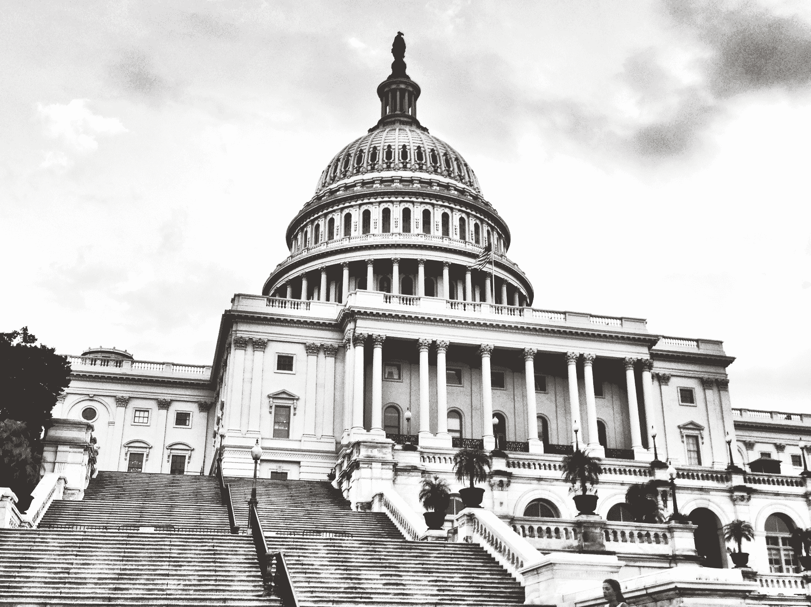
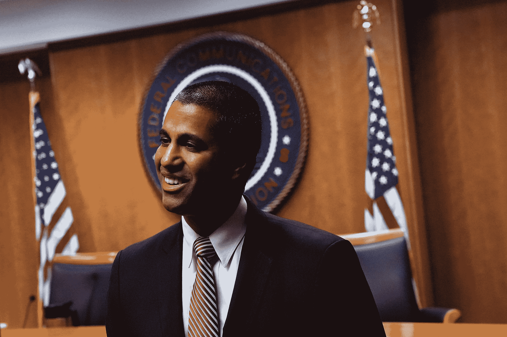

# 没有灵丹妙药可以逆转 FCC 的网络中立决定 

> 原文：<https://web.archive.org/web/https://techcrunch.com/2017/12/21/theres-no-magic-bullet-for-reversing-the-fccs-net-neutrality-decision/>

许多人对联邦通信委员会[撤销](https://web.archive.org/web/20221022201825/https://beta.techcrunch.com/2017/12/14/the-fcc-officially-votes-to-kill-net-neutrality/)其广受欢迎的网络中立规则的决定感到不满。但是，人们应该对左右两边宣布的消除这种危害的宏伟计划持保留态度。不幸的是，这一切都归结于政治。

几位参议员和国会议员明确表示，他们打算通过《国会审查法案》推翻 FCC 的规定。这项 1996 年的法律允许国会撤销过去 60 个立法日颁布的法规；这基本上是国会纠正一个任性机构的快捷方式。

但是，尽管 CRA 今年有效地使用了多次，最令人难忘的是[取消了 FCC 的宽带隐私规则](https://web.archive.org/web/20221022201825/https://beta.techcrunch.com/2017/03/29/everything-you-need-to-know-about-congress-decision-to-expose-your-data-to-internet-providers/)，但这并不意味着它可以重新部署来做同样的事情，以恢复互联网自由，取消 2015 年的网络中立规则。

简而言之，这是因为 CRA 的反对仍然是立法，立法需要多数票——民主党，唯一一个可靠地反对新秩序的政党，只是没有。

图片来源:杰米·格拉瑟/EyeEm/盖蒂图片社

以下是 CRA 废除联邦通信委员会命令所需要发生的事情。

首先，规则需要进入联邦登记册。这需要一点时间——预计明年初。因此，尽管现在喋喋不休，但在规则正式出台之前，什么也做不了。CRA 的一个好处是，它很容易挤进立法日程:只需要 30 名参议员就可以把它放在那里；可以快速调用订购；不能被阻挠。所以至少它不会被某个委员会扼杀。虽然开始很容易，但完成起来并不容易。

假设该法案是由民主党领导层在参议院提出的。随着道格·琼斯在阿拉巴马州的意外胜利，47 名民主党人和 2 名无党派人士可能会投他们的票。参议员苏珊·科林斯(R-ME)已经书面表示她反对 FCC 的计划，为了便于讨论，让我们假设她打破常规，在这个问题上与民主党人一起投票。这仍然是五五开，副总统彭斯肯定会打破这一局面，支持共和党。

因此，在参议院，至少需要说服第二名共和党人加入这项民主党计划。可能有几个参议员还在观望，但这里涉及的政治算计很难读懂。为了网络中立而跨越通道值得吗？这个问题他们的选民在去年之前可能都没有听说过，到明年可能就已经忘记了。毕竟，离开你的党派群体不是一个没有后果的行动。对于这种假设的共和党合作，民主党可能没有太多交易。

但为了讨论起见，我们假设它通过了参议院，然后到了众议院。在这里，民主党在人数上处于劣势(目前是 239 比 193)。这是一个相当大的差距。如果你有任何想法，可以说服 20 多名共和党人加入另一方，恢复许多人眼中的大政府对私人权利的侵犯(理解为:公司)，我相信民主党领导层会洗耳恭听。

也许用不了那么多。毕竟，今年早些时候，15 名共和党人投票反对 CRA 废除宽带隐私规则。如果我们认为他们站在民主党一边，那么还剩下六七个(取决于时间和特别选举)需要转向。

假设*发生了*。一项法案在哪里成为法律？椭圆形办公室。

如果你认为重建一项几乎遭到整个共和党反对的奥巴马时代法规的法案会被总统签署，我有一些坏消息要告诉你。

## 所以你是说有机会

即使 CRA 废除恢复互联网自由是 DOA，我们无论如何应该这样做。

首先，因为成功的可能性为零而简单地放弃一个重要的问题是懦弱的。这是人们关心的事情，我们当选的官员应该坚持不懈地追求它。

> 我们希望国会的每一个成员都公开表明他们是否同意委员会刚刚做的事情。参议员布莱恩·沙茨(D-HI)

但其次，也是更重要的是，对这个问题的投票迫使国会中的每个人对网络中立和 FCC 解散它的选择采取官方立场。我就此询问了参议员布莱恩·沙茨，他坚持认为这是值得的:

“我支持 CRA，”他说。“在共和党控制的国会中，我不确定成功的可能性有多大。但是尝试是非常重要的，让国会中的每个人都记录在案也是非常重要的。我们希望国会的每一个成员都必须公开表明他们是否同意委员会刚刚做的事情。”

如果这个问题仍处于幕后，机会主义者和胆小的政客可以等待时机，等着看共识是什么，或者及时加入胜利的一方，分享一点荣耀。但如果投票是被迫的，那么他们被迫尽快采取立场——在这种情况下，这将是在中期选举之前。

## 向法院提起诉讼

共和党众议员玛莎·布莱克本(Marsha Blackburn)提出了一个半心半意的“开放互联网保护法案”,我们不会在这里讨论——这不会发生，即使发生也不会有帮助，布莱克本不是你想写这种立法的人。除此之外，她认为监管内容是互联网服务提供商的工作，并投票否决了宽带隐私条例。

更有希望的是对联邦通信委员会新规则的某一方面提出诉讼的想法。

AG Schneiderman 对联邦通信委员会不满意

纽约司法部长埃里克·施奈德曼(Eric Schneiderman)对 FCC 的批评非常激烈，他正在计划提起诉讼，理由是(我推测)新规则所需的公众意见征询期(尽管意见的内容不一定会告知结果)管理不当，因此被窃取的身份和潜在的俄罗斯特工“腐蚀”。

> 挑战规则制定过程不是长久之计。挑战规则本身最有可能带来结果。

克莱本委员和罗森沃尔塞尔委员也坦率地对规则制定程序的合法性表示怀疑。在投票时，后者说:“我不同意让我们走到这一步的腐败过程。我不同意这个机构今天在追求这条道路上对我们公民的蔑视。”

挑战规则制定程序不是长久之计，但在问题通过法院解决的过程中，新规则可能会被暂时推迟或取消生效。

挑战最有可能带来结果的规则本身的内容，至少在诉讼方面。

《行政程序法》要求规则不能“武断而多变”整个新规则的基础是互联网如何工作的定义，这在技术上是不准确的，如果诉讼当事人可以证明这个定义基本上是任意选择的(即它的使用不考虑价值)，或者仅仅因为它支持 FCC 的首选规则，整个事情就会崩溃。

联邦通信委员会主席 Ajit Pai 几乎肯定意识到了该命令的技术缺陷

理论上。在现实中，这样的法庭案件可能需要几年时间，并可能升级到最高法院，因为这是最相关和最有争议的先例，在 2005 年。

这可能需要数年时间来解决——与此同时，我们将被新规则所束缚。

## 快点等着

不幸的是，在我们观看的时候，没有什么能够阻止网络中立被拆除。即使是最好的情况也不会阻止规则按计划生效(今年晚些时候，在管理和预算办公室批准后)，即使民主党人横扫中期选举，他们仍将面临对任何拟议立法解决方案的否决。

也就是说，高层的坚决反对和正在进行的诉讼对 ISP 参与任何有问题的行为都是一种强大的抑制，无论这种行为在技术上可能是合法的。他们自己也在打一场持久战，不会为了短期利益而冒险加强未来的监管(当 FCC 再次翻脸时)。不过，你可以期待零评级等灰色区域的做法会卷土重来。

这些方法中的任何一种或全部都将被尝试，但在该规则进入联邦登记册之前，不会有太多事情发生，这可能是几周或一个月后的事情。目前，你最好的选择是确保你的当选官员不要忘记这是选民关心的问题。网络中立不是一天建成的，也不会在一天内恢复——[这场斗争已经持续了几十年](https://web.archive.org/web/20221022201825/https://beta.techcrunch.com/2017/05/30/commission-impossible-how-and-why-the-fcc-created-net-neutrality/)，而且不会很快结束。

