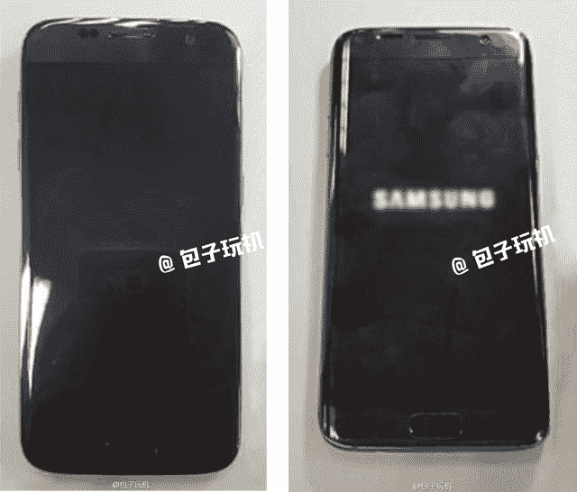

# 这些几乎可以肯定是三星的下一代 Galaxy 手机:Galaxy S7 和 S7 Edge 泄露了所有信息 

> 原文：<https://web.archive.org/web/https://techcrunch.com/2016/02/15/these-are-almost-certainly-samsungs-next-galaxy-phones-galaxy-s7-and-s7-edge-leak-all-over/>

# 这些几乎可以肯定是三星的下一代 Galaxy 手机:Galaxy S7 和 S7 Edge 到处都是漏洞

我们距离世界移动通信大会(Mobile World Congress)还有大约一周的时间，这是一个大型贸易展会，除了苹果，几乎所有人都会在会上展示他们明年的新款旗舰手机。

通常情况下，最大的 MWC 公告会比预期的时间早一点泄露出去……果然，看起来三星的东西已经泄露得相当彻底了。

许多泄密来自埃文·布拉斯，或者，他可能更为人所知的名字是[埃夫 leaks](//web.archive.org/web/20221025223315/http://twitter.com/evleaks%E2%80%9D) 。

他的第一张照片是在周六发布的，展示了银色、黑色和金色的 S7 Edge(配有 Edge 系列的标志性环绕屏幕):

那天晚上晚些时候，他接着拍摄了非 Edge S7，其显示屏更加标准:

现在，通过[微博](//web.archive.org/web/20221025223315/http://m.weibo.cn/3030737153/3942785956446028%E2%80%9D)上的一位用户，我们看到了一瞥(尽管很模糊)实际启动的 S7 Edge:

如果你说“嘿，那个…看起来就像现有的 S6”，你没有错——从表面上看，S6 和 S7 看起来非常相似。

不过，如果传言属实，S7 应该会带来大量新东西:3D 触摸式压敏屏幕、USB C 端口，以及传闻中非常缺失的 microSD 插槽(令许多人失望的是，三星在 S6/S6 Edge 中放弃了 microSD 插槽)