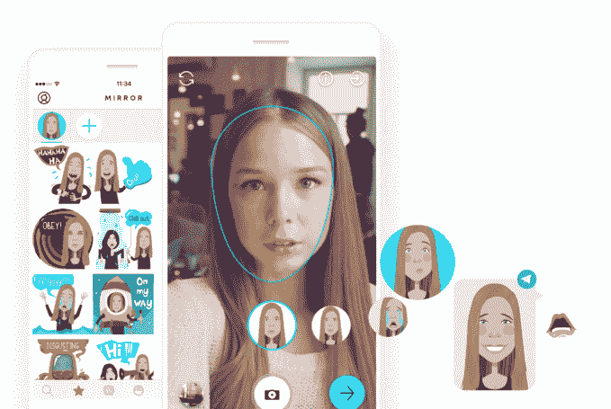

# 这些是在 Y Combinator W18 演示日 2  上亮相的 64 家初创公司

> 原文：<https://web.archive.org/web/https://techcrunch.com/2018/03/20/these-are-the-64-startups-unveiled-at-y-combinator-w18-demo-day-2/>

微生物组疗法、增强现实的 Photoshop 和癌症治疗是创业加速器 Y Combinator 2018 年冬季演示日第二天提出的一些想法。YC 正越来越多地利用其庞大的班级规模(这次有 141 家初创公司)来资助风险特别高的前沿技术和生物技术登月项目，同时用更可预测的企业公司来调整投资组合。

投资者表示，演示日之后的估值最近大幅上升。一些人猜测，通过加密货币发了财的人正试图将他们的回报投资到其他地方，从而推高了对 YC 初创公司的需求。

加速器仍然接纳许多美国成功的国际模仿者，YC 也在重复自己。这款播客应用的产品和策略与一年前在 YC 首次亮相的 Breaker 一模一样。但今天在山景城计算机历史博物馆的舞台上，有许多雄心勃勃和独特的企业亮相，房间里一如既往地挤满了技术投资者的名人录。

查看我们对昨天[发布的所有 64 家创业公司的报道](https://web.archive.org/web/20230322160429/https://techcrunch.com/2018/03/19/here-are-64-startups-that-launched-today-at-y-combinators-w18-demo-day/)，以及我们[从昨天](https://web.archive.org/web/20230322160429/https://techcrunch.com/gallery/best-y-combinator-startups-2018/)挑选的前 7 家公司。(明天早上我们会有今天的最爱。)

以下是在 2018 年冬季演示日 2 推出的 60 多家初创公司:

## 木卫四

[Callisto](https://web.archive.org/web/20230322160429/https://www.projectcallisto.org/) 是一款为受害者打造的不良性行为举报软件。

该公司的产品要求想要举报犯罪者的人提供特定的唯一标识符，如 LinkedIn 个人资料或电话号码。如果两个受害者指认同一个罪犯，他们会被安排互相联系，然后与“选项顾问”联系，后者是一名律师，可以就如何处理这种情况给他们提供选项。该公司表示，访问 Callisto 网站的受害者采取行动的可能性增加了 5 倍。他们已经开始在大学校园推出他们的产品，现在正在接受投资者的捐赠，以向创业社区推出服务。

## 撞击

[凹凸](https://web.archive.org/web/20230322160429/https://sobump.com/) 是一个点对点的街装集市。

这是“z 世代的易贝”。他们一直在快速建立一个在线社区，并在 3 月份已经在 43 万美元的 GMV 上实现了 2.5 万美元的收入。他们声称是盈利的，也有一个参与的用户社区。Bump 表示，用户每周会发送 60 万条信息。他们相信他们最终会超越街头服饰。

[在 TechCrunch 上阅读更多关于 Bump 的内容。](https://web.archive.org/web/20230322160429/https://techcrunch.com/2018/02/22/bump-is-a-peer-to-peer-marketplace-for-streetwear/)

## 同一健康公司

想要改善犬类癌症的治疗，利用基因组检测和基因测序来提高诊断和治疗的疗效。

他们目前有两名试飞员，在两周内已经赚了 39，000 美元

## 一年多

[一个有用的](https://web.archive.org/web/20230322160429/https://www.onederful.co/) 是一个牙科保险的 API。

Onederful 表示，由于保险索赔问题，牙医诊所每年损失 60 亿美元的收入，并且每年在高摩擦索赔验证上花费 30 亿美元。Onederful 的 API 与 240 家保险提供商集成，可以快速可靠地验证患者的保险，并确保牙医获得报酬。

Onederful 不需要逐个出售牙医，而是与顶级牙医软件套件建立合作伙伴关系进行分销。目前在 120 个办公室里。

## 安茹娜

[Anjuna](https://web.archive.org/web/20230322160429/https://www.anjuna.io/) 保护运行在公有云中的应用。

该公司表示，目前大约 30%的工作负载位于公共云中，他们的目标是帮助迁移其余 70%的工作负载。这家初创公司正在使用其内存加密技术来保护正在使用、静止和传输中的应用程序。该公司声称，即使有人对主机有根权限，它也能保护它们。

## BioRender.io

[BioRender.io](https://web.archive.org/web/20230322160429/https://www.biorender.io/) 想要标准化“生物学的视觉语言和沟通它的软件。”

他们认为消除“丑陋的科学图片”有 110 亿美元的市场机会。迄今为止，他们已经与 300 家机构合作，包括生命科学行业的 SaaS 企业。他们的工作也被刊登在科学杂志上。

## 飞艇

[飞艇](https://web.archive.org/web/20230322160429/https://www.airshiphq.com/) 正在建立一个功能标记框架，让小型创业公司像大型科技公司一样推出产品。

虽然 A/B 测试初创公司通常会处理不同标题之类的小内容变化，但 Airship 让客户向大量用户提供完全不同的功能，以便公司更好地了解他们的受众对重新设计或更新的反应。

[在 TechCrunch 上阅读更多关于飞艇的内容。](https://web.archive.org/web/20230322160429/https://techcrunch.com/2018/03/19/airship-wants-to-let-startups-launch-features-the-same-way-facebook-does/)

## 有利益的

制作个性化蛋白奶昔。

大多数蛋白奶昔是为男性运动员和健身者设计并销售的。Gainful 让顾客进行五分钟的健康测试，然后送上个性化的奶昔。8 万人参加了测试，为这家初创公司建立了一个庞大的健康数据档案。它有 2700 名顾客，其中一半以上购买一瓶。Gainful 每月增长 85 %, 2 月份销售额为 4 万美元，每个客户的第一次购买都是盈利的。最终，Gainful 可以利用其竞争对手没有收集的数据，扩展到运动饮料、代餐和个性化健身计划。

## 昆蒂埃拉

[quanti erra](https://web.archive.org/web/20230322160429/http://quantierra.com/)为开发商提供房地产投资来源。

它使用他们的数据库和算法来确定可以建造什么，它的价值，以及它出售的可能性。从他们帮助销售的任何财产中抽取 1.5%的佣金，他们在 3 个月内获得了 141，000 美元的收入，并表示他们有 310，000 美元的已签署条款清单。

## 布鲁姆乔伊

[布鲁姆乔伊](https://web.archive.org/web/20230322160429/https://bloomjoy.com/) 希望成为“生活方式内容的美联社”。

他们创建并整合了他们声称在短短几周内就拥有 500 万每周读者的内容。到目前为止，他们与 19，000 家出版商合作，每周产生 25，000 美元的广告收入。他们认为，这是一个 50 亿美元的市场机会。该团队有媒体背景，之前曾以 1800 万美元出售过一家初创公司。

## YouTeam

[YouTeam](https://web.archive.org/web/20230322160429/https://youteam.io/) 让你“租用”在咨询公司工作但目前无所事事的工程师。

公司从每份工作中抽取 20%的提成。他们说，他们目前每月的净收入为 5.5 万美元。

## 子堆栈

[子栈](https://web.archive.org/web/20230322160429/https://www.substack.com/) 是一个订阅发布平台。

订阅费让记者不必依赖点击诱饵和哗众取宠来获得点击量和广告浏览量。Substack 允许任何出版商或个人立即推出订阅产品。Substack 有 7000 名用户，平均每年支付 70 美元，并收取 10%的费用。它的顶级作家现在挣 30 万美元。Substack 最终希望将用户群转化为社区，并扩展到播客和视频领域。在 Kik 的首席技术官和一名前记者的参与下，Substack 希望夺回流失到社交网络的新闻收入。

关于 Substack 的更多信息，请点击这里阅读 TechCrunch 的报道。

## HelloVerify

[HelloVerify](https://web.archive.org/web/20230322160429/https://www.helloverify.com/) 正在印度进行在线即时背景调查，印度政府最近宣布将开始数字化所有个人记录。

这家初创公司已经准备好成为第一批利用这项立法的公司之一。该公司目前年收入为 300 万美元，并在过去 60 天内完成了 100 万美元的订单。该公司的早期客户包括埃森哲、印孚瑟斯和 Cognizant。

## 照看我的账单

[照看我的账单](https://web.archive.org/web/20230322160429/http://www.lookaftermybills.com/) 是给那些想要“更少麻烦、更低账单”的人准备的

这家总部位于英国的初创公司声称，通过帮助用户管理能源、手机和宽带账单，通过帮助他们更换提供商和优化节约，它每年可以为用户节省 320 美元。用户每次转换业务，他们就能获得 60 美元的佣金，本月迄今为止，他们已经从 4000 名用户那里获得了 8.4 万美元的收入。

## 车站

[站](https://web.archive.org/web/20230322160429/https://getstation.com/) 想成为人们工作时使用的网络浏览器，成为软件即服务的应用商店。

它将工作场所的应用程序放在浏览器的侧边栏中，方便访问，不会让你迷失在无尽的标签中。它集成了 500 个不同的 SAAS 应用程序，用户平均下载 12 个。Station 现在拥有 1.1 万名每周活跃用户，他们每天在该应用上花费的时间超过 4.5 小时。最终，它希望向大型 SAAS 公司出售更深入整合的机会，并推广其应用程序的发现。

## 火炬

[火炬](https://web.archive.org/web/20230322160429/https://torch.io/) 想给整个公司带来高管教练。

这家初创公司使用基于视频的会议软件来帮助指导经理们提高技能。经理可以登录 Torch 的分析仪表板，设定目标并跟踪进展。Torch 由一名前高管教练和一名数据科学家创立。该团队表示，这家初创公司的收入逐月增长了 45%。

## 爱德温(男子名ˌ义为繁荣、富有)

[埃德温](https://web.archive.org/web/20230322160429/https://edwin.ai/) 用 AI 教英语。

他们说他们可以在当时的⅓教英语，费用是⅓。你通过 Facebook Messenger 或语音助手与 Edwin 交流；例如，在脸书，他们已经获得了 75.7 万用户。

## 迈特雷

[Meitre](https://web.archive.org/web/20230322160429/http://meitre.com/) 旨在成为“世界顶级餐厅的 Opentable”

着眼于“前 3%”没有预订困难的餐馆，Meitre 说，他们没有向 Opentable 付费，而是找到了 55 家餐馆，这些餐馆将向他们付费，以减少失约，出售更多的品尝菜单，并将需求转移到非高峰时间。他们声称，这可以带来“每年数十万的额外收入”。到目前为止，他们还没有任何客户流失，并希望扩大到全球约 50，000 家需要这种服务的餐厅。

## Pathrise

[Pathrise](https://web.archive.org/web/20230322160429/https://www.pathrise.com/) 通过收入分成协议，帮助培训学生获得更好的工作，以换取他们未来工资的一定比例。

大学职业辅导员平均比学生多 2900 比 1，办公室陈旧。首先，它了解学生，并使用数据来显示相关的职位空缺。它的培训可以改善学生对招聘人员、简历、面试技巧和薪资谈判的冷冰冰的电子邮件。它希望每雇佣一名学生就能赚 5000 美元。从 75 万名软件工程学生开始，Pathrise 看到了 37.5 亿美元的市场，并计划最终扩展到其他工作类型。学生在教育上花了很多钱，他们争着找工作来偿还贷款。Path rise 可以帮助他们更好地利用他们的学校教育，找到适合他们的工作。

## 特拉菲

[TrapFi](https://web.archive.org/web/20230322160429/https://www.trapfi.com/) 一旦自由职业者的拉取请求被批准，就向他们支付费用，而不是等待每月的支票。

他们收取平台收入的 1.5%；他们说，在两周内，他们已经获得了 500 名用户，并产生了 25，000 美元的交易。

## 六重生物科学

[六重](https://web.archive.org/web/20230322160429/https://www.sixfold.bio/) 设计用于治疗癌症等疾病的纳米颗粒。

他们声称能够以靶向患病细胞而不影响健康细胞的方式提供 CRISPR 开发的基因编辑药物。他们目前正在老鼠身上测试他们的纳米粒子。

## Jido 地图

[Jido Maps](https://web.archive.org/web/20230322160429/http://www.jidomaps.com/) 是一家 AR 初创公司，正在解决持久性问题，即即使传感器不在那里观察它们，也能让数字对象保持附着在现实世界环境中。

该公司称自己为 AR 的“保存按钮”，允许用户放置对象，保存它们并与其他用户分享这些信息。经过一个月的测试，59 家公司正在使用这家初创公司的 API，并将很快将其部署到他们合计 30 万名月活跃用户中。

## 心房

贾斯汀·坎，前贾斯汀。TV 和 Twitch 宣布成立一家“面向初创公司的科技法律事务所”叫做 [心房](https://web.archive.org/web/20230322160429/http://www.atrium.co/) 。

他说，通过他共同创办和投资初创公司的经历，他已经“成为企业法律服务的一名非自愿的超级用户”Kan 估计有 1580 亿美元的市场供外部投资律师事务所，他相信 Atrium 的软件将有助于将法律文件转化为数据。他说，他的服务被用来为客户节省合同、并购、区块链和其他文书工作的小时计费费用。Atrium“通过前期定价使法律服务快速、透明。”

## LUS 品牌

[卢斯](https://web.archive.org/web/20230322160429/http://lusbrands.com/) 为卷发制作护发产品。

在媒体要求人们拉直头发几十年后，公众现在开始接受卷发。但是管理它需要大量昂贵的产品和时间。LUS 为一系列种族生产特定卷曲水平的产品。它销售 17 美元的产品，一年销售额达到 100 万美元。毛利为 70%，公司在银行有 40 万美元存款。现在，它希望扩大资本规模，以一个代表“爱你自己”的品牌来主导每年 500 亿美元的卷发产品市场。

在 TechCrunch 上阅读更多关于 LUS 品牌的信息。

## ZBiotics

ZBiotics 公司制造了一种基因工程饮料，据说可以预防宿醉。

这家初创公司的工程益生菌可以分解乙醛，乙醛是酒精代谢的主要副产品之一，被认为会导致宿醉。Zbiotics 表示，当其产品以每剂 5 美元的价格上市时，这将是世界上第一种上市的基因工程益生菌。

## 将军

[幕府](https://web.archive.org/web/20230322160429/https://getshogun.com/) 帮助企业快速设立店面。

想要起步并在网上销售产品的小企业可能会因为在点击购买按钮出现之前需要完成的大量工作而陷入瘫痪。幕府将军希望为页面编辑器创建一个更简单的工作流程，以便在 Shopify 等平台上建立在线商店。这项服务是专门为非技术人员设计的。

[在 TechCrunch 上阅读更多关于幕府将军的内容。](https://web.archive.org/web/20230322160429/https://techcrunch.com/2018/03/05/shogun-wants-to-help-businesses-easily-build-a-better-online-storefront/)

## 迪尔布莱特

在线提供个性化护肤处方。

他们的主要产品是一种“类视黄醇”，用于帮助治疗痤疮、银屑病和其他炎症性皮肤病。你把你的皮肤照片发给他们的合作伙伴皮肤科医生，帮助你建立皮肤护理方案，并得到必要的处方。

点击 TechCrunch 阅读更多关于 DearBrightly 的信息。

## Sketchbox

[Sketchbox](https://web.archive.org/web/20230322160429/https://www.sketchbox3d.com/) 是针对 AR 和 VR 的 photoshop。

他们相信，有一天，AR/VR 设计师会像今天的网页和平面设计师一样多。到目前为止，他们已经与 2000 多名设计师合作，发现“超级用户”平均每周在平台上花费 3.5 个小时。微软、Oculus 和 Eon Reality 等公司已经测试了 Sketchbox。Sketchbox 认为，这是一个 60 亿美元的市场机会。

在 TechCrunch 上阅读更多关于 Sketchbox 的信息。

## EnvKey

[EnvKey](https://web.archive.org/web/20230322160429/https://www.envkey.com/) 想成为 API 密匙的最后一关。

随着公司变得越来越大，他们必须访问的复杂工具和 API 网络可能会很快失控。EnvKey 试图跟踪所有这些密钥和秘密，并确保它们得到适当的更新。EnvKey 还准备了工具，以确保只有合适的人才能在内部访问它们。

在 TechCrunch 上阅读更多关于 EnvKey 的信息。

## 贸易风生物科学

贸易风生物科学公司正在研究阻止癌症扩散的药物。

它的两位创始人都独立地发现了癌症转移过程中出现的一种癌症蛋白，并选择合作解决这一问题。他们首先关注卵巢癌，尽管他们说他们的疗法将对“大多数”癌症有效。

在 TechCrunch 上阅读更多关于贸易风生物科学的信息。

## 箭

[箭头](https://web.archive.org/web/20230322160429/https://arrowapp.io/) 想为增强现实打造 Instagram。

其应用程序允许用户将文本和表情符号附加到现实世界的物体上，并分享他们的 AR 创作视频。它的自动表情识别常见的物体和面部表情，并用相关的表情符号填充屏幕。这家初创公司预计，2019 年，现代 AR 手机的数量将增长到 5 亿部，从而扩大其潜在用户群。Arrow 的公测在 2 个月内已经看到了 25K 的视频分享。面对 Instagram 和 Snapchat，建立一个新的社交内容提要将非常困难，但 autoemoji 功能是创新的。

## 即兴表演

[Wing It](https://web.archive.org/web/20230322160429/http://m.me/gowingit?ref=bookface) 是一个 Facebook Messenger bot，它试图让你在周末旅行时走出家门。

它会根据你的喜好——比如离家的距离、人均花费等——推荐航空旅馆、当地远足和其他活动。他们目前看到现有用户每周 70%的参与度。

[在 TechCrunch 上阅读更多关于 WingIt 的内容。](https://web.archive.org/web/20230322160429/https://techcrunch.com/2018/03/18/wing-it-is-a-facebook-messenger-bot-meant-to-get-you-out-of-the-house/)

## 蒂佩

[Tipe](https://web.archive.org/web/20230322160429/https://tipe.io/) 是一款为开发者提供的工具，可以将他们生活中不必要的文字剔除。

这家初创公司让非开发人员能够快速、轻松地进行代码修改，从而让开发人员能够更轻松地浏览代码，而不必代表营销部门不断编辑内容。

## 可交换的

正如我们的 Jon Shieber 在这里所写的，“[Swayable](https://web.archive.org/web/20230322160429/http://swayable.com/)是由三位前物理学家创建的，目的是帮助制作政治信息，实际上是告知和说服，而不是简单地煽动和宣传。”

他们旨在帮助政治团体 a/b 测试他们的信息传递，以确定哪种信息传递最有效，同时只分享准确的信息。他们目前每月有 10 万美元的收入，客户包括民主党全国委员会和美国公民自由联盟

在 TechCrunch 上阅读更多关于 Swayable 的内容。

## 全票邮票

[Quantstamp](https://web.archive.org/web/20230322160429/https://quantstamp.com/) 自动检查智能合约安全性。

区块链的新普及导致更多企业使用智能合同。但是手动检查它们的安全性既费时又费钱。去年，由于智能合同黑客攻击，3 亿美元被盗。Quantstamp 开发了一个自动程序来扫描智能合同的漏洞。

它已经通过六次企业智能合同审计获得了 240 万美元的收入，并且有 50 个客户将为每次审计支付 50 万美元。Quantstamp 可以让企业相信自己不会被劫持，从而让智能合约成为主流。

## 惊鸿一瞥 K12

[惊鸿一瞥](https://web.archive.org/web/20230322160429/http://www.glimpsek12.com/) 正在努力削减学校的无效开支。

该公司将教育机构的会计系统与学生成绩数据相结合，以帮助教育机构了解他们投入的资金，并了解他们在积极的学生成果方面获得最佳投资回报的地方。该团队的最终目标是“从根本上改变每年 8000 亿美元的教育支出方式。”

## 清晰的大脑

clear brain 帮助公司将广告瞄准最有可能注册订阅、购买产品或注销账户的用户(例如)。

它从企业已经在使用的工具(如 Segment、Optimizely 和 Heap)中提取数据，然后部署人工智能，根据用户执行特定操作的可能性对他们进行分析和分组。首席执行官比拉尔·马哈茂德(Bilal Mahmood)表示，最终目标是“为营销人员民主化人工智能。”

在 TechCrunch 上阅读更多关于 ClearBrain 的信息。

## 玩家休息室

[玩家休息室](https://web.archive.org/web/20230322160429/https://playerslounge.co/) 是游戏玩家可以争夺现金的在线平台。

玩家可以将钱存入自己的账户，然后寻找其他愿意为一场国际足联或堡垒之夜的比赛投入几美元的玩家。这家初创公司的评级系统让游戏玩家知道他们是在与具有类似技能的人较量，还是超出了他们的联盟。该公司收取 10%的赌注，并表示他们每周增长 25%。

## 记忆健康

[Memora Health](https://web.archive.org/web/20230322160429/https://memorahealth.com/) 是“为患者随访建立虚拟护士”

事实证明，每当有人离开医生的办公室，护士就可以获得报酬，跟踪病人的治疗情况。Memora 的目标是使用人工智能来自动化这种交互。到目前为止，他们已经实现了每月 70，000 美元的经常性收入，并获得了 380 万美元的贷款。他们说他们已经“建立了跟踪美国每一个病人的基础设施。”

## 国库债券

[国库总理](https://web.archive.org/web/20230322160429/https://treasuryprime.com/) 为银行做 API。

大部分银行仍然运行在旧的大型计算机和人工改变上，导致银行服务的延迟。Treasury Prime 表示，它可以将开立银行账户的过程从 3 天缩短到 3 分钟。这家初创公司正在构建用于检查余额和交易历史、通过 ACH 和 wire 发送和接收资金等的 API。

现在，它与一家使用 Treasury Prime 的 API 发行真实银行账户的银行实现了实时集成。Treasury Prime 的团队为硅谷银行(Silicon Valley Bank)和 Stripe 开发了 API，并以 2 亿美元的价格出售了之前的一家公司，该公司希望实现银行业的现代化。

## 猎人 2

在大规模入侵发生的那一刻， [亨特 2](https://web.archive.org/web/20230322160429/https://hunter2.com/) 希望已经有一个在线的实验室演示供工程师们练习。

Hunter2 是一种工具，用于培训工程师通过软接触方法更好地处理 web 应用程序安全，半定期提醒员工需要哪些技能，然后像 Equifax hack 一样围绕现实世界的经验进行练习。

在 TechCrunch 上阅读更多关于 Hunter2 的信息。

## 斯利特

Slite 试图为团队重新设想协作工具。

想象一下，如果谷歌文档是由 Slack 的某个人开发的。Google Docs 已经是一个非常简单的体验，但 Slite 的目标是围绕传统的 notes 应用程序创建一套协作工具。我们的目标是创建一种中心，团队可以进来并留下笔记，最终形成类似于内部维基的东西。

在 TechCrunch 上阅读更多关于 Slite 的信息。

## 播客应用程序

播客应用程序 想成为……播客的网飞。

有 50 万个节目和 3000 万集，播客应用程序可以帮助人们听语音内容，但最终希望进入发现和独家内容订阅。该公司预计，五年内每月将有 5 亿播客听众，并希望让其中 10%的人每月支付 10 美元，独家访问顶级创作者。一年来，播客应用程序的月环比增长率为 50%，现在每天有 4 万名活跃用户。但它必须超越众多其他播客应用，包括之前的 [YC 启动断路器](https://web.archive.org/web/20230322160429/https://techcrunch.com/2017/03/21/demo-day-y-combinator/) 也有相同的策略。

[在播客应用](https://web.archive.org/web/20230322160429/https://techcrunch.com/2018/03/19/the-podcast-app/) 上阅读 TechCrunch 的完整报道

## Groww

[grow](https://web.archive.org/web/20230322160429/https://groww.in/)想成为印度的罗宾汉。

该公司表示，虽然印度有 2.5 亿中产阶级，但其中只有大约 1000 万人在网上投资。这家初创公司开始尝试共同基金，从交易中赚取 1%的佣金。下一步，该公司将考虑股票、债券和加密货币。

## 珀尔塞福涅生物群落

[珀尔塞福涅生物群落](https://web.archive.org/web/20230322160429/http://persephonebiome.com/) 正试图重新调整肠道微生物群，以帮助癌症药物发挥作用。他们正在制造一种含有肠道细菌的药丸。

他们预计在 2019 年进入临床试验。

## 生物机器人分析

[bio bot Analytics](https://web.archive.org/web/20230322160429/http://biobot.io/)分析城市污水“以估计阿片类药物的消耗量”

目前，“最好的数据是统计死亡人数”，这不足以帮助城市做出预测。麻省理工经验丰富的创始人说，他们“热衷于利用我们的技能来解决美国历史上最大的毒品危机。”到目前为止，他们已经收到了 17 封意向书，并相信仅在美国和加拿大，这就是一个每年 15 亿美元的市场机会。除了药物使用，他们还希望测量药物、传染病和食物消费。这是“公司愿意为之支付数十亿美元的数据”

## 蜜腺

[Nectome](https://web.archive.org/web/20230322160429/https://nectome.com/) 旨在保存人的大脑，以备科学家开发出一种将你的记忆上传到电脑的方法。

(正如联合创始人罗伯特·麦金太尔解释的那样)问题在于这种方法是“百分之百致命的”——该公司的计划涉及处于麻醉状态下的绝症患者，对着一台心肺机，将防腐化学物质泵入他们的动脉。

在 TechCrunch 上阅读更多关于 Nectome 的信息。

## 承诺

[Promise](https://web.archive.org/web/20230322160429/http://www.joinpromise.com/) 是一家保释改革初创公司，为各县和地方政府提供了一种替代方案，以关押那些仅仅因为无力支付保释金而身陷囹圄的低风险人士。

对于每位参与者，Promise 为各县提供了全面的接收程序，然后为每位参与者制定了针对他们的护理计划。然后，Promise 将通过帮助参与者确保他们知道何时应该出庭来监督和支持他们，并提醒他们需要履行的义务，如药物测试或药物滥用治疗。该应用程序还为参与者提供工作培训、住房、咨询和推荐。

在 TechCrunch 上阅读更多关于承诺的内容。

## 豆茎

[豆茎](https://web.archive.org/web/20230322160429/http://beanstalk.farm/) 是一家室内农业初创公司，可以以户外农业的成本种植农产品。

该公司简化了运营，同时通过自己的定制机器降低了成本，这些机器可以在一些高成本地区进行户外农业。豆茎有一些优势，即它们不必担心天气，也不需要杀虫剂。他们开始关注菠菜等祖传绿色蔬菜的种植，并专注于种植地 100 英里范围内的顾客。

## 营养基因

[Nutrigene](https://web.archive.org/web/20230322160429/https://www.mynutrigene.com/) 根据自己的健康数据进行个性化补充。

用户上传他们的 23andme(或类似的)数据，他们试图据此创建定制的补充。最终，他们打算进军个性化医疗。他们说，自 2.5 个月前推出以来，他们已经获得了 17，328 美元的收入，每笔订单的利润率为 50%。

在 TechCrunch 上阅读更多关于 Nutrigene 的信息。

## 珍贵

[珍贵](https://web.archive.org/web/20230322160429/https://itunes.apple.com/us/app/baby-art-by-precious/id1103530261) 是一款 iPhone 应用，它使用人工智能来管理你的婴儿照片。

他们在台上说，它“扫描那些混乱，找到有意义的时刻”。到目前为止，他们已经拥有 54000 名每月付费的订户，并且“随着每个孩子的成长，为他们制作和更新完美的相册。”使用专门的人工智能，它可以确定它认为最好的照片，并定期发送给客户。到目前为止，他们说他们每月有 18 万美元的经常性收入，并且是盈利的。他们认为这是一个 200 亿美元的市场机会。

## Zyper

[Zyper](https://web.archive.org/web/20230322160429/http://zyper.co/) 想要“为品牌再造社交网络”。

它确定一个品牌最吸引人的用户，并向他们提供与该品牌产品相关的奖励(而不是金钱),以换取他们发布关于该品牌的内容。该公司表示，自 9 个月前推出以来，他们已经获得了 100 万美元的收入。

## 认知知识产权

[Cognition IP](https://web.archive.org/web/20230322160429/https://www.cognitionip.com/)是一家专注于以更快、更低成本完成工作的科技型专利律师事务所。

这家初创公司声称，他们收取的费用是传统律师事务所的一半，并且他们在 14 天内提交专利申请，而大型律师事务所需要 30 天才能提交专利申请。该公司通过构建自动化工具做到了这一点，比如智能搜索引擎，它可以获取专利申请并找到类似的申请。他们还实现了格式自动化，并开发了为用户填写表格的软件。该公司三个月前成立，收入 20 万美元，实现盈利。

## 镜像人工智能

[镜像 AI](https://web.archive.org/web/20230322160429/http://mirror-ai.com/) 拍一张照片，创建“数千个”看起来像你的表情符号。发布几周后，他们已经安装了 30 万次。

## 塔尔吉姆利

[Tarjimly](https://web.archive.org/web/20230322160429/https://tarjim.ly/en) 将难民和移民与母语人士联系起来，帮助他们应对从文书工作到灾难应对等各种困难情况。

它是匿名的、免费的，并且完全在 Facebook Messenger 中运行，还会有更多的平台。    [在 TechCrunch 上阅读更多关于 Tarjimly 的内容。](https://web.archive.org/web/20230322160429/https://techcrunch.com/2018/02/13/bilingual-tarjimly-lets-you-help-a-refugee-or-aid-worker-right-now/)

## 我们的菜单

[OurMenu](https://web.archive.org/web/20230322160429/https://www.ourmenu.io/) 用网站点餐代替服务员点餐。

对餐馆来说，劳动力成本是巨大的。我们的菜单希望让你在餐桌上用手机点餐，而不是和服务员说话，也不用下载应用程序。你扫描桌子上的一个二维码，选择你的食物，点餐并付款，然后食物就送到你面前了。OurMenu 计划向餐馆收取每月 300 美元的技术费用，并将汇总菜单选择数据卖给他们。

## 拱形

[Archform](https://web.archive.org/web/20230322160429/http://archform.co/) 是一家牙齿矫正器软件初创公司，让正畸医生在自己的办公室里创建、设计和 3D 打印矫正器。

这个想法是为正畸医生提供一种更好地与一些直接面向消费者的牙齿矫正器初创公司竞争的方式，并降低隐适美的成本。

在 TechCrunch 上阅读更多关于 ArchForm 的内容。

## 罗佩奥

[Ropeo](https://web.archive.org/web/20230322160429/https://ropeo.com/) 想成为拉美的缝缝补补。

该公司提供每月服装订阅服务，其中一些功能针对特定市场进行了优化。该公司允许用户在购买前试用，并接受现金提货，因为信用卡在拉美的使用率很低。该公司相信，随着规模的扩大，他们将能够与合作伙伴谈判更好的交易，在服装之后，他们将能够发展到采购不同类型的服装。

## 脉搏

[脉动](https://web.archive.org/web/20230322160429/https://www.pulse.qa/) 试图通过挖掘一个 IT 高管社区来众包研究和咨询报告。

他们目前在该平台上有 3，000 多名 IT 高管，并表示他们每周增加 100 多家公司。它的报告是免费的，而不是旨在赚钱购买连接 IT 买家和供应商。

[在 TechCrunch 上阅读更多关于 Pulse 的内容。](https://web.archive.org/web/20230322160429/https://techcrunch.com/2018/02/13/pulse-qa-wants-to-transform-the-way-we-gather-data-from-cios/)

## 剧本

[剧本](https://web.archive.org/web/20230322160429/http://offlineisbetter.com/) 是给想闲逛的大学生看的。

这是一款在哈佛拥有 240 名测试用户的应用，其中 30%的人每天都在使用它。今年 3 月，他们组织了 101 次聚会，大多数在一起玩得很开心的人事先并不认识对方。iOS 和 Android 都有。

在 TechCrunch 上阅读更多关于剧本的信息。

## 达纳西塔

[达纳西塔](https://web.archive.org/web/20230322160429/http://www.danacita.com/) 提供印尼学生贷款。

以前，在这个 2.6 亿人口的国家里没有贷款，76%的人没有银行账户。Dana Cita 认为，学生贷款可以成为成年人财务生活的开始，也是为其他金融服务招募长期客户的一种方式。迄今为止，它已经向 52 个借款人发放了 10 万美元的贷款。问题是，在看到美国的学生贷款债务危机后，印度尼西亚人是否会想从创业公司拿钱。

## 特里布蒂

[Tributi](https://web.archive.org/web/20230322160429/http://tributi.com/) 想为拉丁美洲建一个涡轮税。

这家初创公司表示，拉丁美洲的绝大多数人都是通过个人会计师来报税，而不是使用软件产品。该公司表示，整个非洲大陆即将进行的税收改革将为像他们这样的解决方案带来更多流量。这家初创公司表示，自推出以来，它每周增长 25%。

## 轻松电子邮件

[EasyEmail](https://web.archive.org/web/20230322160429/https://easyemail.ai/) 是一个 Chrome 插件，它可以分析你的电子邮件，找到你最常用的短语并自动完成句子。

我们发送的如此多的电子邮件感觉像是在自动驾驶仪上写的。如果他们真的是，那不是很好吗？对于发送大量重复性销售或公关电子邮件的用户，该服务提供了一个系统，可以让你避免复制粘贴，让你智能地浏览电子邮件。

在 TechCrunch 上阅读更多关于 EasyEmail 的信息。

## 本(男子名)

[本](https://web.archive.org/web/20230322160429/https://ben.co/) 旨在成为一个学习、购买、销售和存储加密货币的统一平台。

成百上千的钱包和交易所漂浮在区块链的以太网上，新手很容易迷失在竞争中。Ben 的移动应用程序通过集成加密教育与其他钱包交易所区分开来，利用该平台还提供有关货币的新闻并提供与加密投资相关的 Q &。

## 梅杜莫

[Medumo](https://web.archive.org/web/20230322160429/https://www.medumo.com/) 旨在减少当日医疗程序取消。

对患者和医疗机构而言，最后一刻的日程变更可能代价高昂。

但是这些取消中有很多并不是出于自愿，而是因为病人在手术前忘记禁食或避免某些食物。Medumo 通过文本和电子邮件提供支持，提供指示，以便患者在需要时做好准备。对于它的客户来说，他们说这导致了 30%的缺席率。