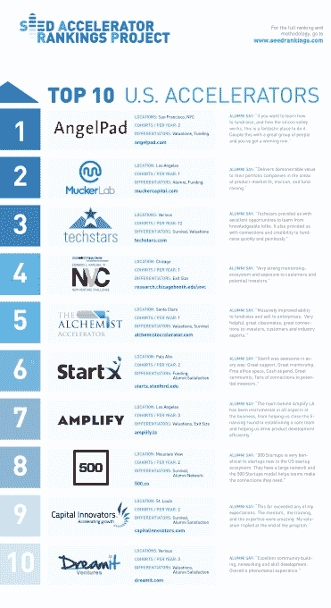

# 这些是美国 20 大加速器

> 原文：<https://web.archive.org/web/https://techcrunch.com/2015/03/17/these-are-the-top-20-us-accelerators/>

**编者按:** *雅艾尔·霍克伯格(Yael Hochberg)是莱斯大学琼斯商学院金融和企业家精神副教授，麻省理工学院创新倡议的研究科学家，[种子加速器排名项目](https://web.archive.org/web/20230320044641/http://seedrankings.com/)的常务董事。苏珊·科恩是里士满大学罗宾斯商学院的管理学助理教授，也是年度种子加速器排名项目的联合主管。Dan Fehder 是 Seed 加速器排名项目的副主任兼首席技术专家。*

近年来，创业加速器已经成为科技领域的一个显著特征，每个月都有越来越多的项目涌现出来。

在许多方面，它们已经成为每年申请和加入项目的数千名企业家的成年礼。

然而，有这么多项目可供选择，而每个项目的公开数据又很少，创业者可能很难找出哪个项目最有效，哪个特定项目最适合帮助他们启动创业。我们创立 Seed 加速器排名项目时，就考虑到了企业家面临的这一挑战。

> 今年前 20 名的竞争非常激烈。随着这么多新项目的出现，以及非股权收购项目和有特定附属要求的项目(如大学附属项目)资格的增加，今年排名的池有了相当大的增长。

我们的目标是促进关于过去十年中出现的加速器模式的对话，并帮助企业家获得对各种项目优势的一定程度的可见性。

该项目是 2010 年由阿齐兹·吉拉尼、凯利·夸恩和雅艾尔·霍克伯格进行的最初加速器排名研究的产物。

[今天，在 SXSW，](https://web.archive.org/web/20230320044641/http://schedule.sxsw.com/2015/events/event_IAP40699)我们发布了最新版本的年度排名。

今年，一些趋势显而易见。首先，虽然出现了许多新的程序，但也有许多程序被关闭了。此外，许多较新的项目是垂直专业化的，专注于特定的行业，例如医疗保健或能源。最后，许多新项目都与地方政府或州政府举措有关。

总的来说，我们发现了许多有趣的新项目，它们太年轻，没有可靠的结果，因此没有包括在今年的排名中。然而，我们期望在未来的几年里看到一些顶级的项目。

在确定谁有资格获得排名时，我们考虑了所有符合加速器计划正式定义的计划:固定期限、基于群组、具有教育和导师组成部分、以公开推介或演示日为高潮。

此外，项目必须至少有一批毕业生，至少有 10 名毕业生，主要位于美国，并愿意向我们的团队提供充分的透明度。当然，有一些自称加速器的项目不符合这些标准，因此没有资格参加这个排名项目。最终，我们核实并邀请了 150 多个项目参与排名过程。

为了构建排名，我们收集了大量加速器项目及其毕业生的详细数据，包括加速器自己提供的机密数据。

然后，我们计算了各种量化指标，以更好地了解项目如何在几个重要结果上叠加，包括:估值、筹资、退出和生存。除了这些措施，我们还对每个加速器的毕业生进行了广泛的调查，以确定他们对该计划的满意度，以及他们是否会向其他企业家推荐该计划。

近 1000 名加速器计划校友与我们分享了他们的创业经历。

根据我们的标准，以下是前 20 名:

| 军阶 | 程序 | 军阶 | 程序 |
| 1 | 安吉尔帕德 | 11 | 汹涌 |
| 2 | 穆克实验室 | 12 | 大众挑战 |
| 3 | 科技之星 | 12 | 布兰德里 |
| 4 | 芝加哥大学 NVC 分校 | 13 | 第八代 |
| 5 | 炼金术士 | 14 | 零到 510 |
| 6 | StartX | 15 | 阿尔法实验室 |
| 7 | 放大 LA | 17 | BlueStartups |
| 8 | 500 家创业公司 | 18 | 时代 |
| 9 | 资本创新者 | 19 | 贝塔斯普林 |
| 10 | Dreamit | 20 | 铁厂 |

今年，该榜单的首位是一位新的冠军:Angelpad(去年的#3 节目)。Mucker Lab(去年排名第四)和 Techstars(去年排名第二)分别位居第二和第三。Angelpad 的崛起源于其毕业生极高的满意度、其投资组合公司的高估值以及成功的融资。

Mucker Lab 同样以高校友满意度和筹资数字而闻名，而 Techstars 在估值和公司生存类别中尤为成功，强大的校友网络也为其毕业生发挥了作用。芝加哥大学新创企业挑战赛(University of Chicago New Venture Challenge)在第一年的参赛中凭借一系列强劲的退出排名第四，其中包括 2B Grubhub 的首次公开募股(IPO)和布伦特里的收购。

在今年的排名中，有一些接近的分组和一个完全相同的分组。排名第 5 位^(到第 10 位^(的节目在综合得分上比较接近。第 12 位^(和第 12 位)不分上下，第 16 位到第 20 位的节目得分也比较接近。))

值得注意的是，今年的名单中没有 Y Combinator 和 rock health——这两个项目现在都将自己归类为种子基金，而不是加速器，并要求我们尊重他们向新模式的演变。当然，这并不是对这些项目功效的陈述——根据提交给排名团队的 2013 年数据，如果 Y Combinator 没有过渡模型，它们仍将位居榜首。

那么，我们用来评估加速器有效性的指标是什么呢？为了更准确地了解加速器项目，我们计算了许多不同的指标:投资组合公司的平均估值；筹集到大量风险或天使投资的毕业生比例；公司筹集的平均金额；有重大退出事件的投资组合公司的百分比；退出时公司的平均估值；仍在运营的公司的百分比；以及毕业生对这个项目的看法。

为了确保我们是在比较苹果和苹果，我们衡量了毕业后一年、两年和三年的情况，并根据公司进入加速器时所处的阶段进行了调整，例如他们是否已经进行了两轮融资或有正收入，而不是作为一个全新的公司进入。

总体而言，从我们前 10 名的加速器中毕业的创业公司目前的总估值略低于 44 亿美元。在前十名中，大约有 3.5%的公司通过加速器成功退出，这个数字很低，但相对于种子期创业公司成功退出所需的典型时间而言，这种现象并不令人惊讶。

另有 35.6%的公司在从一个项目毕业后的一年内进行了一轮重要的融资，平均融资额为 150 万美元。此外，非常明显的是，从初创公司的角度来看，顶级项目几乎得到了普遍的满意。

例如，在排名前 10 的项目中，96%的创业公司表示，知道他们现在知道什么，他们会重复这种经历。

今年前 20 名的竞争非常激烈。随着这么多新项目的出现，以及非股权收购项目和有特定附属要求的项目(如大学附属项目)资格的增加，今年排名的池有了相当大的增长。鉴于此，跻身前 20 名是与众不同的标志。