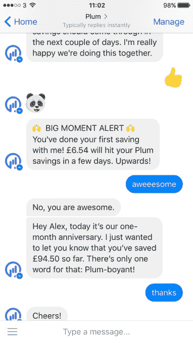
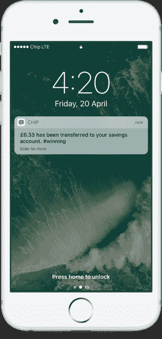

# 这些聊天机器人想帮你管理你的钱 

> 原文：<https://web.archive.org/web/https://techcrunch.com/2016/10/10/these-chatbots-want-to-help-you-manage-your-money/>

聊天机器人能帮你理财吗？三家总部位于伦敦的金融科技初创公司押注答案是肯定的，并跳上了这条即时通讯的列车，试图吸引千禧一代进入他们各自的平台。

想法是这样的:一个对话界面，加上插入你的银行账户并在后台分析你的支出的技术，是提供财务援助的最佳方式，以帮助你跟踪你的钱，并实际上为雨天储蓄。

更广泛地说，这些聊天机器人针对的是千禧一代，他们声称，千禧一代通常不太懂金融，而且完全通过表情符号交流也非常舒服。我开玩笑，算是吧。

选择今天宣布消息或者全面上线的是 Plum、Chip、Cleo，有点尴尬。没人说，你在等一个聊天机器人财务助理，三个人马上就来了。

## 李子

由分别是 TransferWise 和 Tictail 早期团队成员的 Victor Trokoudes 和 Alex Michael 创建， [Plum](https://web.archive.org/web/20221210034621/https://withplum.com/) 被宣传为第一个由人工智能驱动的脸书聊天机器人，使你可以毫不费力地开始节省小额资金。聊天机器人连接你的当前账户，Plum 的人工智能学习你的消费习惯，允许它每隔几天自动向你的 Plum 储蓄账户存入少量资金。

在与 Trokoudes 的一次通话中，他告诉我这个想法是，你可以用一种你几乎不会注意到的方式“微储蓄”。Plum 通过查看您过去 3-12 个月的支出，并预测您现在和未来可以节省多少钱来做到这一点。

他还表示，脸书信使是提供储蓄助手的合适方式，不仅因为消息应用是 Plum 的目标用户已经聚集的地方，还因为 Plum 在很大程度上是一个后台进程。当大部分繁重的工作发生在 Plum UI 之外时，为什么要让用户下载一个应用程序呢？

Plum 目前在英国处于私人测试阶段，将于 10 月底转向邀请制。它刚刚从 500 家初创公司的小额基金和一些天使投资者那里获得了 50 万美元的种子资金。

## 芯片

由西蒙·拉宾和之前创办 Roamer 的尼克·乌斯蒂诺夫创办，表面上看[芯片](https://web.archive.org/web/20221210034621/https://getchip.uk/)是一款类似于 Plum 的微型聊天机器人。关键的区别在于，Chip 实际上已经推出并选择开发自己的 iOS 和 Android 聊天机器人应用程序，而不是依赖于 Facebook Messenger 等现有的消息应用程序。

“我们已经建立了芯片来帮助我们的朋友/同龄人拥有更快乐、更健康的金钱关系，”这家初创公司告诉我。“怎么会？证明他们真的能存钱，而且真的有能力存钱——这对于任何人都是可能的，不管你挣多少钱，也不管你对金钱有多糟糕。

为了实现这一点，芯片机器人会根据你的支付能力自动将钱存入你的芯片储蓄账户。它通过学习你的消费习惯并通过自己的人工智能运行这些数据来做到这一点。

储蓄只是一个开始:我被告知，Chip 的大愿景是能够提供一系列“价格透明、帮助客户拥有更快乐、更健康的金融生活”的金融服务。想想透支、个人贷款和外汇市场的竞争。

这是 Plum 的 Trokoudes 的愿景，他借鉴 TransferWise 的剧本，看到了银行业蛋糕的许多部分，其中更多的价值可以直接传递给消费者。你不再需要成为一家银行，就可以获得客户的银行账户数据，从中可以获得大量的增值机会。

## 克利奥（Cleopatra 的昵称）（f.）

Cleo 首先是一名企业家毕业生，它自称是你理财的智能助手。由人工智能驱动的聊天机器人今天全面推出，它可以让你询问你的银行账户和信用卡数据，并帮助你跟踪你的支出，希望能更好地预算。

“我们专注于让管理你的钱变得非常非常简单，而不是综述或微储蓄，”Cleo 联合创始人兼首席执行官 Barnaby Hussey-Yeo 告诉我。“它是为那些不愿意每周花几个小时在电子表格上试图管理他们的现金的人准备的”。

这家初创公司使用机器学习来帮助你更明智地使用你的钱，并自动化许多 Hussey-Yeo 描述为无聊的事情，例如对交易进行分类或理解图表。“我们试图提供可行的方法，使用实时数据实时保存 140 个字符或更少的内容，”他补充道。

实际上，这包括从管理订阅、优化日常支出到寻找更好的金融产品。与 Plum 和 Chip 没有什么不同，Cleo 的更大目标是利用你提供的数据及其算法提供全方位的银行产品，以确保你总是得到最好的交易。

[https://web.archive.org/web/20221210034621if_/https://www.youtube.com/embed/lrr_Al3g_nI?feature=oembed](https://web.archive.org/web/20221210034621if_/https://www.youtube.com/embed/lrr_Al3g_nI?feature=oembed)

视频