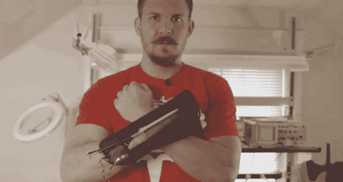
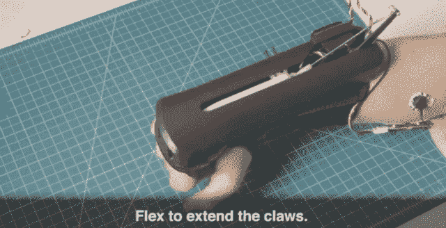

# 当你弯曲 TechCrunch 时，这些华丽的 DIY 金刚狼爪子会自动伸出

> 原文：<https://web.archive.org/web/https://techcrunch.com/2015/05/27/these-glorious-diy-wolverine-claws-automatically-extend-when-you-flex/>

# 当你弯曲时，这些光荣的 DIY 狼獾爪子会自动伸展

还记得去年《T2》中那些绝对疯狂的狼獾爪子吗？那些提前出生的*肯定会把某人的眼睛挖出来？*

 *不断发展的 DIY 金刚狼爪概念的最新成果(可悲？)让整个事情变得不那么危险，但也带来了令人敬畏的变化:弯曲你的手臂，爪子会自动伸出。

[https://web.archive.org/web/20221204200123if_/https://www.youtube.com/embed/5T3uTwY7pqM?feature=oembed](https://web.archive.org/web/20221204200123if_/https://www.youtube.com/embed/5T3uTwY7pqM?feature=oembed)

视频

那么，爪子怎么知道你在弯曲？

他们实际上是作为一个名为[my oware](https://web.archive.org/web/20221204200123/https://www.kickstarter.com/projects/312488939/myowaretm-harness-the-power-of-your-muscle-signals)的传感器的演示而建造的，该传感器目前正在已经成功的 [Kickstarter 活动](https://web.archive.org/web/20221204200123/https://www.kickstarter.com/projects/312488939/myowaretm-harness-the-power-of-your-muscle-signals)中。

在你的手臂上绑几个垫子，然后弯曲。当你这样做时，MyoWare 通过肌电图[检测你是否在弯曲(或者弯曲的力度有多大)。它将你的 flex 转换成数字信号，然后将该信号发送到 Arduino，用于你可能连接的任何命令。在这种情况下:手臂弯曲？发射爪子！](https://web.archive.org/web/20221204200123/http://en.wikipedia.org/wiki/Electromyography)

有兴趣建立自己的吗？MyoWare 背后的公司(Advancer Technologies)计划在几周内发布一个教程，尽管他们承诺如果他们的 Kickstarter 超过 2 万美元，就会立即发布。它目前的价格不到 1.6 万美元，所以这个目标似乎很可行。

**更新:**罢工那！看起来他们已经发布了 Makezine 的完整教程。去大楼！

*