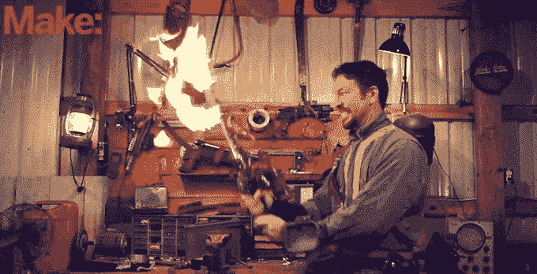

# 这些人实际上用辐射尘建造了那把可怕的火焰剑 

> 原文：<https://web.archive.org/web/https://techcrunch.com/2015/11/12/these-guys-actually-built-that-terrifying-flame-sword-from-fallout/>

# 这些人实际上用放射性坠尘建造了那把可怕的火焰剑

这是一个规则:如果一个很酷的东西存在于视频游戏或电影中，有人会(试图)把它变成现实。

生化奇兵的[大老爹](https://web.archive.org/web/20221007031745/https://beta.techcrunch.com/2008/09/29/big-daddy-costume-with-moving-drill-hits-ebay-just-in-time-for-halloween/)。[金刚狼的爪子](https://web.archive.org/web/20221007031745/https://beta.techcrunch.com/2014/05/15/diy-wolverine-claws/)。[雷神之锤。](https://web.archive.org/web/20221007031745/https://beta.techcrunch.com/2015/10/14/this-replica-of-thors-hammer-can-only-be-lifted-by-its-creator/#.zzzljg:rN4x)(自插:[医生的 TARDIS](https://web.archive.org/web/20221007031745/https://beta.techcrunch.com/2012/12/23/this-diy-mini-tardis-is-bigger-on-the-inside/) )

现在:烤肉串，疯狂的，被核辐射吞噬的剑。

[https://web.archive.org/web/20221007031745if_/https://www.youtube.com/embed/RijwebuSJG8?feature=oembed](https://web.archive.org/web/20221007031745if_/https://www.youtube.com/embed/RijwebuSJG8?feature=oembed)

视频

由 Make 公司的 Caleb Kraft 在艺术家 Platinumfungi 的帮助下建造的这个现实版尽可能接近它的数字原版。

我的意思是，看看这个(顶部是真实的生活构建；下图是来自游戏的概念艺术):

他们从武士刀开始，然后绑上一切东西，从丁烷罐到从旧摩托车上拆下来的刹车杆。在你考虑自己去做这件事之前，给你提个醒:事实上 Caleb 也做了一把 [Ukelele 大小的疯狂的麦克斯火焰吉他](https://web.archive.org/web/20221007031745/http://makezine.com/2015/11/12/we-built-the-flaming-sword-from-fallout-4/)在整个“不自吹自擂”方面帮了大忙。

演示视频嵌在上面，但 Caleb 在 Make 上也有每日的[构建日记——如果像我一样，你认为这个过程一半有趣，我会推荐它。](https://web.archive.org/web/20221007031745/http://makezine.com/2015/11/12/we-built-the-flaming-sword-from-fallout-4/)

它能帮助你在核灾难中幸存下来吗？也许不是。但是当袭击者来拿你的帽子时，至少你看起来像个坏蛋。