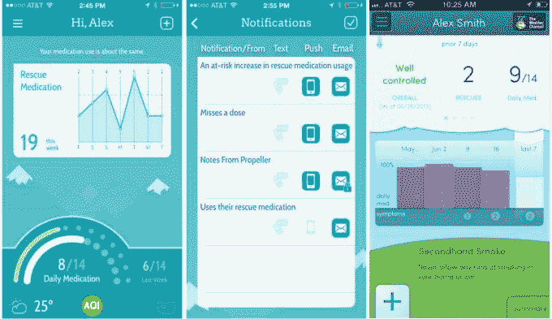
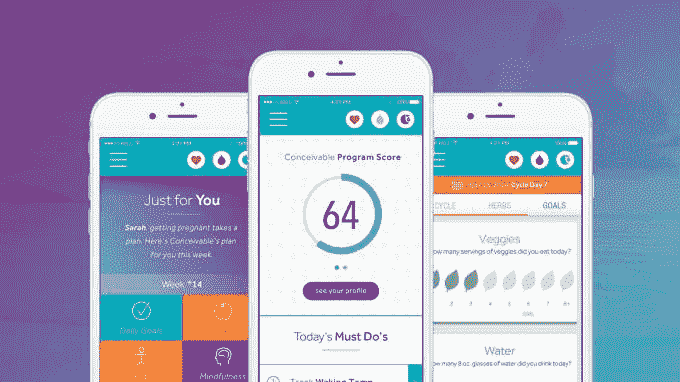

# 这些医疗保健应用让我们保持最佳行为 

> 原文：<https://web.archive.org/web/https://techcrunch.com/2015/12/24/these-healthcare-apps-keep-us-on-our-best-behavior/>

More posts by this contributor

长期以来，医疗保健技术一直被动地专注于治疗急性病。相反，我们的系统和新的创新应该优先考虑主动保持人们的健康。

IHI 的“三重目标”原则的影响有助于这种结构性转变，以及基于绩效的薪酬趋势，最引人注目的是，大型雇主之间的经济激励有助于降低风险，实现更好的人口健康管理。

因此，几乎每个人都在问的关键问题是:我们如何可靠地影响行为改变，以增加美国各地大大小小群体的福祉？预防保健的未来取决于答案。

Beam 是一家值得研究的公司。Beam 是一种新型的牙科保险公司，它为其会员提供一种联网牙刷，这种牙刷可以与一个精巧的移动应用程序同步。

平衡木是关于风险的。当然，像许多保险公司一样，他们想更好地定价。但是他们也想降低风险。当保持最佳健康状态时，支付者、提供者和患者同样受益。

毕竟，最好的诊所是你永远不会去的。最好的医院是让你远离校园的医院。

**眼见为实**

上周，我与 Beam 的首席执行官亚历克斯·弗洛梅尔进行了交谈。在 Beam [公布其在团体和个人保险方面的抱负之前，他们的团队花了数年时间证明他们的智能牙刷及其配套应用程序可以让人们刷牙更频繁、更持久。](https://web.archive.org/web/20221007134506/https://links.mixmax.com/b/yh5iNrPk52AqoGPYF?rn=iIXZiVWaoNlI&re=gIt92YuwWah12ZAJXZiVWaoNnI)

这些结果在字面上和象征性上都支持了他们的全部努力。

Frommeyer 说:“这是从霍桑效应开始的。

对于那些不熟悉的人来说，霍桑效应有时被称为观察者效应，并导致个人改善他们的行为，以回应他们首先被观察的基本事实。这是行为心理学家对彼得·德鲁克著名观点的诠释，即一切都是可以衡量和改善的。

两者都是有效的，它们是其他一切的起点。量化行为使我们能够改变它。

> 诀窍在于，你必须在正确的时间以正确的剂量向人们展示他们的信息。Beam 首席执行官 Alex from Meyer

“经过多次迭代后，我们看到了有意义的行为变化。诀窍在于，你必须在正确的时间以正确的剂量向人们展示他们的信息。这因人而异，”Frommeyer 说。“但基本原理是一样的。给我一个简单的，非常准确的反馈回路。排行榜很有帮助。框架也很重要。我和我的家人相比如何？朋友？别人喜欢我？”

现在 Beam 三分之二的刷牙时间都在两分钟或以上，而全国平均时间为 45 秒。该应用的日参与度翻了一番。

**游戏结束了？**

霍桑效应只能带你到这里。

游戏化是一个流行词，它的流行来了又去。但是展示它的好处对行为改变是必不可少的，而医疗保健是游戏和博彩应用很少的一个领域。

关于这一点，我从 Frommeyer 那里得到了 Beam 软件最近一次重大更新的演示，它在已经存在的数据驱动图表和图形的基础上添加了一个游戏化层。“巨石和创可贴”是新 Beam 应用程序中一个简单、制作精良的游戏。游戏中的回合，或者说生命，只能靠刷牙来获得。

这款产品天生适合儿童，该公司认为成年人也会受到同样的诱惑。像 Doodle Jump 和 Angry Birds 这样容易上瘾的休闲游戏证明了少可以多，而且你不需要大规模游戏工作室的预算来制作令人愉快的东西。

[gallery size = " TC-article-featured-image-wide " ids = " 1255174，1255179，1255178"]

**回到未来**
实践中行为改变的另一个重要参考点是[螺旋桨健康](https://web.archive.org/web/20221007134506/https://links.mixmax.com/b/TfH32QkEaxwrdf0c8?rn=iIXZiVWaoNlI&re=gIt92YuwWah12ZAJXZiVWaoNnI)，它专注于慢性疾病的管理，特别是哮喘。

Propeller 远程跟踪症状，并使用慢性阻塞性肺病症状来预测性地确定谁需要关注，在他们开始遭受痛苦或返回接受护理之前。

他们的首席执行官大卫·范·西克尔在这篇文章的电子邮件采访中告诉我，对他们来说，改变慢性病行为的关键是向前看，而不是向后看。患有慢性疾病的患者更有可能坚持治疗，但是他们的治疗方案既费时又乏味。无论你的意图有多好，都很难长时间保持完美。

但 Propellor 的特别之处在于，它不仅仅让我对过去一览无余。它积极参与对未来的理解。<

当我觉得我可以改变过程时，改变我的行为会更有动力。知道我爆发的可能性有多大，以及我能做些什么来防止这种结果，这给了我力量。知道我应该专注于做好一两件具体的事情，会让我更有可能达到我想要的结果。

范·西克尔解释说，像他这样的数字平台，使人们可以更轻松地治疗他们的慢性病。计算机可以承担处理数据、识别趋势和检测异常的重任。患者应该只担心简单、直接的建议，这些建议会产生重大影响。

简化原本极其复杂的世界可以在行为方面产生巨大的变化。“我们相信，你越能简化和支持自我管理，个人就越容易超越自己的期望，充分参与自己选择的活动。”

**亲爱的，我收缩了习惯**

Beam 和 Propeller 都利用了新的智能设备，这些设备专门针对其特定的使用情况进行了调整。然而，物联网的巨大前景，以及随之而来的许多以健康为导向的可穿戴设备和智能医疗设备，正受到高废弃率的威胁。

根据 Endeavour Partners 的[研究](https://web.archive.org/web/20221007134506/https://links.mixmax.com/b/35U19Vq0svEuXoP7p?rn=iIXZiVWaoNlI&re=gIt92YuwWah12ZAJXZiVWaoNnI)，拥有可穿戴设备的三分之一美国消费者在六个月内停止使用它。该小组还得出结论，虽然十分之一的成年人拥有活动追踪器，但一半的人不再使用它。为什么？

答案很可能是智能设备、家庭显示器、可穿戴设备等对我们的要求太高了。与 Beam 努力让事情变得有趣，Propellor 努力让事情变得简单类似，事实证明，让事情变小也很重要。

对这些趋势最突出的对冲来自斯坦福大学和 BJ·福格教授在行为设计方面的努力。

具体来说，他的“小习惯”概念指出了可持续健康改善的道路，证明了婴儿的步伐本质上是越小越好，有能力产生巨大的复合影响。你可以在这里阅读更多关于“小习惯”的内容。

从本质上讲，变革必须在尽可能小的范围内发生。福格的哲学是“目标是有害的，除非它们引导你让特定的行为变得更容易做到。不要把你的动机集中在做行为 X 上，相反，要集中在让行为 X 更容易做。”

从像 [PatientIO](https://web.archive.org/web/20221007134506/https://links.mixmax.com/b/8zT9iw6q8SA4UrP2H?rn=iIXZiVWaoNlI&re=gIt92YuwWah12ZAJXZiVWaoNnI) 和 [HealthLoop](https://web.archive.org/web/20221007134506/https://links.mixmax.com/b/XNKaYDjKD8JUwAknk?rn=iIXZiVWaoNlI&re=gIt92YuwWah12ZAJXZiVWaoNnI) 这样的家庭护理疗法，到像[imagine](https://web.archive.org/web/20221007134506/https://links.mixmax.com/b/TK78MOGG2sbfG0eEG?rn=iIXZiVWaoNlI&re=gIt92YuwWah12ZAJXZiVWaoNnI)这样的虚拟生育应用，再到像 [Alme](https://web.archive.org/web/20221007134506/https://links.mixmax.com/b/b9YSkjMAn0S5Hjdmr?rn=iIXZiVWaoNlI&re=gIt92YuwWah12ZAJXZiVWaoNnI) 这样的 Siri 类健康教练，Fogg 的原则在任何事情上都可以看到。

**跟随领导**

我会第一个承认，无论我的牙科保健师如何羞辱我，我都不会按照规定刷牙和使用牙线。对大多数人来说，负面反馈并不能完成工作。

我们今天在医疗保健中没有科学问题，我们有行为问题。我们在改变我们的行为方面远远不够好，纯粹而简单。我们有一个“按照科学所说的去做”的问题。需要新的思路，比如我上面描述的方法等等。

当前全系统对预防保健的关注仍然常常意味着:更频繁地去看医生或牙医，进行更多的检查。越多越好，对吗？

没有。预防性护理与更多的护理紧密相关。更多的检查和检查增加了我们在早期阶段感染疾病的可能性，但这无助于鼓励和奖励患者养成和保持健康习惯的日常工作。<

伟大的健康实际上是由每天的选择组成的，是在没有别人注视的时候做出的。医疗保健的未来在战壕里，而不是在云中。