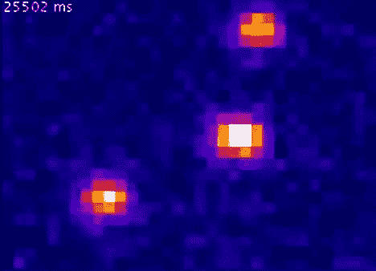

# 这些高速“纳米起重机”可以形成分子装配线 

> 原文：<https://web.archive.org/web/https://techcrunch.com/2018/01/19/these-high-speed-nano-cranes-could-form-molecular-assembly-lines/>

纳米工厂的情况不太好。他们很难让所有这些微小的工人同步并一起快速移动。但是让德国人来让事情顺利进行吧！它所需要的只是一种新奇技术“电”的小心应用

由 DNA 形成的微型纳米机器可能是小规模大批量生产的未来:药物、微型芯片组件，当然还有更多纳米机器。但是移动简单的、可重复使用的机器，比如半微米长的小臂，比人类规模的要困难得多。在那样的尺度下，信号线是不可能的，如果你想用第二只手臂移动它，你怎么移动那只手臂呢？

有一段时间，化学信号已经被使用；在纳米机器人上清洗某种溶液，它会改变方向，关闭它的抓取尖端或诸如此类的东西。但是那很慢而且不精确。

慕尼黑工业大学的研究人员正在寻找方法来改善这种在分子水平上控制机器的情况。他们正在与“纳米起重机”合作，这基本上是一种从基底伸出的定制的 400 纳米 DNA 链，带有一个灵活的碱基(字面意思是——它由不成对的碱基组成)，可以让它向任何方向旋转。它更像一个微小的机器人手指，但我们不要分裂头发(或碱基对)。

Friedrich Simmel 和他的团队发现，或者说认识到了 DNA 分子的潜力，因此这些纳米鹤带有负电荷。所以理论上，它们应该会随着电场而移动。这正是他们所做的。

 他们将微小的荧光色素分子附着在仙鹤的尖端，这样他们就可以实时看到它们在做什么，然后在它们周围的电场被小心改变时观察仙鹤。

令他们非常高兴的是，这些起重机完全按照计划移动，从一边到另一边转换，转圈等等。研究人员说，完成这些动作的速度是使用化学药品的十万倍。

纳米起重机运动范围的显微图像，蓝色和红色表示选定的停止点。

“我们想出了完全放弃生物化学纳米机器转换的想法，以利于 DNA 结构和电场之间的相互作用，”Simmel 在 TUM 新闻发布会上说。“实验证明，分子机器可以移动，因此也可以用电力驱动……我们现在可以在毫秒的时间尺度上启动移动，因此比以前使用的生物化学方法快 10 万倍。”

因为场提供能量，这种运动可以用来推动其他分子——尽管这还没有被证明。

但不难想象数以百万计的这些小机器在广阔的(对它们来说)领域中工作，在复杂的过程中推动组成分子相互靠近或远离，或者滚动产品，“就像一条装配线，”正如西梅尔所说。

该团队的工作，像大多数伟大的研究一样，在回顾中似乎显而易见，为他们赢得了令人垂涎的《科学》封面故事。