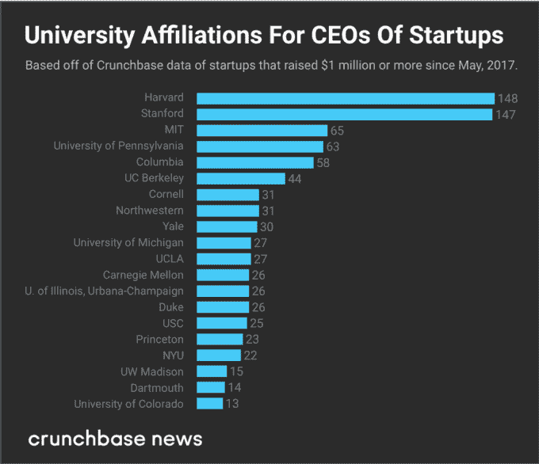

# 这些学校毕业的初创公司首席执行官获得的资助最多

> 原文：<https://web.archive.org/web/https://techcrunch.com/2018/05/12/these-schools-graduate-the-most-funded-startup-ceos/>

乔安娜·格拉斯纳撰稿人

More posts by this contributor

成为风险投资公司的首席执行官不需要学位。但毕业于哈佛、斯坦福或其他十几所培养出大量顶级初创企业高管的知名大学，可能会有所帮助。

这是我们最新的毕业季数据分析得出的核心结论。在这个练习中， *Crunchbase News* 调查了过去一年中融资 100 万美元或以上的初创公司首席执行官在美国顶尖大学的附属机构。

从许多方面来看，这些发现与我们近一年前发现的没有太大区别，我们观察了受资助的初创公司创始人的大学背景。然而，有一些曲折。以下是一些重要的发现:

谈到培养未来的首席执行官而不是创始人，哈佛在与斯坦福的竞争中表现得更好。这两所大学在 CEO 校友排名中基本并列第一。(斯坦福大学在创始人方面遥遥领先。)

商学院很大。尽管 MBA 项目的申请人可能越来越少，但这个学位在初创公司的首席执行官中仍然很受欢迎。在哈佛和宾夕法尼亚大学，超过一半的 CEO 毕业于商学院。

大学背景对首席执行官有影响，但不是决定性的。我们榜单上的 20 所商学院毕业于 800 多家全球初创公司的首席执行官，这些公司在大约过去一年里筹集了 100 万美元或以上的资金，仅占总数的少数。下面，我们将更详细地充实这些发现。

### 初创公司的首席执行官们上学的地方

首先从学校排名说起。这里没有太多大的惊喜。哈佛和斯坦福远远超过了 CEO 名单上的任何其他机构。每家公司都统计了近 150 名知名校友，他们都是去年融资 100 万美元或以上的初创公司的首席执行官。

麻省理工学院、宾夕法尼亚大学和哥伦比亚大学位列第五。常春藤联盟学校和大型研究型大学构成了我们名单上剩余的大约 20 所院校中的大部分，这些院校在培养即将毕业的首席执行官方面有着良好的记录。下表列出了这些数字:

#### 初创企业首席执行官青睐传统 MBA

是的，比尔·盖茨和马克·扎克伯格从哈佛退学了。史蒂夫·乔布斯在一学期后离开了大学。但在 CEO 的世界里，他们是例外。

风险投资支持的公司的领导者的典型道路更稳重一些。名牌大学的学位比比皆是。MBA 学位，尤其是顶级项目的 MBA 学位，是一个非常受欢迎的证书。

顶级商学院在各自的大学只招收很小比例的学生。然而，这些机构产生的首席执行官比例过高。例如，沃顿商学院(Wharton School of Business)的学位占据了宾夕法尼亚大学(University of Pennsylvania)首席执行官校友的大多数。哈佛商学院也毕业了一半以上的哈佛附属公司的首席执行官。在西北大学的凯洛格管理学院，这一比例接近一半。

#### CEO 校友的背景真是五花八门

虽然初创公司首席执行官的教育背景确实有很多重叠，但也有很大的差异空间。自去年 5 月以来，约有 3，000 家美国初创公司和近 5，000 家上市首席执行官的全球初创公司筹集了 100 万美元或以上的资金。在这两种情况下，这些初创企业的领导者大多没有上过上述名单上的学校。

不可否认，这个问题的数学有点模糊。Crunchbase 网站上有很大一部分 CEO 档案(可能超过三分之一)不包含大学背景。然而，即使考虑到这一点，看起来超过一半的美国首席执行官不是入围名单上的学校的毕业生。与此同时，对于非美国籍的 CEO 来说，只有一小部分人上过榜单上的学校。

因此，给毕业生的一些启发是:如果你的目标是成为一名有资金支持的初创公司 CEO，最可靠的途径可能是创办一家初创公司。学位很重要，但不是决定性的。