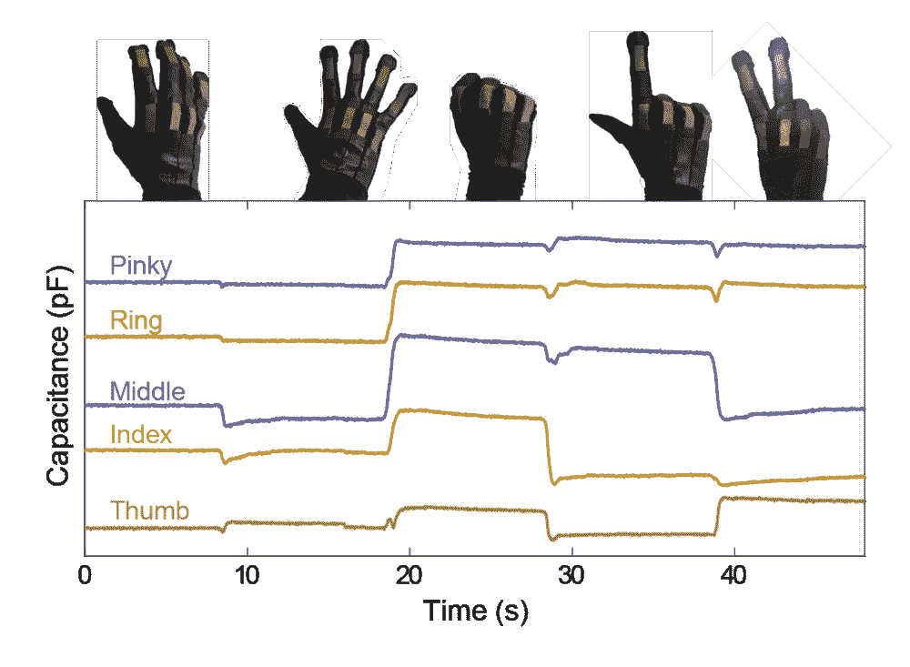

# 这些有弹性、耐用的传感器可以直接编织到衣服里

> 原文：<https://web.archive.org/web/https://techcrunch.com/2017/07/12/these-stretchy-durable-sensors-could-be-woven-right-into-clothing/>

# 这些有弹性、耐用的传感器可以直接织进衣服里

如果我们必须有一个物联网，把衣服遗忘在聚会之外是没有意义的。但是衣服必须经过磨损、清洗、捆扎和折叠——很难制造出能经受住这一切的电子产品。不过，很多人都在尝试；哈佛大学怀斯研究所(Wyss Institute)的最新尝试是使用简单但有效的分层方法来制造一种耐用、可定制的柔性传感器。

从某种程度上来说，这是相当基本的:一种在硅胶填充物上下各有一层导电织物的材料夹层。当织物拉伸时，硅树脂变得更薄，导电层靠得更近，改变了它们的电容，产生了不同的电信号。

这些层的组装方式是将织物放在液态硅树脂上并使其固化，从而将这些层物理地锁定在一起。因此，信号更容易预测，织物总是会恢复到基本电容——同时，即使是轻微的弯曲或拉伸也会立即产生可测量的变化。它也可以被切成任意大小和形状的碎片。

该团队用多块材料组装了一只手套，发现手指的细微动作很容易被检测到。

 “我们的传感器灵敏度更高，这意味着它有能力分辨更小的动作，比如一个手指轻微的左右移动，而不是简单地整只手是张开还是握紧拳头，”研究生 Vanessa Sanchez 解释道，她是描述这种材料的论文的合著者，[在哈佛大学的新闻发布会上](https://web.archive.org/web/20230205200143/https://wyss.harvard.edu/soft-and-stretchy-fabric-based-sensors-for-wearable-robots)。

这对从体育到虚拟现实的所有行业都是一个福音。许多当前的身体跟踪解决方案既僵硬又怪异，比如戴在你指关节上的外骨骼或安装在运动服内的秒表大小的追踪器。

然而，这种材料仍处于早期阶段。因为信号如此简单，如果不仔细调整，它就不可能从根本上定向——这意味着系统只能分辨出一块正在弯曲，而不是向右或向左弯曲。不过，我相信聪明的工程师会解决这个问题，不管是通过信号处理还是不同的切割和粘贴材料的方式。

该团队在最新一期的先进材料技术中详细介绍了他们的过程[。如果你有兴趣自己尝试，哈佛的](https://web.archive.org/web/20230205200143/https://softroboticstoolkit.com/publications/textile-silicone-hybrid-sensor)[软机器人工具包](https://web.archive.org/web/20230205200143/https://softroboticstoolkit.com/textile-silicone-hybrid-sensor)中也有记录。