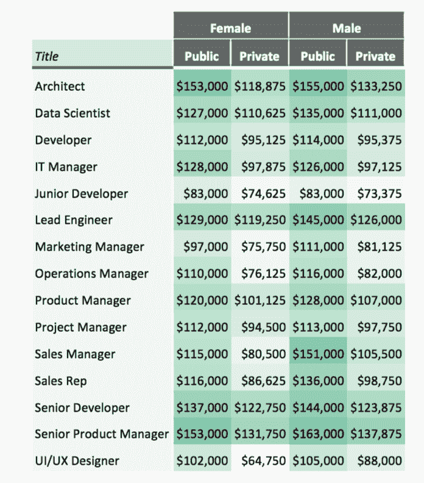
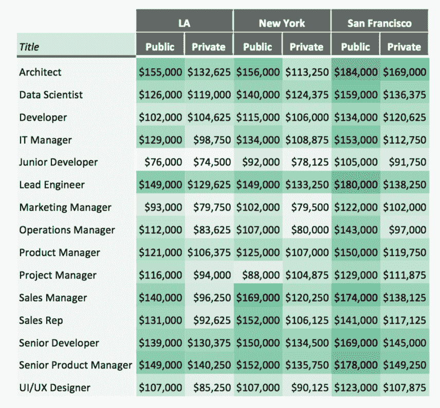

# 这些技术工作能让你赚到最多的钱

> 原文：<https://web.archive.org/web/https://techcrunch.com/2018/03/05/these-tech-jobs-can-earn-you-the-most-money/>

为了更好地协商你的薪水，了解别人的工资水平会非常有帮助。根据文化工作场所和薪酬比较平台[的新数据，一般来说，你在上市科技公司工作会比在私营科技公司工作赚得更多。根据 Comparably 的数据，公司越大，你赚的钱就越多。](https://web.archive.org/web/20230331015715/https://www.comparably.com/)

一家资金不多的私营科技公司的高级开发人员年薪约为 7.3 万美元，而一家上市公司的高级开发人员平均年薪约为 13 万美元。然而，根据 Comparably 的说法，无论你在哪里工作，作为一名建筑师或高级产品经理，你都将赚得最多。

就地点而言，旧金山上市公司在这 15 个职位中薪酬最高。旧金山上市公司的建筑师平均收入为 184，000 美元，而洛杉矶为 155，000 美元。

毫不奇怪，全国范围内从事相同工作的男女之间存在性别薪酬差距。一家上市科技公司的男性高级开发人员平均收入为 14.4 万美元，而从事同样工作的女性平均收入为 13.7 万美元。

Comparably 的数据显示，销售经理的收入差距最大，在上市公司，男性平均收入为 15.1 万美元，女性平均收入为 11.5 万美元。

在 2016 年 3 月至 2018 年 2 月期间，compare ly 从美国的小型、中型和大型(包括公共和私营)科技公司的 10 多万人那里收集了匿名薪酬数据。compare ly 特别关注了科技界最受欢迎的 15 个职位，比如建筑师、数据科学家、开发、营销经理、运营经理、产品经理等。

值得注意的是，私人科技公司有时会提供股权作为补偿，但在计算中并未考虑到这一点。然而，相比之下，它确实考虑了年度奖金。

自 2016 年 3 月发布以来，Comparably 一直专注于薪资和薪酬数据。多年来，它已经发展成为一个类似玻璃门的公司文化审查工具。相比之下，由杰森·纳扎尔(Jason Nazar)创建的该公司已经筹集了 1380 万美元的资金。