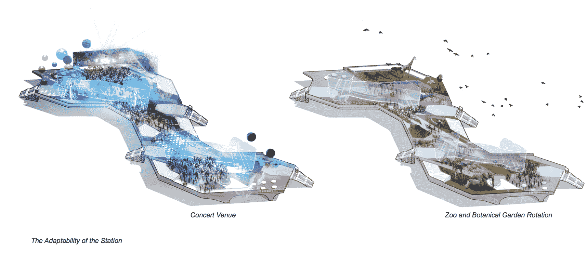
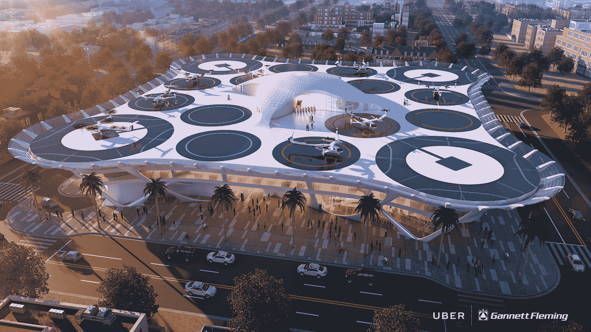
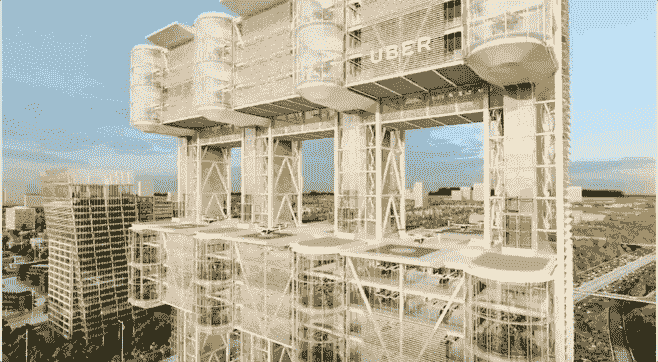
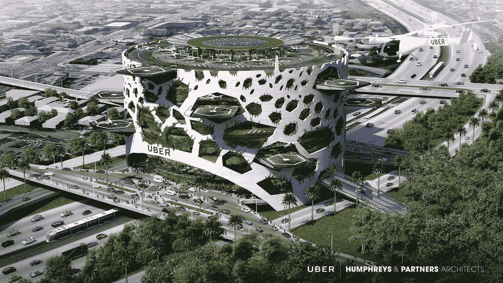
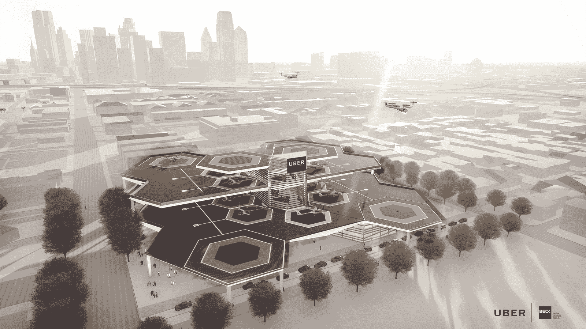
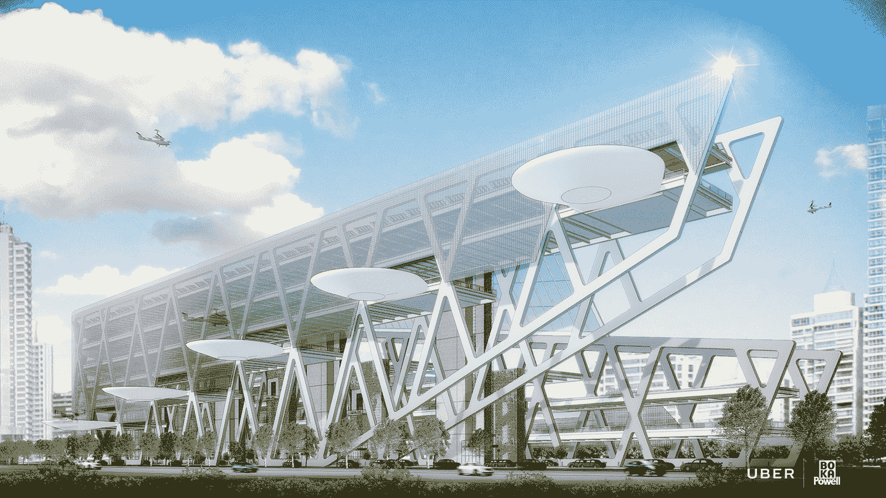

# 这些 uberAIR 的“Skyport”设计非常漂亮

> 原文：<https://web.archive.org/web/https://techcrunch.com/2018/05/09/these-uberair-skyport-concepts-are-beautiful/>

UberAIR 进展顺利，计划在 2020 年开始展示这项技术，并在 2023 年开始运营飞行出租车服务。为了到达那里，它将需要优步所说的“天空港”——供这些电动垂直起降车辆上下乘客的区域。

在 Elevate 的第二天，优步的建筑师和设计伙伴展示了他们的机场概念。所有的机场概念都需要能够在 3 英亩的占地面积内每小时支持 4000 多名乘客。skyports 还必须确保电动垂直起降飞机能够在两次旅行之间轻松充电。

尽管所有这些机场在结构上都是可行的，但城市的财务可行性却完全不同。无论如何，这里有一些来自设计和建筑公司 Corgan 的新的 skyport 概念。

[gallery ids="1635642，1635488，1635490，1635489"]

根据 Corgan 的说法，巨型 Skyport 的想法是创建一个具有模块化组件的系统，可以适用于任何地方。理论上，这个基本组件，即 skyport 本身，可以被添加到开放空间，停车场的顶部或摩天大楼的屋顶上。每个机场每小时可起降 1000 次航班。Corgan 还设想将这个车站用作社区聚会场所，举办音乐会、艺术节和植物园等活动。

根据 Corgan 的设计前景，“该站重新连接了曾经居住在高速公路两侧的分裂社区，因此成为一个新的社区聚集点”。

第一天，优步航空部主管 Eric Allison 解释了节点概念。节点本质上是一种 skyport 分组，使优步能够更好地管理 eVTOLs 网络。例如，Allison 说，40 个节点每天可以管理数百万人的旅行。

另一个概念来自 Gannett Fleming(上图)，该公司设计的 skyports 每模块每小时最多可支持 52 个 eVTOLs。到 2028 年，该框架每小时可以处理 600 次到达和离开。这种设计可以让太阳能充电。使用机器人来旋转停放的飞机，以更好地定位它们，以便立即起飞。

皮卡德·奇尔顿和奥雅纳在他们的设计中采取了更加垂直的方式来提高效率。这种设计可以使每个模块每小时起降 180 次。

下一个是 Humphreys & Partners。这个概念是以蜂巢为模型的，因为类似于蜜蜂进出蜂巢的飞行模式，eVTOLs 会在优步盘旋中复制相同的模式。该设计每层每小时可容纳 900 名乘客。

贝克团队在设计中采用了类似蜜蜂的方法，称之为蜂巢。不过，这个设计看起来更像一个真实的蜂巢，而不是 Humphreys & Partners 的设计。这种设计可以适应每小时 150 次起飞和着陆，并且可以扩展到每小时处理 1000 次旅行。

最后但并非最不重要的是一个来自 BOKA 鲍威尔。这种设计每小时可以处理 1000 次起飞和降落，并且具有可以自我反转的结构，以适应风向变化。

你最喜欢哪一个？