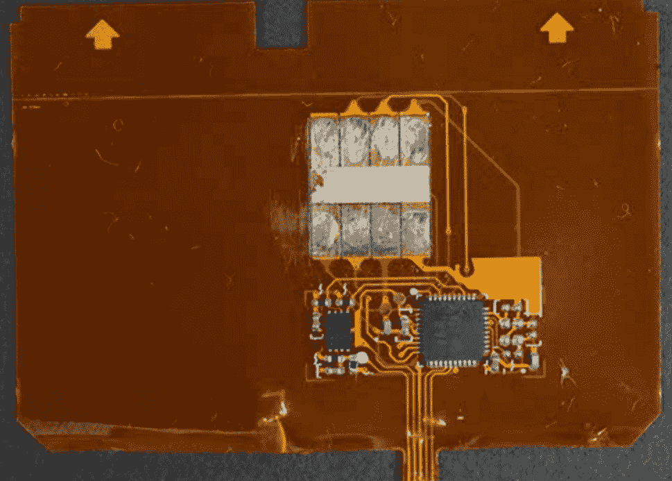

# 窃贼现在使用“微光”来抓取芯片/个人识别卡数据 

> 原文：<https://web.archive.org/web/https://techcrunch.com/2017/02/02/thieves-now-use-shimmers-to-grab-chippin-card-data/>

# 窃贼现在使用“微光”来抓取芯片/个人识别卡数据

就在你认为把卡塞进投币口是安全的时候，提款机变得更聪明了。名为“微光”的新设备现在可以读取你的卡号，在某些情况下，还可以访问你卡上的芯片。虽然这种技术并不新鲜——微光在 2015 年开始出现——但它们仍然是一个巨大的安全漏洞，比标准的撇油器危险得多。

因为微光很薄，可以消失在自动提款机或读卡器里。芯片激活时读取的数据不能用于创建基于芯片的卡，但因为一些磁性数据是在读取过程中传递的，所以您可以使用 Shimmers 轻松地重新创建哑磁卡。

PIN 和芯片卡使用一种叫做动态 CVV 的系统，这使得它们比标准卡更难破解。然而，一些银行和供应商“显然没有正确实施芯片卡标准，即 EMV(Europay、Mastercard 和 Visa 的简称)”，Brian Krebs 说。

NCR 公司在 2016 年的一份报告中写道:“这种攻击成功的唯一方式是，如果(银行卡)发行商在授权交易时忘记检查 CVV。”“所有发卡机构都必须进行这些基本检查，以防止这类欺诈。卡填隙不是芯片卡或 ATM 的弱点，因此没有必要为 ATM 增加防止这种形式攻击的保护机制。”

底线呢？经常检查提款机和你周围的奇怪东西。可悲的是，简单地拉动读卡器可能不再有效，因为这些更薄的读卡器可以滑入插槽并隐藏在那里，等待你的卡。

