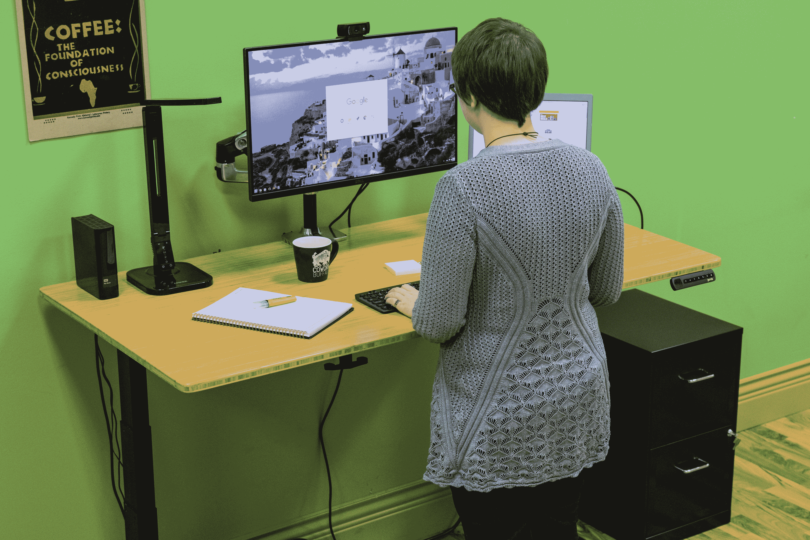
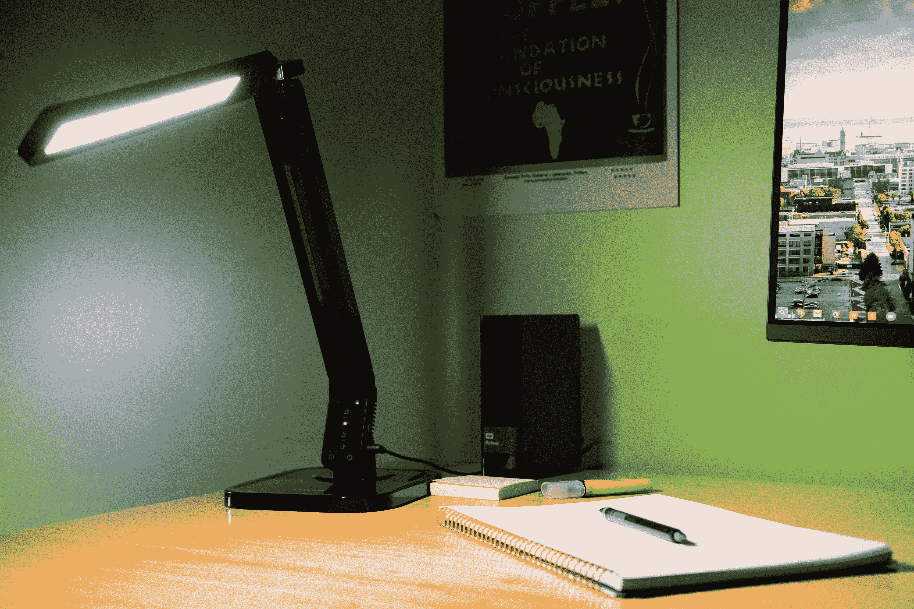
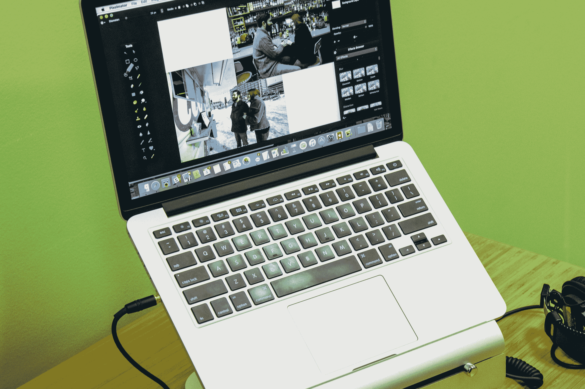
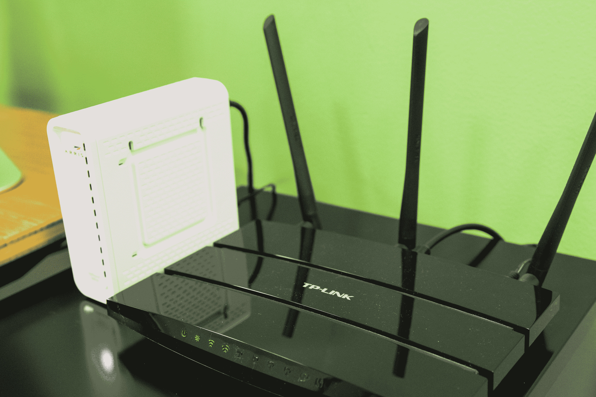
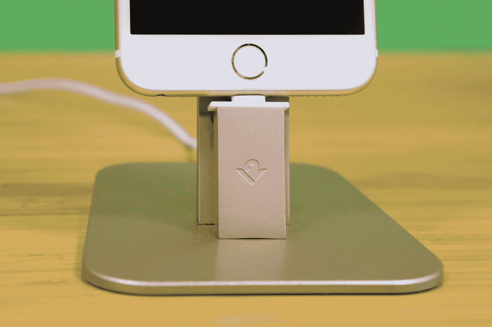
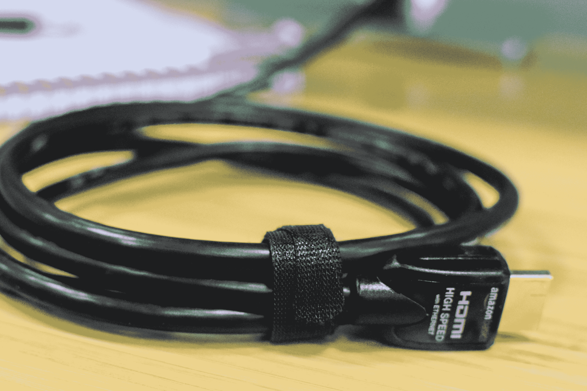
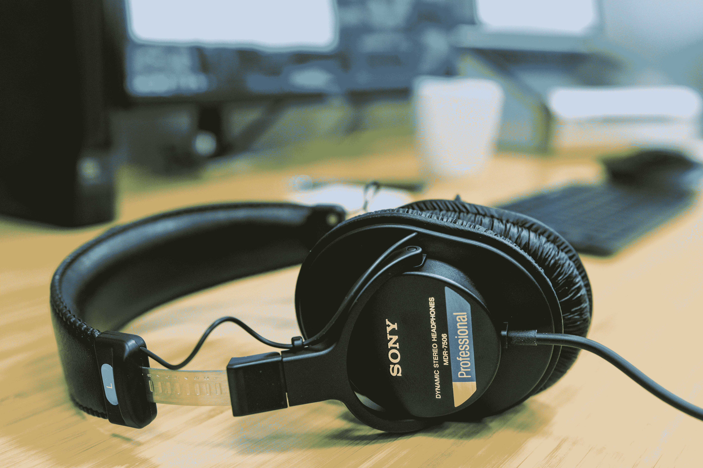
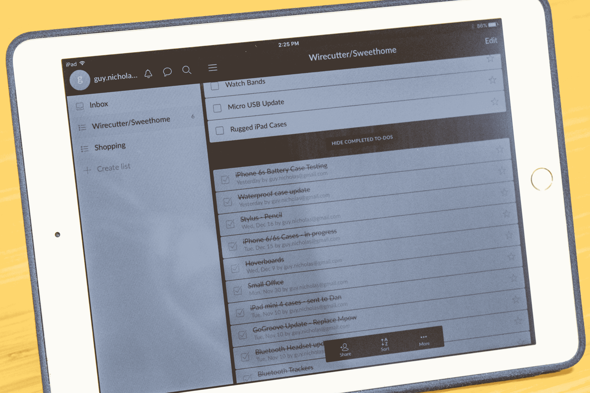

# 让你的家庭办公室合法化的东西 

> 原文：<https://web.archive.org/web/https://techcrunch.com/2016/05/19/things-to-make-your-home-office-legit/>

编者按:这篇帖子是与 [*钢丝剪*](https://web.archive.org/web/20230202024552/http://bit.ly/1q1sonc) *合作完成的，这是一份最佳技术的买家指南。这是几个线切割指南的浓缩版；你可以在下面的讨论中找到完整指南的链接。*

快速调查:你花了多少时间在 Slack 中设置你的星级频道和通知？在过去的三个月中，您重新排列手机主屏幕的频率如何？你花了多少精力为你的家庭办公室挑选桌子？你的椅子？等等——你只是在牌桌上用你的笔记本电脑吗？

在[wire cutter](https://web.archive.org/web/20230202024552/http://wrctr.co/1Lb0K0g)，我们几乎都是远程工作者，我们知道拥有一份需要大量注意力和决策的工作是什么感觉。这就是为什么我们研究、测试并沉浸在构成 [一个符合人体工程学且高效的工作空间](https://web.archive.org/web/20230202024552/http://wrctr.co/1RNVDWs) 和 [让一切成为可能的技术](https://web.archive.org/web/20230202024552/http://wrctr.co/1LXj1P9) 中。继续读下去，了解你能为这个空间买到的最好的东西，在这里，犒劳自己能获得真正的投资回报。

## 书桌等。

### **站立式办公桌**

如果你想在坐着和站着之间转换，[Ergo Depot Jarvis Bamboo](https://web.archive.org/web/20230202024552/http://wrctr.co/1UzSHO5)是我们见过的全尺寸可调站立式办公桌中最超值的。这是我们测试过的最坚固的立式办公桌，价格不到 800 美元，是不太稳定的桌子价格的一半。它有七年的保修期，运输速度比大多数桌子都快。最重要的是，无论是在站立位置还是在桌子高度，它看起来都很光滑，而且在你的胳膊下感觉很结实和光滑。

如果你还没有准备好投入空间或金钱来购买一张可调节的桌子，那么[Ergo Desktop Kangaroo Pro Junior](https://web.archive.org/web/20230202024552/http://wrctr.co/21RvB4a)就可以坐在你现有的桌子上，在几秒钟内将你的电脑设备移动到站立位置。与其他转换选项相比，它更轻、体积更小，您可以轻松将其移动到不同的桌面位置。

### **挑选传统书桌**

如果你不想走站着的路线，你可以用任何你想要的(或者能找到的)东西当书桌。最重要的是它如何适合你——也就是说，你的身高、你的手和你的坐姿。

首先，你的桌子需要为放置合适的显示器、键盘和鼠标提供足够的空间。起点是一个高出地面 28 到 30 英寸的表面。然后，坐在那个高度，微微后仰(从 90 度到 100 度或者 110 度)。在那里，确认以下内容:

*   你的眼睛与屏幕上的一个点在一条直线上，该点在显示器框架顶部下方 2 到 3 英寸处。
*   你的手平放在键盘和鼠标上。
*   你的手肘弯曲成 90 度或接近 90 度，你的手肘和上臂都紧靠着你的身体，而不是向前伸出。

任何能让你的眼睛、手臂和手保持适当对齐的桌子都可以作为办公桌使用，无论是宜家的平板还是父母车库的门。

### **办公椅**

在坐了一年八把顶级椅子并与四位人体工程学专家交谈后，我们得出结论， [Steelcase 手势](https://web.archive.org/web/20230202024552/http://wrctr.co/1ojQCae) 是最适合大多数人的 [最佳办公椅](https://web.archive.org/web/20230202024552/http://wrctr.co/1ojQCY3) 。它的球窝扶手(功能类似于人的肩膀)比任何其他任务椅都具有更大的可调范围。这意味着你更有可能找到适合你的坐姿，无论你喜欢什么样的坐姿。它看起来不错，提供了几十种颜色和表面处理选项，并有一家老牌公司提供的 12 年保修。

## 照明

### **台灯**

在网络上工作通常意味着深夜、清晨和疲惫的双眼。为了给你的空间增添温暖、富有层次感的光线，并在漫漫长夜中工作，挑选一款 [宜家 for SSO](https://web.archive.org/web/20230202024552/http://wrctr.co/22YgCrp)。这种可调节、价格适中的建筑师风格 LED 灯看起来和感觉上都像是一种更昂贵的型号。增加一盏辅助灯来平衡你的头顶或窗户的光线，会降低会导致头痛的光线对比度。夜晚温暖的灯光也可以帮助你入睡(假设你还使用了显示器调节实用程序，如[f . lux](https://web.archive.org/web/20230202024552/http://wrctr.co/1UzSWZr))。

### **办公室用 LED 灯泡**

非常实惠的 [沃尔玛超值 LED 60 瓦当量](https://web.archive.org/web/20230202024552/http://wrctr.co/1RperJy) 是用于高架灯具的最佳 LED 灯泡，因为它能很好地调光，并向各个方向均匀地传播光线。大多数 [LED 灯泡](https://web.archive.org/web/20230202024552/http://wrctr.co/1TgGjAQ) 使用 2700 开尔文的“暖白”色温，旨在让你的家感觉温暖、诱人、放松。但你的家庭办公室可能更以任务为导向，所以你应该考虑更清爽的 [日光(5000K)温度](https://web.archive.org/web/20230202024552/http://wrctr.co/1TgGlZs) 。

## 电脑配件

### **笔记本电脑支架**

如果你没有预算或空间在办公桌前放置一台 [显示器](https://web.archive.org/web/20230202024552/http://wrctr.co/1Sk7EgN) ，那么对你的姿势和健康来说，下一个最好的东西就是笔记本电脑支架，它可以让你的视线水平低于显示器顶部 2 到 3 英寸，让你不会无精打采。我们查看了 34 种型号，并测试了其中的 11 种，我们发现[Rain Design I level 2](https://web.archive.org/web/20230202024552/http://wrctr.co/22Yhigz)最适合最广泛的人群，而 [笔记本电脑](https://web.archive.org/web/20230202024552/http://wrctr.co/1VRJIXy) 。在撰写本文时，iLevel 2 的价格约为 70 美元，但它凭借其方便的按钮调节和简单坚固的设计赢得了这个价格。铝有助于将热量从笔记本电脑中传导出去，iLevel 2 将电缆隐藏在底部支架后面，不像 [格里芬升降机](https://web.archive.org/web/20230202024552/http://wrctr.co/22LhLG6) 和大多数其他开放式设计的支架。

### **监视器**

[戴尔 UltraSharp U2715H](https://web.archive.org/web/20230202024552/http://wrctr.co/1PDyD4I) 拥有漂亮的 27 英寸 2560×1440 分辨率 IPS 显示屏，尺寸和分辨率非常适合家庭办公室。它足够大，可以让你并排在两个窗口中工作，但它的分辨率不够高，以至于你会遇到奇怪的缩放问题。当我们用价值 1200 美元的 X-Rite [i1Pro 2 分光光度计](https://web.archive.org/web/20230202024552/http://wrctr.co/1MQdpko) 和价值 170 美元的 Spyder4 Pro 色度计对其进行测试时，我们发现工厂校准的显示器质量近乎完美。至于端口，它有它们:两个 HDMI 1.4、一个 Mini DisplayPort 1.2、DisplayPort 1.2 输入和输出、音频、四个 USB 3.0 端口和一个快充 USB。

**桌面硬盘**

经过 20 多个小时的新研究和测试，我们发现 [5TB 希捷备份加](https://web.archive.org/web/20230202024552/http://wrctr.co/1QS4TBP) 是您家庭办公的最佳台式机硬盘。它可靠、快速、经济，并且 Seagate 提供两年保修。只比希捷或者 WD 的 4TB 台式机硬盘贵几块钱，而且比 WD 的 4TB 硬盘快，很划算。它还配有两年免费的 200 GB OneDrive 存储，如果你使用 one drive，这很棒(如果你不使用，就没用了)。这款设备提供了备份数据的绝佳方式。

**便携式硬盘**

如果你需要携带比你放在包里的超薄小容量笔记本电脑更多的数据，那么 [2TB 希捷备份加超薄](https://web.archive.org/web/20230202024552/http://wrctr.co/1UrvYDk) 是最好的便携式硬盘。在过去的两年里，我们在研究和测试 上花费了 [150 个小时，希捷备份加 Slim 是可靠、快速和廉价的；重量仅为 0.35 磅，厚度不到半英寸，比竞争产品更薄更轻。2TB 的型号是每 TB 最便宜的，在读取和写入方面，它与其他顶级竞争者一样快。额外奖励:您可以获得两年 200 GB 的免费 OneDrive 存储空间。](https://web.archive.org/web/20230202024552/http://wrctr.co/1PDyNsZ)

## 联网

### **最佳 Wi-Fi 路由器**

稳定、快速、安全的互联网连接对您的家庭办公室至关重要，因此对于这种环境，我们推荐使用[AC 1750 Netgear r 6400](https://web.archive.org/web/20230202024552/http://wrctr.co/1pHY8gh)，而不是我们为大多数人推荐的 [路由器](https://web.archive.org/web/20230202024552/http://wrctr.co/1TgGZGi) 。在我们的测试中，R6400 在长距离方面比[TP-Link Archer C7](https://web.archive.org/web/20230202024552/http://wrctr.co/1RpeXHB)快 40%，后者本身就比我们评估的大多数路由器快。R6400 提供了通常在昂贵得多的路由器中发现的强大功能，例如内置的 VPN 服务器，可在您外出时提供安全的网络连接，一个 [QoS 功能](https://web.archive.org/web/20230202024552/http://wrctr.co/1UxcsUJ) 可对某些应用程序的流量进行优先排序，并支持苹果的 Time Machine 备份。它还有一个更快的 USB 3.0 端口，用于连接 [NAS 设备](https://web.archive.org/web/20230202024552/http://wrctr.co/1VRK3to) 。

### **网络附加存储设备**

借助网络连接存储设备，您可以在家庭办公环境中增加数 TB 的存储容量，而无需连接外部硬盘。您可以使用 NAS 来备份您的电脑，或者将其设置为您自己的个人“云存储”，通过电话或电脑从任何有互联网连接的地方访问。在 [投入三周的研究和测试半打型号](https://web.archive.org/web/20230202024552/http://bit.ly/1pK88FR) 后，我们发现[QNAP TS-251](https://web.archive.org/web/20230202024552/http://wrctr.co/1pHYtzu)是备份和远程访问的最佳 NAS 设备。与大多数价格相当的 NAS 设备相比，它有更快的处理器和更大的内存，而且它有灵活、强大的软件，可以满足大多数用户的一切需求。我们建议跳过预装的存储选项，购买两个[Western Digital Red 驱动器](https://web.archive.org/web/20230202024552/http://wrctr.co/1pYty2C) 设置为镜像驱动器，以便安全存储。

## 通讯

### **电话坞**

你可以用一根松散的电缆给你的手机充电和同步，但 dock——一个插上电源时支撑手机的支架——是一个不错的升级。 [十二南的 HiRise Deluxe](https://web.archive.org/web/20230202024552/http://wrctr.co/25utfg5) 很容易成为我们最喜欢的任何闪电连接器 iPhone 的坞站。它也适用于配备微型 USB 的手机，尽管它的设计侧重于苹果设备。它让 iPhone 的耳机插孔可以使用，并使单手对接和移除手机变得容易。如果你想节省 20 美元，你可以购买非豪华型号，这种型号没有 Lightning-to-USB 电缆，需要更多的组装，但我们认为豪华型号是值得的。

### **蓝牙耳机**

如果你整天不停地打电话，或者如果你需要在开车时打电话，那么[Plantronics Voyager Edge](https://web.archive.org/web/20230202024552/http://wrctr.co/22LiwPo)是最好的蓝牙耳机。我们 [在 20 个小时内测试了 12 款](https://web.archive.org/web/20230202024552/http://wrctr.co/1V1kJQK) ，Voyager Edge 在音质、电池续航时间、蓝牙范围和舒适贴合性方面达到了最佳平衡。我们的作家、编辑和音频专家一致认为，它的传出音频听起来比我们测试的其他型号更好，其传入呼叫质量也很好。虽然它在电池续航时间或续航里程方面不是表现最好的，但它仍然是一款物有所值的产品。

**USB 耳机**

如果你大部分时间都在电脑前，那么[Jabra UC Voice 550 Duo](https://web.archive.org/web/20230202024552/http://wrctr.co/1XZWBNL)就是 [最好的 USB 办公耳机](https://web.archive.org/web/20230202024552/http://wrctr.co/1VRKfc6) 。即使在最长的电话会议中佩戴也足够舒适，这要归功于柔软、填充良好的耳罩，它不会给你的耳朵带来压力(并且仍然允许你听到周围发生的事情)。在我们测试的所有型号中，UC Voice 550 Duo 的语音通话音质最佳，降噪麦克风可以过滤背景噪音，因此您不会让来电者抓狂。当你不想被听到时，转向易于使用的静音控制；在我们的测试中，它们是我们尝试过的最安静、最谨慎的。

## 电缆管理和组织

**线缆纠纷**

对于杂乱的桌面线缆，最强大、最灵活的解决方案也是最简单、最便宜的——这可能是你在一年级时发现的。具体来说，是 Velcro 牌的5 元 100 条装的薄领带。

你可以将一根线缆捆起来存放，系上一个带子，放在线缆上，将线缆绑在桌腿上，或者将多余的线缆捆起来。如果您需要将线缆固定在某个表面上以便于使用，请考虑六件装的 [iGotTech 线缆夹](https://web.archive.org/web/20230202024552/http://wrctr.co/1LXkUew) 。每个背胶夹可以压住两根细或中等粗细的电缆。为了保持较厚的东西整齐地捆绑在一起，让你的桌子看起来真的很好，你需要 [Bluelounge 的 Soba](https://web.archive.org/web/20230202024552/http://wrctr.co/1WUZ8sh) 系统。

这就像是你办公桌上的模型火车套件:你把袖子剪成合适的长度，把它们缠绕在你的电缆上，并在需要的地方添加插座和 Y 型接头。如果您有许多较粗的电缆和多个设备要运行，来自 [电子管](https://web.archive.org/web/20230202024552/http://wrctr.co/1MQewR6) 和 [主控器](https://web.archive.org/web/20230202024552/http://wrctr.co/1ojSkIG) 的通道对我们来说很好。宜家的[SIGNUM](https://web.archive.org/web/20230202024552/http://wrctr.co/1RxhCeL)也是一个选择，如果你腾不出任何墙面空间(而且如果你住在宜家商场附近)，但它需要更多的捆绑工作和规划。

**浪涌保护器**

电涌保护器不会永远使用:就像灯泡一样，当它们烧坏时，每隔几年就需要更换。经过 30 多个小时的研究和电气工程师 32 个小时的测试，我们喜欢[Tripp Lite TLP 1008 tel](https://web.archive.org/web/20230202024552/http://wrctr.co/25utEz0)——不是因为它的性能更好，而是因为当它的保护电路磨损时，它实际上会停止工作。Tripp Lite TLP1008TEL 的 10 个插座提供足够的空间来满足大多数家庭办公需求，并为您的设备提供足够的保护，使其免受最常见的电气威胁。

### **电源板隐藏**

如果电线会堆积在地板或桌子上的电涌保护器周围，那么捆绑和包裹电线是没有用的。我们发现[blue lounge cable box](https://web.archive.org/web/20230202024552/http://wrctr.co/1RFi7Wp)是我们测试中最容易清理的选项。CableBox 的形状适合大多数电涌保护器，甚至是双宽 8 或 10 插座型号，它是一个好看、简单的盒子，非常容易安装:电线放在两侧的插槽中，额外的电缆或砖块塞在里面(或用附带的拉链绑住)。对于一个简单的塑料盒来说，它似乎很贵，但它的形状和大小恰到好处。而 [杂乱自有心理成本](https://web.archive.org/web/20230202024552/http://wrctr.co/1SBqVyx) 。

## 音频附加功能

### **耳机**

您控制着家庭办公室中的播放列表，因此一副出色的耳机是对专注和享受的投资。我们推荐 [索尼 MDR-7506 耳机](https://web.archive.org/web/20230202024552/http://amzn.to/1WVar3P) 供您工作时聆听。它们是我们选出的价格在 150 美元以下的最佳耳挂式耳机，但通常售价只有这个价格的一半。Sonys 是专业录音室的中流砥柱，其音质被音频专家小组一致评为我们测试的 15 款耳机中的最佳。

它们可以永远使用，因为它们有可更换的耳罩、一年的零件保修，以及结实的盘绕电线，可以承受从你的办公椅上多次翻滚。不幸的是，它们没有内置麦克风，这使它们成为电话会议的糟糕选择，但对于排除干扰和几乎所有其他事情来说却是很好的选择

**蓝牙音箱**

如果你在工作时需要走动，或者如果你想要一个可以随身携带的扬声器，拿起一个 [UE ROLL](https://web.archive.org/web/20230202024552/http://wrctr.co/1MQf7SM) 。它在坚固、防水、便携的设计中为您提供高于平均水平的声音。在我们请音频专家小组进行测试和分析的 30 款 [蓝牙扬声器](https://web.archive.org/web/20230202024552/http://wrctr.co/1WUZP4N) 中，UE ROLL 脱颖而出，成为声音、便利性、设计和口袋大小的最佳组合——它是“便携式蓝牙扬声器的丰田凯美瑞”

## 生产力应用

一旦你建立了自己的工作空间，你就会想随时与你的客户和同事保持联系，无论他们在哪里。由于 Wirecutter 和 Sweethome 由一个全远程团队组成，我们依靠 [一套精心挑选的应用](https://web.archive.org/web/20230202024552/https://thewirecutter.com/blog/11-apps-we-use-for-remote-working/) 来保持每个人的协调。你需要的只是一个良好的互联网连接。

*这些指南中的链接包含会员代码。这些选择可能已经更新。要查看当前推荐，请阅读* [*Wirecutter 的*](https://web.archive.org/web/20230202024552/http://bit.ly/1q1sonc) *指南。*