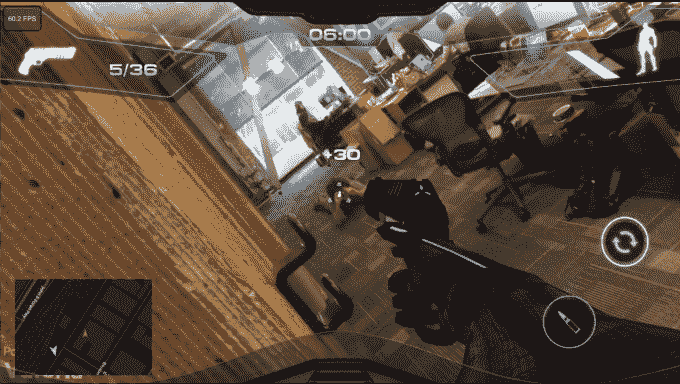

# 这款售价 18 美元的智能手机将你的世界变成增强现实第一人称射击游戏 

> 原文：<https://web.archive.org/web/https://techcrunch.com/2016/02/23/this-18-smartphone-gadget-turns-your-world-into-an-augmented-reality-first-person-shooter/>

# 这款售价 18 美元的智能手机可以把你的世界变成一个增强现实的第一人称射击游戏

生活只是一场与父亲的激光枪战游戏。我有机会玩了该公司 Inceptor 智能手机加密狗的早期原型及其增强现实大型多人第一人称射击应用程序。这是一个爆炸。

该公司今天将在 Indiegogo 上发布，目标是筹集 5 万美元。查看上面的视频，看看蒂托和我在玩 Father.io 时惹恼了 TechCrunch 办公室的每个人。

抛开高科技激光枪战游戏的乐趣不谈，你会发现 Father.io 实际上有着巨大的野心，要创造一个增强现实的大型在线多人第一人称射击游戏。

Indiegogo 的活动为一个由邪恶力量领导的黑暗未来搭建了舞台，我 99%确定这是亚马逊的 Alexa。

> 父亲。木卫一是另一个现实的未来，设定在技术奇点之后不久。人工智能已经超越人类智能，物联网将整个世界连接到网络。人类创造了“以太神”(Ethereus)，一种超级云计算机，能够在人工进化的永久和超加速过程中重新设计自己。

尽管对虚拟现实空间中游戏的承诺进行了大量的宣传，但现实中固有的技术困难使得人们对增强现实游戏的兴趣暂时搁置。父亲爱娥当然雄心勃勃。这款游戏旨在成为一款主要的跨平台 AR 体验，用户可以利用智能手机、智能手表、电脑甚至怪异的无人机来玩游戏。

或许最令人兴奋的是，参与这一行动的成本非常低。这款名为 *Inceptors* 的智能手机附加产品，早期支持者的起价仅为 18 美元。根据该公司的估计，这些设备应该在夏末开始发货。

除了红外装置可以让你射击附近的玩家，它们还可以在“敌人”进入你的区域时提醒你，这样你就可以准备好对付他们了。

无论你是为了与朋友一起玩激光枪战的高科技游戏的承诺而购买 Father.io，还是真正投身于“以太神”(Ethereus)，这种独特的增强现实游戏绝对是一种有趣的体验。