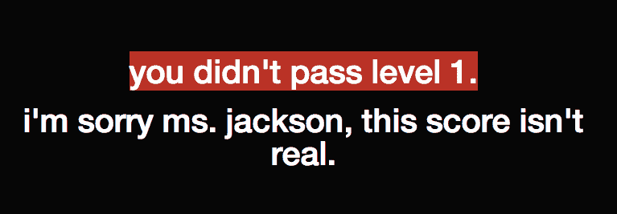
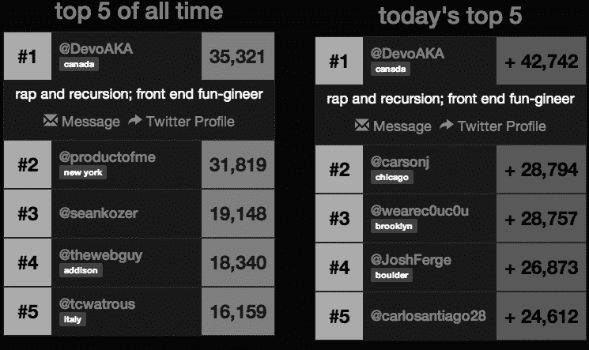

# 这位 21 岁的年轻人从大学辍学来测试我们的说唱知识

> 原文：<https://web.archive.org/web/https://techcrunch.com/2014/06/18/this-21-year-old-dropped-out-of-college-to-test-our-knowledge-of-rap/>

德雷克、Jay-Z、Kanye:你能在短短几秒钟的音频中说出他们的歌曲吗？21 岁的丹尼·星期五对它们了如指掌。他 12 岁开始编程，14 岁开始痴迷说唱。他现在从大学辍学，来到硅谷众包世界上最大的说唱粉丝。进入[Rap 测试](https://web.archive.org/web/20230325082431/http://www.theraptest.com/)。

这款游戏仅在五天前上线，已经有超过 16 万的访问者，玩了超过 62 万的游戏。“它收到了 NPR 发来的推特，现在 MC Hammer 在推特上关注我，”Friday 说。

俄罗斯阿姆粉丝团体的某个人甚至在周五联系了他，看他是否能把这个网站翻译成俄语。“当我们有 300 多人半夜在法国演出时，我们知道我们已经到了关键时刻。”“我们”是室友乔希·因迪格和因迪格在费城的朋友克里斯·巴雷特。

游戏是这样运作的:你从一个说唱歌手列表中选择你的艺术家，然后网站播放 15 秒钟的音频片段，你必须从中决定播放哪首歌。对任何有收音机的人来说，偶尔听听嘻哈音乐应该很容易。(旁注:我为了坎耶连第一关都过不了。星期五向我保证，这可能只是一个错误，但我很肯定他是友好的。)

任何人都可以玩，但那些想要战斗的人可以通过 Twitter 注册，然后比较他们在网站排行榜上的位置。

星期五，当我们在旧金山 SoMa 的一家奶品店见面时，几乎是泪流满面。他一直在夜以继日地工作，包括周一这位传奇说唱歌手的 43 岁生日的图派克·夏库尔测试。

他也可能因为睡眠不足和说唱天才联合创始人 [Mahbod Moghadam](https://web.archive.org/web/20230325082431/http://www.crunchbase.com/person/mahbod-moghadam) 最近的一条推文而有点情绪化:

星期五盯着他的手机，摇了摇头。“那是验证。对不起，我现在很情绪化，”他说。他穿着一件自制的 t 恤，正反两面都有《美国某地》中 Jay-Z 的歌词

游戏看似简单有趣。但正如 Friday 解释的那样，这并不简单——这也不是他第一次尝试病毒式传播。说唱测试实际上是坎耶测试的一个迭代。但是星期五打算用他的最新发明来扰乱唱片公司获取数据的方式。

星期五说，我们不是典型的“混蛋”，指的是他的三人开发团队。他通过与尼尔森收视率的比较解释了他的意思。Friday 认为 Nielsen 垄断了音乐数据，这太贵了，而且对唱片公司行业没有帮助( [RIAA](https://web.archive.org/web/20230325082431/https://www.riaa.com/index.php) 也出借行业数据)。

近几十年来，随着 Spotify 和 iTunes 等流媒体服务的兴起，音乐行业的专辑销售收入大幅下降。“我不是来整顿音乐产业的……这到底是什么意思？但我有一些有用的东西。”

虽然这个游戏看起来很有趣，但是星期五是一个非常严肃的人。他是那种会制作成本电子表格的人，他会列出一系列目标。他愿意尽一切努力去实现它。这个家伙实际上住在旧金山卡斯特罗区一所房子的壁橱里，和一群 Thiel Fellows 作为室友。他说这让他一直在努力。他也读了很多书，并说他关注那些在网上传播的东西。他甚至等了一个星期才发布 Rap 测试，以确保所有必要的元素都准备好了。

现在的目标是引进一名专门的说唱歌手(有传言说，他正在和一个大人物谈判——你可能认识他，但周五还不能透露)，并增加不仅仅是说唱和嘻哈音乐。他还希望从能够欣赏他所构建的东西及其对大数据的潜力的人那里获得一些资金。