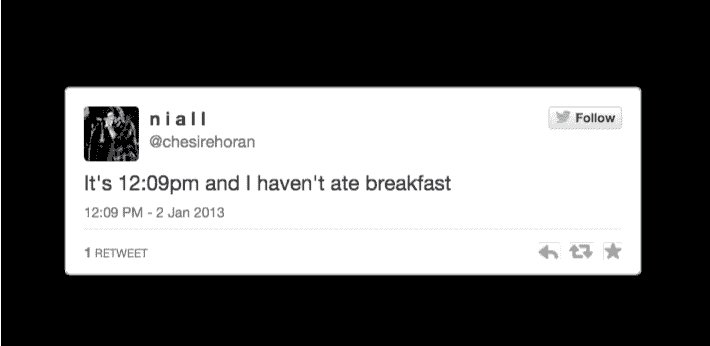

# 这个艺术项目将世界上的推文变成了时钟 

> 原文：<https://web.archive.org/web/https://techcrunch.com/2014/12/13/this-art-project-turns-the-worlds-tweets-into-a-clock/>

# 这个艺术项目将世界上的推特变成了一个时钟

不要看钟。你知道现在几点了吗？

Twitter 确实如此。事实证明，人们*喜欢*发关于时间的微博。那么，为什么不把 Twitter 的消防水管变成一个巨大的众包时钟呢？

这就是所有这些分钟背后的想法。该时钟由荷兰技术与艺术工作室[为正在](https://web.archive.org/web/20221007195618/http://studiomoniker.com/) [Van Abbemuseum](https://web.archive.org/web/20221007195618/http://vanabbemuseum.nl/en/programme/detail/?tx_vabdisplay_pi1%5bptype%5d=18&tx_vabdisplay_pi1%5bproject%5d=1464) 进行的展览建造，每隔几秒钟就会发布一条与当前时间直接相关的不同推文(基于您的系统时钟，以实现国际兼容性)。

我已经看了几个小时的推文，下面是我学到的:

*   中午时分，人们喜欢发微博说他们还在睡觉
*   下午三点左右，人们开始抱怨饥饿或无聊
*   一天 24 小时，人们都喜欢发微博说自己嗨了或者喝醉了。

我想要这样的东西整天在我桌上的小屏幕上运行。BRB，找个老朋友来黑。