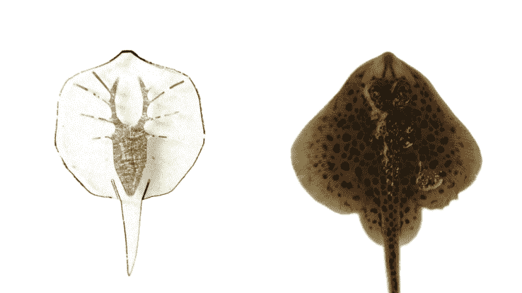

# 这条人造黄貂鱼有着金色的骨架和光激活的老鼠肌肉

> 原文：<https://web.archive.org/web/https://techcrunch.com/2016/07/07/this-artificial-stingray-has-a-gold-skeleton-and-light-activated-rat-muscles/>

模仿大自然最优雅的设计已经成为制造同样优雅的机器人的流行方法( [close，](https://web.archive.org/web/20230326073041/https://techcrunch.com/2016/06/28/the-pleurobot-robo-salamander-crawls-and-swims-like-a-real-amphibian/)反正)——但是也使用大自然的原材料吗？这就是哈佛大学 Wyss 研究所的研究人员所做的，他们创造了一种微小的光控黄貂鱼，它有着纯金的骨架，利用重组的老鼠肌肉移动。啊，美丽的新世界！

由哈佛大学的 Sung-Jin Park 和 Kevin Kit Parker 领导的研究人员从骨骼开始，以大约 1/10 的比例工作于它所基于的 batoid 鱼(包括鳐鱼和鳐鱼),并再现了这种生物实际解剖结构的简化版本。

他们从骨骼开始研究:黄金是有弹性的，不会起反应，他们将脊柱和肋骨设计成自然的凸面。在肋骨周围，他们培养了老鼠来源的心肌，这种心肌经过基因改造，对光做出反应，而不是通常来自神经系统的电信号。整个东西被包裹在一个非常像小射线形状的弹性护套中。

“小滑板”旁边的人造光线

这里有一张[更详细的图层和动力图](https://web.archive.org/web/20230326073041/https://techcrunch.com/wp-content/uploads/2016/07/paperfigurestingray.jpg)。

注意:在这种情况下，“机器人”并不能充分抓住事情的本质。然而，尽管含有必须生长和进食的活细胞，它也不完全是动物。它的创造者疯狂地命名:“组织工程软机器人射线”、“生物混合系统”、“人造动物”和“生物启发游泳机器人”，没有一个完全令人满意。“生物机器人”——或者可能是“生长机器人”，因为它们是培养的，而不是组装的——似乎是一个更吸引人的选择。

蝙蝠鱼四处游动的动作简单而优雅:它们的身体本质上是一个大鳍，它们在受控的波浪中波动，使自己向后、向前或转向一侧。

在人工射线中，肌肉在受到刺激时只需向下用力；反方向的黄金肋骨弯曲提供了反作用力，当肌肉放松时，那部分鳍向上弯曲。营养物质是由浸泡整个东西的溶液提供的。

转向是通过比另一侧更强烈地刺激身体的一侧来完成的，肌肉的光反应性质使它们自然地向光源移动。你可以在下面看到这个网络生物:

单独来看，这个小生物机器人的每一个方面都是非凡的，但将它们加在一起产生的协同作用使整个事情令人惊讶。事情的每一个方面要么是机器人学——模仿生物学，要么是生物学——模仿机器人学。研究人员对每一个过程的控制范围和精确度显而易见，这个生物机器人代表了一个新的领域，这个领域的成就已经几乎令人难以置信。

这足以让这个团队成为《科学》的封面故事——它如此引人注目，以至于《华尔街日报》刊登了一篇关于[如何拍摄射线](https://web.archive.org/web/20230326073041/http://science.sciencemag.org/content/353/6295/97)的完整报道。

但是，我们不要被夸张的说法冲昏头脑，比如研究人员创造了人工生命或某种可怕的“莫罗博士岛”式的怪物——这对后者来说肯定太可爱了，而前者夸大了这种情况。

对于这项研究中包含的所有专业知识和进步，最终的产品本质上是纯机械的。没有神经、消化、循环、感知或生殖系统；它确实是一个生物增强的机器，而不是机械增强的有机体。

毫无疑问:尽管这种人造射线的创造困难重重，令人印象深刻，但它代表了在复制生命的微妙而强大的工具时，对简单的 T4 问题的一系列解决方案。即使是最简单的神经系统也超出了我们精确模拟的能力，更不用说再造了——而人类的大脑要大很多数量级，也更复杂——事实上，它几乎肯定是我们所知的最复杂的系统。

也就是说，生物工程和机械工程之间这种程度的融合确实是一项了不起的成就。生物仿生学被发现于机器人学和其他科学的前沿，这是有充分理由的:直到最近，我们才开始接近甚至是最基本的专业知识水平，而大自然已经用这些知识创造了数十亿年的生物。