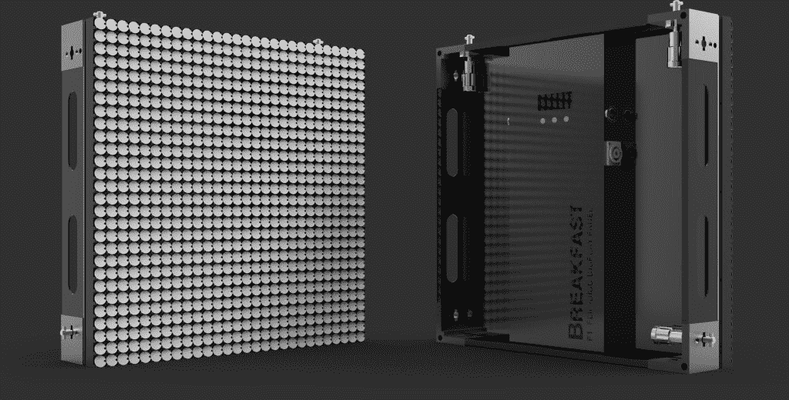

# 这个聪明的点屏幕是你的高科技时髦办公室 TechCrunch 的一个有趣的部件

> 原文：<https://web.archive.org/web/https://techcrunch.com/2016/11/29/this-clever-dot-screen-is-a-fun-widget-for-your-high-tech-hipster-office/>

# 这个聪明的点屏幕是你的高科技时髦办公室的一个有趣的部件

看，都 2016 年了。谷物棒、宠物美容站、小睡舱和乒乓球室不足以让一个年轻的程序员热血沸腾。你需要独特的东西。你需要一个翻盘系统。

这个系统是由一家早餐公司创造的，基本上是你过去在机场看到的大规模模拟数字标牌的现代版本。使用磁控开关，每个像素立即从暗到亮(或从暗到彩色)翻转。这意味着您可以创建单色动画或标牌。

显然，像这样的屏幕用途有限，但它绝对是你时髦的办公室的一个不错的谈资，可以取代你在前台的讽刺性的会说话的鱼。

【YouTube = https://www . YouTube . com/watch？v=HeXISRDQE8w]

该公司写道:“The 在这个系统中的核心创新是 F1 翻转盘显示面板。”这些 17 英寸 x 17 英寸的模块化面板每个包含 784 个半英寸的翻转盘，可以排列成任何整体屏幕尺寸或形状。有了 32 个面板，您可以设计一个 11 英尺 x 5.5 英尺的矩形显示器，或者一个 17 英尺高 45 英尺长的单行显示器。翻转光盘以及容纳光盘的外壳都可以定制。对于特定的颜色。”

它还带有一个控制器应用程序，你可以添加一个 3D 摄像头来创建有趣的视频和文本装置。还有一个为喜欢冒险的人准备的 API。价格取决于您购买的数量，他们现在接受预购。

虽然磁点翻转屏幕不会像辣酱搅拌站或私人足部按摩师那样吸引人才，但很高兴知道你可以通过在潜在雇员进入时让他们的名字以黑白形式出现来打动和激发他们，或者，除此之外，当他们经过你在 Mission 的豪华办公室时给风投发信息(“救命！我们需要钱！”).

【YouTube = https://www . YouTube . com/watch？v=7oSH-aZKyU8]