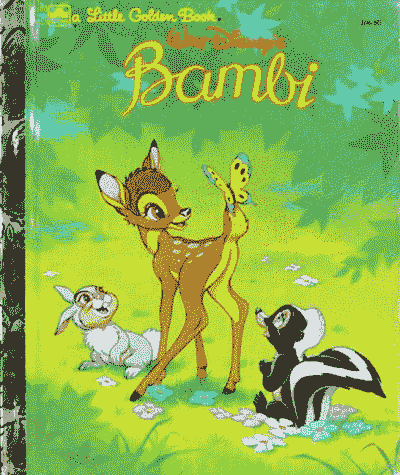

# 这款迪士尼 AR 应用可以成为智能涂色书的秘密玩法

> 原文：<https://web.archive.org/web/https://techcrunch.com/2017/08/23/this-disney-ar-app-could-be-a-stealth-play-for-smart-coloring-books/>

当我们在博物馆大厅里漫步时，谁不想给我们路过的画作做一点小小的修饰呢？迪士尼已经创建了一个增强现实应用程序来实现这一点，但鉴于该公司的核心竞争力，我不禁想知道博物馆用例是否只是另一个的烟幕弹——具体来说，就是数百万本普通故事书的智能化。

[该研究项目被称为 AR 博物馆](https://web.archive.org/web/20230324103533/https://www.disneyresearch.com/publication/ar-museum/)，正如你所料，这是一款在你浏览博物馆时使用的应用程序。但它避开了成年人会想到的明显的 AR 应用，比如为你用手机指向的画作提供额外的背景，直接进入“我想知道梵高有蓝色皮肤会是什么样子？”

绘画被组织成可以通过触摸重新着色的区域。所以在某种程度上，app 只是一个花哨的油漆桶；事实上，当你用它来给这些区域重新着色时，虚拟颜料滴会从你的设备中飞出，落在画布上。但是事情远不止如此。

如果在创建图像时已经考虑到这一点，那么像这样对图像重新着色是很容易的——例如，在一个层上使用肤色，在另一个层上使用天空等等。如果是一幅画，这些区域需要在后期处理中定义，但正如研究人员指出的那样:“手动创建复杂画作无缝重新着色所需的图层对艺术家来说是一项乏味的任务。”

现在通常我会说，“但对于深度学习模型来说，这是轻而易举的事情。”与目前图像处理领域的几乎所有人不同，研究人员没有使用机器学习，而是用普通的加权方法分解了绘画的组成颜色。(对于这种有界性很好的问题，它实际上是一个更好更简单的解决方案。)

该过程在一分钟内将一幅画分割成有用的颜色区域，这是艺术家手动完成时间的十分之一，并且对于应用程序的目的来说做得更好。这种预处理可以在博物馆的所有画作中完成，因此当你(可能在另一个应用程序中)浏览印象派运动的时间线时，孩子们可以自娱自乐地将星光灿烂的夜晚变成星光灿烂的白天。

但我认为这是他们偷偷摸摸的地方。

迪士尼为什么突然这么关心博物馆了？你能想到其他*有绘画艺术的*吗，孩子们可能喜欢着色和重新着色，但却被禁止？也许成千上万的家庭正坐在那里，等待着科技的魔力给他们注入新的生命？

 是的！所有那些旧故事书！数百万本，在全球各地的货架上。迪士尼可以非常容易地用所有需要的资产来训练应用程序，以识别和重新着色这些经常被遗忘的宝藏。突然间，书籍被赋予了新的生命，也许与它们的 AR 交互就建立在这个平台上，并且使用该技术进行更奢侈的重铸。《火星上的斑比》、《狐狸和斑点狗》等。

当然，他们失去了一些销售，因为孩子们没有亲自给实体书上色，但他们获得了一批专注的孩子，他们将 AR 视为与迪士尼资产互动的自然方法。至少在我的幻想中是这样的。

至少它是一个整洁的工具，可以很容易地在去博物馆的途中占据一个孩子的手。如果不止如此，正如我猜想的那样，这可能是让一些经典书籍多使用几年的一个好方法。