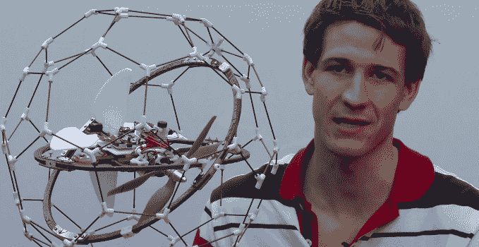
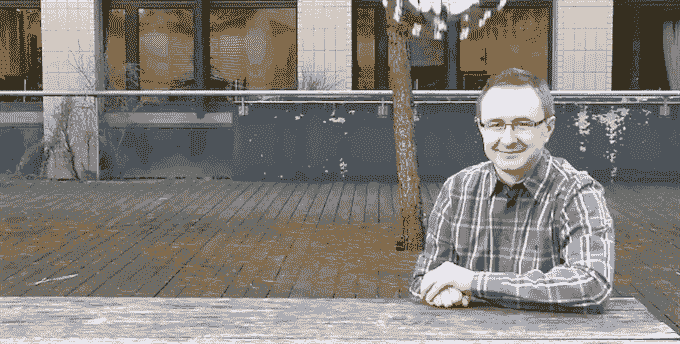

# 这种无人机可以拯救生命，并在室内飞行，而不会不断坠毁 

> 原文：<https://web.archive.org/web/https://techcrunch.com/2015/02/09/this-drone-can-save-lives-and-fly-indoors-without-crashing-constantly/>

# 这种无人机可以拯救生命，并在室内飞行，而不会不断坠毁

一栋大楼着火了。里面可能还有人。

传统上，我们会派一名消防队员去侦察——但这让更多人面临生命危险。一定有更好的方法，对吗？

我们可以派出一个机器人，但是绝大多数的现代机器人在登上像楼梯这样的卑鄙敌人的那一刻就会悲惨地失败。

我们可以派一架无人机飞来飞去，但众所周知，无人机在室内很难操控。如果它的任何一个螺旋桨碰到墙壁，它会立刻盘旋着坠落地面。

更糟糕的是:如果它夹伤了人，许多无人机螺旋桨都有足够的能力划破皮肤。现在你被困在燃烧的大楼里*和*被原本要救你的东西攻击。

见见标准无人机上的 **GimBall** ，一个非常聪明的(我不经常用这个词)旋转。

[https://web.archive.org/web/20221006162621if_/https://www.youtube.com/embed/TIpqxsVDgVs?feature=oembed](https://web.archive.org/web/20221006162621if_/https://www.youtube.com/embed/TIpqxsVDgVs?feature=oembed)

视频

围绕 GimBall 无人机核心的是一个球形笼，它有三个目的:让它沿着墙壁或天花板滚动，使设备的螺旋桨远离你的皮肤，并吸收震动以使设备保持在空中。

笼子由一个多轴万向架系统(因此得名“万向架”)固定，允许笼子独立于其核心的螺旋桨/摄像机装置旋转和滚动。

当然，这看起来像是直接从反乌托邦科幻噩梦中扯出来的东西——就像《星球大战》中的机器人迪卡和《T2》中的曼哈克混合在一起。但这不是追捕叛军，而是拯救生命——在红外相机(用于透过烟雾观察)和抗坠毁外壳之间，很容易想象它在不太遥远的未来会这样做。

似乎其他人也会同意:GimBall 背后的公司 Flyability 刚刚在国际[无人机大赛](https://web.archive.org/web/20221006162621/https://www.dronesforgood.ae/)中击败 20 多个其他团队，赢得了 100 万美元的奖金。

唉，现在它还是一个原型——虽然该公司希望在明年左右将它变成一个商业产品，但它现在还不可用。

