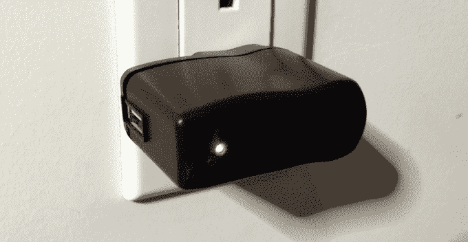
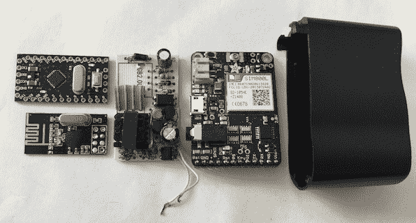

# 这个假的手机充电器实际上正在记录你输入的每一个键

> 原文：<https://web.archive.org/web/https://techcrunch.com/2015/01/14/this-fake-phone-charger-is-actually-recording-every-key-you-type/>

# 这个假的手机充电器实际上正在记录你输入的每一个键

“墙上突出来的那个手机充电器是谁的？哦。这一定是本的。本总是把他的充电器留在工作的地方。经典本！”

唉，不是本的充电器。见鬼，这根本不是充电器。它实际上是一个伪装成手机充电器的小间谍设备*，能够嗅出你在桌上无线键盘上键入的每一个键。哦，它可以把它听到的东西直接发送到窃听者的手机上。哦！哦！即使你拔掉它，它也会继续工作——它只是假装关机。*

上面那个小盒子是由 Samy Kamkar(没错，就是这个 Samy，他创建了今天肆虐 Myspace 的以[命名的蠕虫](https://web.archive.org/web/20230405174804/http://en.wikipedia.org/wiki/Samy_%28computer_worm%29)，还在几周前创建了那个[疯狂免提黑客项链](https://web.archive.org/web/20230405174804/https://techcrunch.com/2014/12/18/this-little-usb-necklace-hacks-your-computer-in-no-time-flat/))创建的，他称之为“KeySweeper”

在你惊慌失措把键盘扔进垃圾桶之前，这里有一个好消息:这个特定的设备只影响某些无线键盘。最值得注意的是，微软品牌的无线键盘。我们仍在努力挖掘一个更详尽的列表，但现在，让“微软无线键盘”成为你的警示标志。

在一份声明中，微软指出，它只影响 2011 年 7 月之前发布的 2.4 Ghz(不是蓝牙)键盘(**更新:**见本文底部黑客背后的人 Samy 对此的说明)。即使是“唯一的”旧键盘，记住:除了游戏玩家，大多数人不会经常更新他们的键盘。

**这里有一些 KeySweeper 可以做的更疯狂的事情:**

*   在你打字的时候嗅出击键的声音。
*   如果它检测到某些击键(如“TopSecretWebsite.com”)，它可以抓取随后的文本块(如您的用户名和密码)，并通过短信发送给安装该设备的人。
*   在设备上存储击键记录。这些日志可以通过硬连线 USB 从设备中提取，或者通过将第二个 KeySweeper 设备放在第一个设备的范围内(比如说，墙另一侧的插座)。
*   插上电源后，它从墙上获取电能。
*   当一个异常多疑的旁观者从墙上拔掉电源时，它*看起来*好像断电了——但实际上它只是切换到电池供电。继续记录/发送。太棒了。

从好的方面来看，*如今销售的大多数*品牌无线键盘使用的加密方法有点难以破解。例如，罗技在其所有无线产品上使用 128 位 AES(参见本文档第 6 页的[以供参考)。](https://web.archive.org/web/20230405174804/http://www.logitech.com/images/pdf/roem/Logitech_Adv_24_Ghz_Whitepaper_BPG2009.pdf)

Samy 估计每个单元将花费 10 到 80 美元来构建，这取决于你想要什么样的功能(例如，放弃短信支持会使它下降大约 45 美元)——但很快指出他不是真正销售这些的*而不是*。

你可以(也应该！)在这里阅读 Samy 的[项目的完整分解。](https://web.archive.org/web/20230405174804/http://samy.pl/keysweeper/)

**更新:**虽然微软表示只有 2011 年 7 月之前的键盘会受到影响，但 Samy 给我发了一封短信，指出这些键盘仍在销售，似乎是制造的:

> 只是想提一下——虽然微软声明它只影响 2011 年之前的键盘，但易受攻击的键盘今天仍在生产和销售，甚至来自微软自己的网站和像百思买这样的主要零售商。
> 
> 我上个月刚刚从百思买购买了全新的易损坏键盘，序列号旁边的日期显示“2014 年 7 月”

