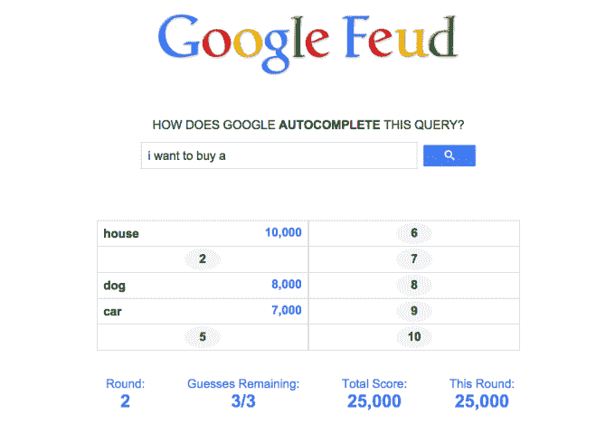

# 这个游戏把谷歌自动完成变成了一个家族争斗的游戏

> 原文：<https://web.archive.org/web/https://techcrunch.com/2015/03/14/this-game-turns-google-autocomplete-into-a-game-of-family-feud/>

# 这个游戏把谷歌自动完成变成了一个家族争斗的游戏

该死，这比我想象的有趣多了。

你有没有在谷歌上输入东西，只是为了看看自动完成框里会弹出什么奇怪的东西？

[谷歌世仇](https://web.archive.org/web/20230214025448/http://www.googlefeud.com/)采用了这个概念，并把它变成了一个家庭世仇式的游戏。你对 hivemind 了解多少？

GoogleFeud 提供了搜索查询的前半部分，您填写剩下的部分。你的目标是尽可能多地猜测最流行的查询。

如果它提出“我是否应该出售我的……”例如，你可能会猜“房子”、“汽车”或“狗”。如果你的猜测符合谷歌访问者搜索的最流行的查询之一，你就得一分；如果没有，你就出局了。三振出局，游戏结束。例如，想看看上面那块板的答案吗？[给你。](https://web.archive.org/web/20230214025448/https://techcrunch.com/?attachment_id=1132248)

我注意到的一个缺点是:该引擎不太擅长组合类似的结果，这是真正的*家庭不和*在幕后造成的。你的回答也必须绝对具体——如果你说“飞机”,而答案是“飞机”,那就是罢工。

撇开怪癖不谈，消磨几分钟，看看你能多好地预测大众的惊奇，这是一种非常有趣的方式。

你首先从四个类别中选择一个:文化、人、名字和问题。我建议从名字开始，因为它似乎最不容易受到上述缺点的影响。

额外提示:没有内置的多人游戏选项，但它仍然是一个与朋友合作玩的非常棒的游戏。我花了一上午时间和我的未婚夫一起头脑风暴猜测——虽然这个游戏完全打败了我们，但我们玩得很开心。

你可以在这里找到[谷歌世仇。](https://web.archive.org/web/20230214025448/http://www.googlefeud.com/)

*哦，还有一点有趣的琐事:这个游戏是由[贾斯汀·胡克](https://web.archive.org/web/20230214025448/https://twitter.com/justinhook)制作的，他帮助撰写了《开心汉堡店》和 5 集《开心汉堡店》漫画系列。*

[ [通过 ProductHunt](https://web.archive.org/web/20230214025448/http://www.producthunt.com/posts/google-feud)