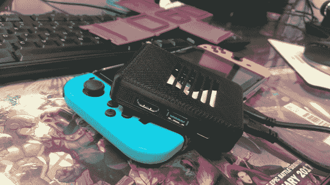
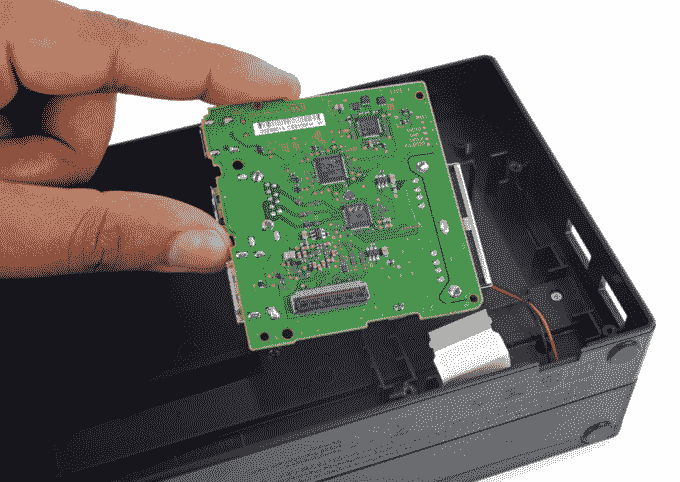

# 这家伙为他的任天堂 Switch 造了一个旅行码头，我也想要一个

> 原文：<https://web.archive.org/web/https://techcrunch.com/2017/05/02/this-guy-built-a-travel-dock-for-his-nintendo-switch-and-i-want-one/>

# 这家伙为他的任天堂 Switch 造了一个旅行码头，我也想要一个

我爱我的任天堂 Switch。几乎是一个不合理的数目，真的。在这一点上，它已经和我一起旅行了数千英里，我可能已经在*野性的呼吸*中绕着 Hyrule 旅行了同样远的距离。

不过，Switch 缺少的一点是更便携的坞站。一个旅游码头，如果你愿意的话。它可以让我在旅途中将开关连接到电视上，而不必随身携带笨重的家庭坞站。正如我们从各种拆卸中了解到的[，除了一小块 3″的板，船坞里面几乎是空的:](https://web.archive.org/web/20230323163258/https://www.ifixit.com/Teardown/Nintendo+Switch+Teardown/78263#s156438)

*(这是官方 dock 里面的东西。图片来源:iFixit)*

为什么不做一些更紧凑的东西呢？这个人就这么做了。

Redditor [imnotashinobi](https://web.archive.org/web/20230323163258/https://www.reddit.com/r/NintendoSwitch/comments/68n86d/nintendo_switch_dockling/) 拆除了一个官方坞站，3D 打印了一个两件式外壳，去掉了所有多余的空间，做了一些电缆折纸，嘣:他有了一个坞站，正好可以放入他携带开关的外壳中。他称之为“Dockling”(鸭子，小鸭。码头，码头。聪明！)

你可以通过 USB-C 插入开关，而不是将开关插入坞站。在另一端，你有另一个 USB-C 端口(用于电源)和一个 HDMI 端口(用于将其连接到电视)。这意味着随身携带一两根额外的电缆，但电缆更容易装进行李箱，而且不太可能被压碎。

这仍然是一个概念验证，但他的最终目标是将这些箱子(你必须自带内部零件)卖给其他想要更便携的东西的人。

但是真的，任天堂:人们想要这个。如果你做不到，别人会的。