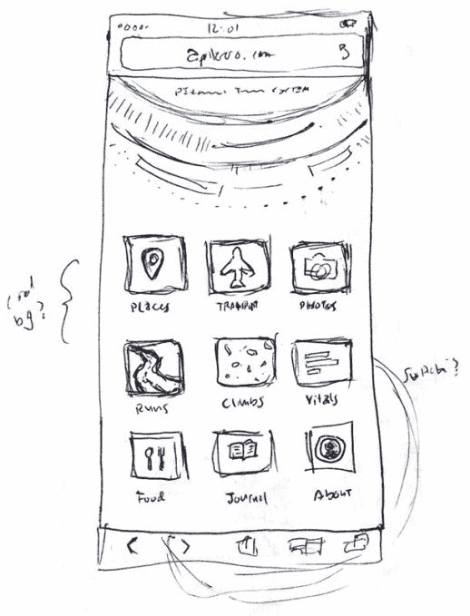
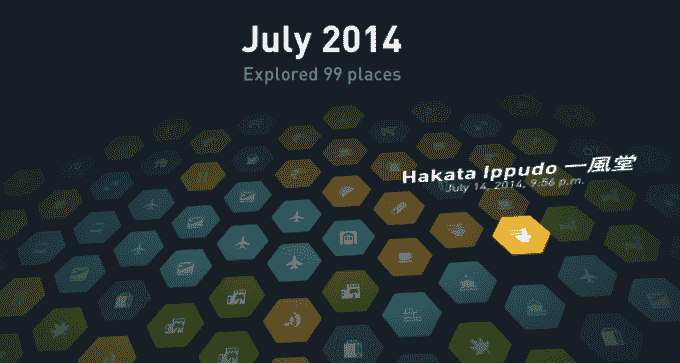
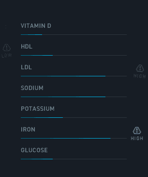
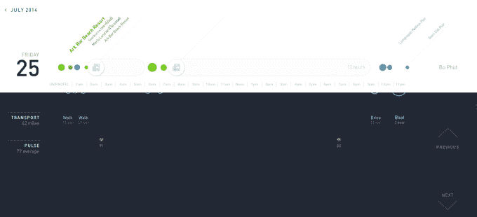

# 这家伙追踪自己的一切，并把它放到网上让所有人都看到 

> 原文：<https://web.archive.org/web/https://techcrunch.com/2014/08/07/this-guy-tracks-everything-about-himself-and-puts-it-up-online-for-everyone-to-see/>

软件开发和设计师[阿南德·夏尔马](https://web.archive.org/web/20221006110527/http://www.crunchbase.com/person/anand-sharma)在三月份开始追踪关于他自己的一切，包括他一天走了多少步，走了多远，他是如何到达那里的(骑自行车，走路，坐飞机等等)，甚至他一天中有多少 GitHub 提交或 [Instagram](https://web.archive.org/web/20221006110527/http://instagram.com/aprilzero) 上传。

这个想法似乎已经酝酿了一段时间。Sharma 在四月份辞去了他在 Quizlet 的设计总监的工作。正如他所说，104 天，9 个国家，60 个城市，1280 次承诺和 14 个墨西哥卷饼之后，[四月零点](https://web.archive.org/web/20221006110527/http://aprilzero.com/)，他建立的跟踪关于他自己的一切并向世界展示的网站诞生了。

夏尔马在他的手机上使用各种应用程序，如 [Nike+](https://web.archive.org/web/20221006110527/https://secure-nikeplus.nike.com/plus/) 、 [FourSquare](https://web.archive.org/web/20221006110527/https://foursquare.com/) 和 [Moves](https://web.archive.org/web/20221006110527/https://www.moves-app.com/) 来跟踪这一切。他甚至制作了一个如何布置的插图，并在 4 月 0 日发布，这样我们就可以看到他是如何组织的。正如他在网站上所说，“我测量了自己的心率 494 次，通常是每分钟 69 次。在过去的 130 天里，我在这个网站上发了 1494 条信息，跑了 32 趟&吃了 15 个玉米煎饼。”这个人喜欢他的墨西哥卷饼。

他每天追踪的所有健康信息:

*   每天走路的脚步
*   最新跑步记录，包括速度、距离和地图
*   攀岩运动
*   全天心率
*   重量
*   体脂%
*   血液水平

他每天追踪的其他东西:

*   Github 提交(更改的文件和代码行数，提交消息)
*   Instagram 上的照片
*   小鸟叫声

他追踪的尚未公开展示的东西:

*   我在电脑/手机上做的事情(我去了哪些网站，阅读和回复了多少封邮件，在 Photoshop 中的活动，等等。)
*   睡眠
*   食物和饮料
*   情绪
*   水肺潜水(位置、深度、看到的物种等。)

当我伸手问他为什么要大费周章地追踪这一切，并在网上展示给全世界看的时候，夏尔马正在 Arkbar 享受一个小小的 R&R。他坦率地告诉我，“知道我的活动正在被跟踪并向全世界公布，这真的是做有趣的事情或更加努力的巨大动力。尤其是像是要不要去跑步，或者我跑多快/多远这样的事情。如果没有其他人在看，我可能会抄近路，但现在我觉得我要承担责任，否则我会让我的访客和朋友失望。我也发现自己出去的次数更多了，去了更有趣、更多样的地方。今年早些时候，我会每周去同一个墨西哥卷饼店 5 次；味道很好。现在我发现自己为了历史记录的利益，试图把它混在一起。”

他还说这有助于他做出总体上更好的决策。夏尔马用他如何跟踪自己的维生素水平来说明这一点。“我的维生素 D 现在很低，所以我知道我需要多晒晒太阳，并且不要忘记服用维生素。我想我已经习惯了在数字界面上看东西，这已经成为我最容易思考和处理信息的方式。看到它随着我做的事情而改变，就形成了一个很好的反馈回路，”夏尔马告诉我。

他说，视觉和日常跟踪效果更好，因为数据往往与我们的记忆有所不同，我们的记忆更具选择性和局限性。

“在一个时间永远不够用、所有事情都试图吸引你注意力的世界里，找到正确的平衡真的很难，这有助于让事情变得简单一些。”

他还查看并跟踪他去过的所有地方，在这些地方之间旅行(步行、驾车、飞行、乘船等。)，花了多长时间，走了多远，甚至是走了什么路线到达那里。

“我的位置是我追踪的最重要的东西，也是所有其他数据的支柱，”Sharma 说。"它给出了所有的上下文，否则它将只是一堆不相关的统计数据."

所有这些对一个人来说都很好，但夏尔马暗示了一个更大的计划。他正在建造一个他称之为陀螺仪的东西。

夏尔马说:“基本上，陀螺仪是我已经完成的产品的第二版。“自从推出[April Zero]以来，我收到了数百条来自人们的信息，询问他们如何才能获得自己的产品，他们中的许多人都不在硅谷，希望为它付费。在看到它的运行和使用实时数据后，我认为一个自然的反应是“哦，是的，我需要这个。"

他告诉我，对于大多数人来说，实际的实现会非常不同。“大多数人根本不在乎攀岩。很多人不编码或者没有 Github 提交。这些事情对我来说特别有意义，”夏尔马说。

他的基本愿景——衡量、可视化和理解你个人关心的事情——适用于每个人。“不再需要出去买一个 100 美元的手镯或其他东西来开始。他告诉我:“告诉人们立即下载一个免费的应用程序，比买了东西等一个星期再来要好得多。”。

夏尔马在制造陀螺仪的同时，还需要解决隐私和安全等一些问题。“我已经向全世界公开了我的所有信息，但我当然不希望其他人这样做，”夏尔马说。但他也相信分享个人信息的力量，就像他一样。“想象一下，你的一些朋友很容易就能看到你昨天做了什么，或者你最近心情是否好。我想制作一些工具，能够在保持隐私的同时，轻松地与信任的朋友分享，尤其是对于医学和敏感的东西。”

根据 Sharma 的说法，从 4 月 0 日开始的时间线将是陀螺仪的核心组件之一。他还暗示将包含更多样、更有趣的数据选项。一些可以为每个人定制的小东西，也许是个性化的？看起来，有些东西现在还处于构思阶段。与此同时，夏尔马计划继续向我们更新他的静息心率，最后一次潜水的照片，以及他最后一次摇壶铃的地点。根据网站显示，看起来他现在在东京。

