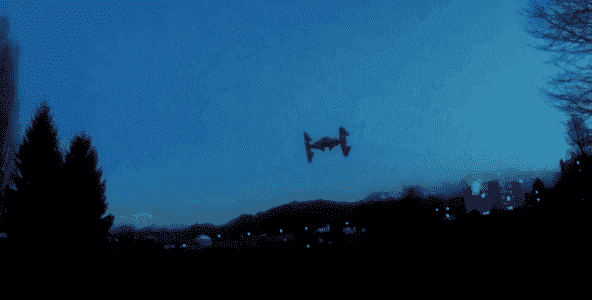
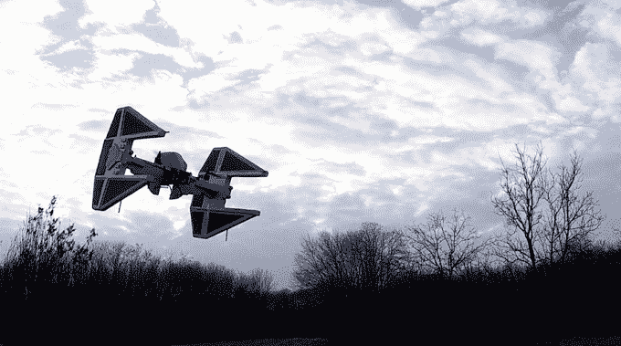

# 这家伙把他的无人机变成了星球大战 TIE 战斗机 

> 原文：<https://web.archive.org/web/https://techcrunch.com/2015/03/02/this-guy-turned-his-drone-into-a-star-wars-tie-fighter/>

# 这家伙把他的无人机变成了星球大战 TIE 战斗机

还记得几周前定制的千年隼四轴飞行器吗？它最好小心点。叛军联盟不再是唯一一个空中有鸟的联盟了。

作为他的千年隼项目的后续，法国遥控业余爱好者 [Olivier_C](https://web.archive.org/web/20221006194842/http://www.rcgroups.com/forums/showthread.php?t=2331840) 建造了第二架四轴飞行器——但这一次，他是为帝国建造。

[https://web.archive.org/web/20221006194842if_/https://www.youtube.com/embed/rFa0D1fq54k?feature=oembed](https://web.archive.org/web/20221006194842if_/https://www.youtube.com/embed/rFa0D1fq54k?feature=oembed)

视频

奥利维尔模仿《绝地归来》中的 TIE 截击机，他说这个家伙花了大约 15 个小时来设计，并且“至少花了同样多的时间”来让它正常飞行。最后，至少有 14 个螺旋桨为此牺牲了——包括几个把碳弹片射进他车库墙壁的螺旋桨。

它能让凯塞尔在不到 12 秒差距内运行吗？那鸿但是它可能会让当地公园的一些人大吃一惊。

相比之下，他的千年隼的首次飞行:

[https://web.archive.org/web/20221006194842if_/https://www.youtube.com/embed/GRtXd1eiH-s?feature=oembed](https://web.archive.org/web/20221006194842if_/https://www.youtube.com/embed/GRtXd1eiH-s?feature=oembed)

视频

想看这个东西一步一步来吗？奥利维尔在这里有一个完整的画廊。

