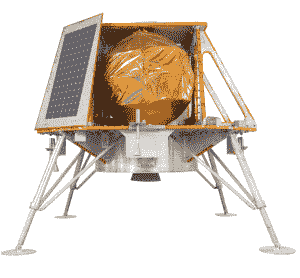

# 这个印度团队计划成为第一家登陆月球的私营公司 

> 原文：<https://web.archive.org/web/https://techcrunch.com/2016/11/09/this-indian-team-plans-to-be-the-first-private-company-to-land-on-the-moon/>

位于印度班加罗尔的私人公司 TeamIndus 是唯一一家参加 T2 谷歌月球 X 大奖的印度参赛者，该奖项是让私人航天器登陆月球的国际竞赛。

对于 TeamIndus 来说，有一些令人兴奋的事情处于危险之中。如果他们在比赛中获得第一名，他们将赢得 2000 万美元，并成为第一家登上月球的私营公司。如果他们成功了，他们将实现他们自己政府的太空机构还没有完成的事情:在月球上软着陆。

该公司在竞争中起步较晚，在谷歌月球 X 奖宣布三年后才加入。但是今天，TeamIndus 拥有 100 多名员工，是赢得 X-Prize 因月球着陆器技术而获得的 100 万美元[里程碑奖](https://web.archive.org/web/20221206154651/http://lunar.xprize.org/about/milestone-prizes)的三个团队之一，并且正在筹集超过 1000 万美元的资金。

这些因素有助于确保 TeamIndus 在竞争中的领先地位，但他们肯定还有一些路要走。例如，该公司尚未获得发射合同，如果他们想在 2017 年 12 月之前满足 X-Prize 登月的最后期限，这是他们需要尽快完成的事情。

他们的登月任务他们的任务计划包括用印度火箭将一艘宇宙飞船发射到近地轨道。宇宙飞船将完成围绕我们星球的两个轨道，然后开始推进动作，将它推向月球。插入燃烧将把航天器送入月球轨道，在那里它将绕月球运行三到四圈，然后开始其任务中最复杂的部分:降落到月球表面。

一旦飞船着陆，TeamIndus 漫游者将从母飞船上展开。为了完成 X 奖的要求，着陆器将沿着表面滚动至少 500 米，并将月球的高清图像和视频发送回地球。

TeamIndus 月球车插图/图片由 TeamIndus 提供

除了一辆漫游车，TeamIndus 还将把一项学生科学实验带到月球表面，该实验是从提交给他们的 [Lab2Moon](https://web.archive.org/web/20221206154651/http://lab2moon.teamindus.in/) 竞赛的 3000 多个可能的实验中选出的。

**TeamIndus 对火箭的选择**

当被问及为何推迟发布时，TeamIndus 的联合创始人，

印度的极地卫星运载火箭/图片由 ISRO 提供

拉胡尔·纳拉扬解释说，他们的情况与其他 X 奖竞争者有点不同。虽然其他团队已经与私人火箭公司签署了发射合同，但 TeamIndus 将使用政府所有和运营的火箭进行飞行。

具体来说，TeamIndus 将搭载印度空间研究组织的 [PSLV 火箭](https://web.archive.org/web/20221206154651/http://www.isro.gov.in/launchers/pslv)，这是一种具有可靠历史的运载工具。6 月，PSLV [号完成了其第 35 次^号连续成功任务](https://web.archive.org/web/20221206154651/https://spaceflightnow.com/2016/06/22/pslv-c34/)。

通过购买 PSLV，TeamIndus 开创了与印度政府做生意的先例。纳拉扬指出，因为这是第一次出现这种情况，所以需要更多的时间来解决所有问题。

> “ISRO 以前从未向私人公司出售过专用运载火箭。我们正在这里开辟新天地。”TeamIndus 联合创始人 Rahul Narayan

当被问及是否需要政府的许可才能登上月球时(就像《月球快车》最近做的那样)，纳拉扬解释说，因为 PSLV 归印度政府所有，所以签署的发射合同自然会包括政府的许可。

与其他选择将 X 奖团队带到月球的火箭相比，PSLV 可以说是最可靠的，可能是 TeamIndus 的一个巨大优势。一个以色列团队 Space-IL 已经获得了 SpaceX Falcon 9 的发射权，在过去的 18 个月中，SpaceX Falcon 9 已经有两次任务失败，导致不可避免的计划延迟。月球快车[将他们的信心](https://web.archive.org/web/20221206154651/http://spacenews.com/moon-express-buys-rocket-lab-launches-for-lunar-missions/)寄托在火箭实验室的[电子火箭](https://web.archive.org/web/20221206154651/https://www.rocketlabusa.com/)上，这是一种来自新西兰发射供应商的运载工具，还没有进行过飞行。

如果其他条件相同，一个团队对火箭的选择可能会决定谁先到达月球。

当然，对于他们选择的重要火箭来说，TeamIndus 必须首先能够负担得起费用。根据谷歌月球 X 奖的要求，每个团队 90%的任务费用必须由私人资助，印度政府不能“赠予”TeamIndus 一次登月之旅。

然而，ISRO 将在其他方面帮助 TeamIndus。纳拉扬告诉 TechCrunch，TeamIndus 将有权使用 ISRO 的振动和声学测试设施，以使他们的航天器符合飞行要求。

这当然会节省一些钱，但这种类型的援助与其他 X 奖竞争者的援助不相上下。纳拉扬估计，所有其他费用，包括火箭、地面操作和技术开发的费用，加起来约为 7000 万至 8000 万美元。

迄今为止，该公司已经公开表示，他们已经筹集了大约 300 万美元(50 万美元的种子资金，150 万美元的 A 轮投资，100 万美元的 X 奖里程碑奖)。但纳拉扬告诉 TechCrunch，TeamIndus 很快将结束另一轮融资，使其总额达到 1000 万至 1500 万美元，并计划为他们的 100 人团队增加更多人。

客观地看，来自美国的谷歌月球 X 大奖团队 [Moon Express](https://web.archive.org/web/20221206154651/https://beta.techcrunch.com/2016/08/03/moon-express-becomes-first-private-company-to-receive-permission-to-go-to-the-moon/) 已经筹集了超过 3000 万美元，截至 8 月份只有大约 25 名员工。

TeamIndus 宇宙飞船(漫游者将被装载在里面)/图片由 TeamIndus 提供

虽然员工工资只是整体预算的一部分，但印度工程师的[平均工资](https://web.archive.org/web/20221206154651/http://www.payscale.com/research/IN/Job=Software_Engineer/Salary/2a0a9605/Bangalore)远低于美国工程师的工资，所以像 TeamIndus 这样的公司有能力建立一个更大的团队。纳拉扬表示，TeamIndus 雇用更多人的能力在像谷歌月球 X 奖这样复杂的竞争中是一项资产。

虽然这种规模的团队在这场竞争中是独一无二的，但我们必须等待，看看聘请更多工程师的能力是否真的是一个优势。

**一切结束后会发生什么？** 那么比赛结束后会发生什么？像 Moon Express 和另一家美国竞争对手 [Astrobotic](https://web.archive.org/web/20221206154651/https://www.astrobotic.com/) 这样的团队已经表示，他们打算在获奖后维持基于月球的业务。

然而，TeamIndus 有一个不同的计划。纳拉扬说，虽然他们不指望在比赛后继续月球任务，但他们希望维持航天业的业务。他指出，TeamIndus 已经建立了设计、原型制作和分析空间级技术的能力，这种技术可以用来创建一个建造卫星的企业。

但是现在，他们的焦点仍然在月球上。纳拉扬和他的 100 名员工都在朝着首次将印度人带上月球的目标努力，他谈到这一点时非常自豪。

当被问及如果 TeamIndus 赢得谷歌月球 X 奖会有什么感觉时，纳拉扬说:“如果你的球队赢得了板球世界杯，你会有同样的感觉。”