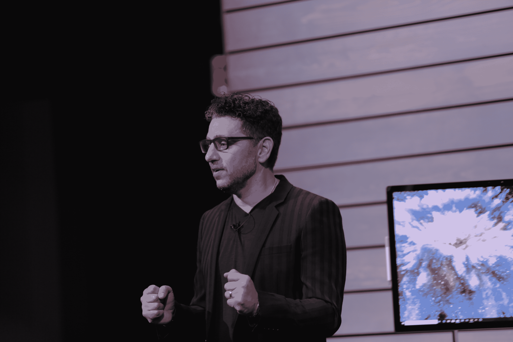

# 这是微软的 Surface Studio 2

> 原文：<https://web.archive.org/web/https://techcrunch.com/2018/10/02/this-is-microsofts-surface-studio-2/>

# 这是微软的 Surface Studio 2

今天微软活动的最后一件硬件。该公司发布了 Surface 家族中最引人注目的成员的更新。正如预期的那样，该公司的创新 iMac 竞争对手 Surface Studio 今天获得了更新。

正如今天发布的其他产品一样，表面上看起来非常相似。就像笔记本电脑一样，在这里也很好。工作室有一个你会在台式电脑中发现的更具突破性的设计。然而，从硬件角度来看，有许多关键的更新。

根据该公司的数据，28 英寸的屏幕亮度提高了 38%，对比度提高了 22%。它总共有 1350 万像素。

触摸屏具有笔输入的倾斜灵敏度，具有 4，096 级压力和改进的墨水延迟。在里面你会发现帕斯卡图形，再加上高达 2TB 的固态硬盘。鉴于 Nvidia 最近宣布了下一代图灵架构，这是一个有趣的举动。不过，这些卡仍然非常昂贵，Nvidia 继续与其基于 Pascal 的卡一起销售。

Studio 2 在演示期间的工作令人钦佩，使用笔的响应时间很快，板载人工智能能够将手写内容转换为文本，同时从云中下载相应的图像。

https://www.youtube.com/watch?v=RmVAbB3M-4Y