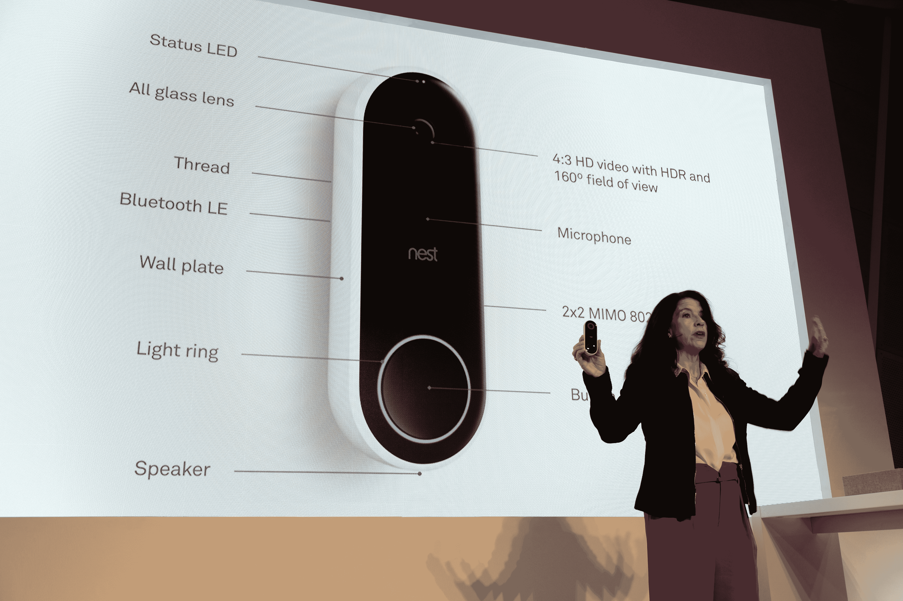

# 这是 Nest 的新视频门铃 

> 原文：<https://web.archive.org/web/https://techcrunch.com/2017/09/20/this-is-nests-new-video-doorbell/>

# 这是 Nest 的新视频门铃

我们正在旧金山的 Nest 新闻发布会现场直播，该公司正在发布新产品速射。

最新登场:智能视频门铃 Nest Hello。

如果你熟悉现有的产品，如[环形视频门铃](//web.archive.org/web/20221025222643/https://beta.techcrunch.com/tag/ring/)，这一个也是类似的——只是具有 Nest 通常的所有抛光。

它有一个内置的麦克风/扬声器装置，这样你就可以和任何在你门口的人交流——但是，聪明的是，他们还提供了预先录制的点击发送快速响应，以便在不方便对着你的电话大喊大叫的时候使用。

还超级聪明:午睡模式。专为父母设计，考虑到熟睡的婴儿，您可以禁用室内门铃，同时继续在手机上接收门铃警报。

与此同时，Hello 将接收 Nest 花了几年时间在其 [Nest Cam IQ 线](https://web.archive.org/web/20221025222643/https://beta.techcrunch.com/2017/05/31/nests-latest-home-security-camera-is-the-super-smart-nest-iq/)中构建的人/面部识别系统。这意味着它可以识别出你家前廊上的动作是人在走动还是树叶在飘过。

Nest says Hello 将于 2018 年在 Q1 上市；还没有提到价格。

