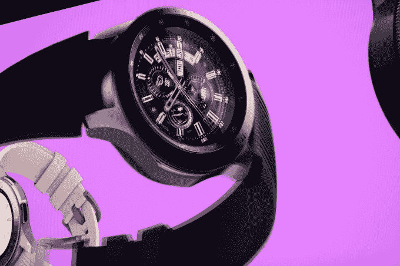

# 这是三星的新款 Galaxy 手表

> 原文：<https://web.archive.org/web/https://techcrunch.com/2018/08/09/this-is-samsungs-new-galaxy-watch/>

# 这是三星的新款 Galaxy 手表

在今天的大事件之前，谣言有点混乱。然而，三星在保密今天的重大可穿戴新闻方面做得稍微好一点。到目前为止，我们已经听到了一些传闻，但是细节都很粗略。据传闻，新设备确实是 Galaxy Watch，打破了 Gear 的命名惯例。

从表面上看，新设备具有与 Gear 相同的大部分功能，包括圆形边框，它还可以兼作控制装置——这是该系列相对于苹果产品的主要功能之一。Galaxy 手表也有两种尺寸，这是对早期三星手表的明显改进，早期三星手表对许多手腕来说都太大了。

目前还没有电池大小的具体细节，尽管该公司表示，这款新的可穿戴设备应该可以“一次充电几天”，这是一个令人印象深刻的说法，如果属实，肯定是智能手表世界的主要陷阱之一。当你需要充电的时候，有一个新的[无线充电组合](https://web.archive.org/web/20230307140213/https://techcrunch.com/2018/08/09/samsungs-wireless-charging-duo-takes-aim-at-apple-airpower/)，它可以处理 Galaxy 移动设备，同时观看。

与之前的传言不同，Galaxy Watch 似乎仍在运行 Tizen，而不是 Android Wear。

**更新:**三星[表示](https://web.archive.org/web/20230307140213/https://news.samsung.com/us/samsung-galaxy-watch-stay-connected-no-matter-where-you-are/)这款手表将于 8 月 24 日在美国上市，随后几周将在其他市场推出。42 毫米版本的手表将售价 329.99 美元，而 46 毫米版本将售价 349.99 美元。

此外，三星的声明确认了手表仍将运行 Tizen。

