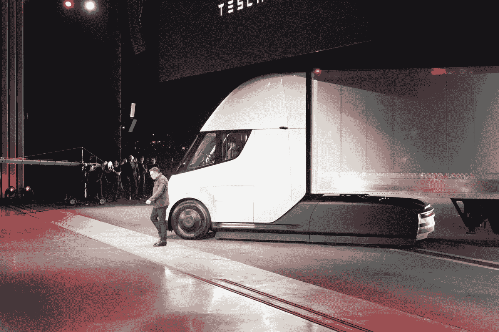

# 这是特斯拉新的大型全电动卡车——特斯拉 Semi 

> 原文：<https://web.archive.org/web/https://techcrunch.com/2017/11/16/this-is-teslas-big-new-all-electric-truck-the-tesla-semi/>

正如承诺的那样，特斯拉推出了全电动半挂卡车，被恰如其分地称为“特斯拉半挂卡车”，由此产生的 8 级运输车辆确实是一大看点。

正如你所看到的，它拥有相当大的充电容量，并且具有非常独特的美学外观，这显然有助于它在道路上从其他商业货运车辆中脱颖而出。

特斯拉 Semi 将在 5 秒内从 0 加速到 60 英里/小时，与柴油卡车相比，这是令人难以置信的快。它可以在 20 秒内从 0 到 60 英里/小时的速度牵引 80，000 磅的最大牵引负荷。它可以在 5%的坡度上以 65 英里/小时的速度行驶，这比柴油竞争对手最高 45 英里/小时的速度要好得多。就里程而言，它可以以高速行驶 500 英里，不到 80%的行程是 250 英里。由于其极其符合空气动力学的设计，它还具有比超级汽车更好的阻力系数。

然而卡车真正的秘密武器并不在于它能变成一个巨型战斗机器人(这个功能还没有被激活，如果确实存在的话，特斯拉也不会承认它存在)。相反，这种卡车提供了一种不需要换档的变速器(这对于全电动汽车来说是正常的)，具有再生制动，每特斯拉提供“基本上无限”的制动寿命。

[gallery ids="1568688，1568689，1568690，1568691，1568692，1568693，1568694，1568695，1568696，1568697"]

特斯拉还表示，semi 在响应能力和操控性方面优于其柴油竞争对手，在相同的时间跨度内，可以比柴油 Semi 卡车行驶更长的里程，在常规交通中及其周围更安全。它还使用了许多 Model 3 组件来最大限度地提高生产效率，包括每个车轮的单独 Model 3 电机，甚至 Model 3 嵌入式门把手。

特斯拉 Semi 的另一个突出之处在于其设计——该公司指出，这种驾驶室是为司机量身定制的，其启动旨在使进出更容易，并且在驾驶室内能够完全站立。相对于道路，司机也位于驾驶室的中心，这是车辆设计的一个独特之处，但对于几乎没有乘客的汽车来说，这是一个合理的选择。还有一个可移动的乘客跳跃座椅，偏置在主司机位置的后面。

特斯拉还为 Semi 增加了两个最受欢迎的车内功能:触摸屏。它们位于驾驶员两侧，提供导航信息、盲点监测和行程数据记录应用。还有一套车队管理和路由工具，特斯拉表示，通常需要第三方附加硬件才能集成到汽车中。

当然，电动卡车并不是马斯克和特斯拉的专利。有一个有点古怪的名字叫尼古拉，它正在与博世合作开发一种混合氢动力电动动力系统。此外，戴姆勒还透露了自己的概念，三菱 E-FUSO 全电动视觉一卡车 220 英里的范围，但没有指定的释放窗口。

电动半挂卡车有什么大不了的？这是一个公平的问题，尤其是考虑到传统柴油发动机重型卡车的范围。一辆坦克的续航里程可达近 900 英里。但是从相对明显的生态角度(这是显而易见的)和成本效益的角度来看，电动卡车的长期优势都很有意义。

它还可以通过太阳能超级充电器充电，一次充电 30 分钟可以行驶 400 英里，这可以在你卸下驾驶室装卸货物时完成。特斯拉计划将这些巨型充电器放置在世界各地，以确保人们可以轻松地从一个目的地移动到另一个目的地，并在目的地和出发地都没有问题地充电。

从长期来看，电动卡车的寿命可能更长，维护成本也更低，而且在它们的使用寿命期间为它们加油的成本应该远低于使用内燃机的卡车的运营成本。特斯拉表示，Semi 比柴油卡车需要的维护“少得多”，特别是因为它没有内燃机汽车的高应变运动部件，包括发动机、变速器、后处理系统和差速器。

特斯拉 Semi 还提供了先进的安全功能，采用特殊的电池设计，加强了电池单元本身，并且由于它们在底盘中的定位，还有助于降低卡车的整体重心。挡风玻璃也是由玻璃制成，旨在抵御冲击，卡车通过自动检测任何可能导致此问题的稳定性并相应地扭转每个车轮，从而避免折叠，这是此类卡车的常见问题。

全景摄像机试图消除盲点，也有助于支持物体检测，在发现潜在危险时自动向驾驶员发出警报。

特斯拉还在其 Semi 中内置了增强的自动驾驶功能，这并不奇怪，因为它在其消费类汽车系列中开拓和完善了这些干燥辅助功能。在 Semi 上，特斯拉的 Autopilot 提供自动紧急制动、车道保持和车道偏离警告，以帮助鼓励安全的公路驾驶。

这绝对是现代运输卡车的未来版本，有许多铃铛和哨子，看起来确实可以让货运公司和司机的生活更加舒适和方便。对司机的关注尤其有趣，因为特斯拉似乎希望从根本上获得对其卡车运输的支持，以及通过诉诸航运公司自身的长期财务推理。

这种型号的卡车是一种日间卡车，没有卧铺，设计用于短途运输。但特斯拉表示，它可以很容易地扩展驾驶室，以容纳一个卧铺车厢，然后扩展底层电池组，以支持这一点。它也可以在发动机罩上方有或没有空气动力罩的情况下使用，这取决于它所牵引的拖车的高度。

特斯拉可能仍将面临许多挑战，既要大规模生产这款卡车，又要鼓励广泛采用。但它坚持自己的剧本来看待这个行业，在这个行业中，传统参与者长期以来一直以一种方式做一些事情，创新相对较少，并彻底改变事情。问题是应用这种模式是否会继续对其有利。每辆卡车都有一百万英里的故障保修，特斯拉正在尽最大努力让人们相信变化是一件好事。