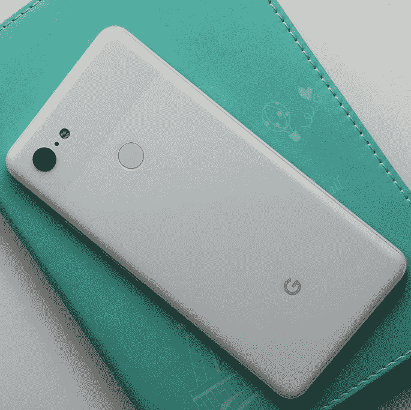

# 这是谷歌 Pixel 3 XL 

> 原文：<https://web.archive.org/web/https://techcrunch.com/2018/08/22/this-is-the-google-pixel-3-xl/>

# 这是谷歌像素 3 XL

很可能要到 10 月份才会发布，但是我们已经看到了很多谷歌的 Pixel 3 。很多很多。这里还有很多。

即将到来的智能手机的无数次泄露，几乎是你想看到的每一个角落和缝隙。事实上，今天早上有[设备的](https://web.archive.org/web/20221208005142/https://twitter.com/wylsacom/status/1032225048285855744)[实际上竞争泄露](https://web.archive.org/web/20221208005142/https://rozetked.me/articles/2732-fotografii-google-pixel-3xl)，其中一个实际上拿着手机的相机兜了一圈，[公布了一些照片](https://web.archive.org/web/20221208005142/https://www.instagram.com/khoroshev/)。

很难说有多少受控泄漏是有意的。最终，这些泄露会让产品在发布前就引起注意，即使它们确实消除了大部分或所有的惊喜。不管怎样，这东西到处都是。

在 Pixel 3/Pixel 3 XL 的情况下，除了顶部的巨大缺口之外，人们对所有东西的反应似乎都相当积极。当然，谷歌确实在 notch 前沿倾斜，最近发布的 Android Pie 增加了这一功能。

新照片几乎与我们迄今为止看到的所有照片一致，包括背面的单个摄像头和似乎是有线版本的 Pixelbuds，它需要附带的 USB-C 加密狗/适配器。

据报道，3 XL 的显示屏为 2960 × 1440 像素，超过了 2 XL 的 2880×1440 像素。据传闻，这部分是因为新手机有一个彻头彻尾的 6.7 英寸大显示屏。甚至超过了 Note 9 的 6.4 英寸。

据说这里有一辆骁龙 845，这当然是有道理的。当然，这款手机将运行 Android Pie。

哦对了，然后[还有这个](https://web.archive.org/web/20221208005142/https://www.androidauthority.com/google-pixel-3-xl-leaked-images-896726/)。