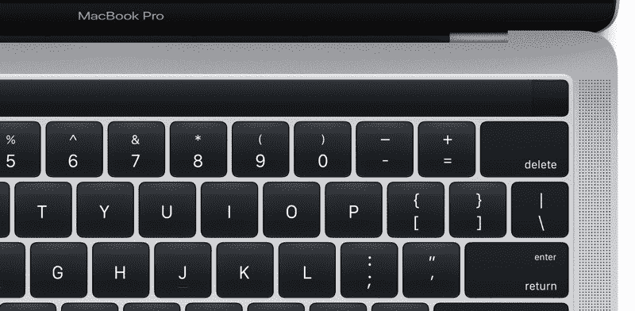

# 这是新款 MacBook Pro，带有神奇工具栏迷你显示屏

> 原文：<https://web.archive.org/web/https://techcrunch.com/2016/10/25/this-is-the-new-macbook-pro-with-the-magic-toolbar-mini-display/>

苹果在 macOS Sierra 12.1 更新中泄露了其即将发布的 MacBook Pro 的两张隐藏图像。MacRumors [首先注意到](https://web.archive.org/web/20230326054558/http://www.macrumors.com/2016/10/25/images-of-new-macbook-pro-leaked/)系统文件中的图像。认识新的 MacBook Pro。

正如[所料](https://web.archive.org/web/20230326054558/https://techcrunch.com/2016/10/20/new-macbook-pro-oled-mini-screen-could-be-called-the-magic-toolbar/)，MacBook Pro 在键盘上方配备了第二块迷你显示屏。它取代了函数行，并且应该根据您正在做的事情而改变。在例子中，你可以看到显示屏(可能称为[魔法工具栏](https://web.archive.org/web/20230326054558/https://techcrunch.com/2016/10/20/new-macbook-pro-oled-mini-screen-could-be-called-the-magic-toolbar/))提示用户用触控 ID 传感器确认 Apple Pay 支付。

如您所见，函数行不见了。一方面，我不记得上次使用 F7 钥匙是什么时候了。另一方面，现在已经没有物理的退出键了。在照片上，我们可以看到显示屏的左侧有一个取消按钮。因此，这或多或少有点像在你当前的键盘上按下 escape 但与盲目地按下键盘左上角的键相比，这将更加困难。

这些照片还显示，新的 MacBook Pro 中将有一个触控 ID 传感器。你可以在下面的第二张照片上看到，触控 ID 地区有点暗。它和显示器的其他部分颜色不一样，所以我认为它不是显示器的一部分。但它看起来不像你的 iPhone 或 iPad 上的 home 键。当你将手指放在 iPhone 的 home 键上时，金属环会感应到你的手指，并触发触控 ID 传感器。令人惊讶的是，触控 ID 传感器周围没有环。不过，像 3D Touch 这样的东西可能会让金属环变得无用。

同样值得注意的是，键盘看起来非常像 12 英寸 retina MacBook 上的键盘，键帽更大。我不喜欢 12 英寸 retina MacBook 上的低调旅行。但目前还不清楚这种键盘是否像外接魔法键盘上那样有更深的开关。

正如你在上面的照片中看到的，13 英寸的 MacBook Pro 将在显示屏和键盘周围有一个更薄的边框。扬声器现在位于键盘的两侧，而不是键盘的下方——这一变化尤其可能表明 MacBook 更加纤薄。铰链似乎更小；让我们希望它仍然像现有 MacBook Pro 型号上的一样强大。

今天就到这里吧！我们不知道这台笔记本电脑的端口数量。我们不知道内部组件、发布日期或价格。有传言称，它将搭载英特尔 Skylake 处理器和一系列 USB Type-C 端口。如果你看看目前的 MacBook Pro，USB 和 MagSafe 端口在厚度方面是一个瓶颈。将所有这些端口切换到 USB Type-C 端口会使笔记本电脑变得更薄。

苹果将在周四举行一场活动。除了更新的 MacBook Pro 型号，该公司还应该更新 13 英寸的 MacBook Air，采用新的设计和更好的组件。iMac 可以接收性能更新。Mac Pro 和 Mac Mini 多年来一直被忽视，目前还不清楚它是否会改变。最后，虽然新的视网膜外部显示器可能很快就会出现，但它可能还没有准备好。苹果仍然可以宣布新的显示屏，并在晚些时候发货。

