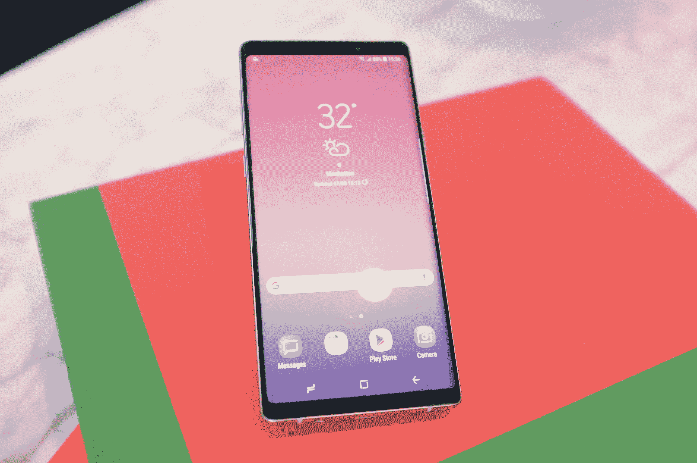
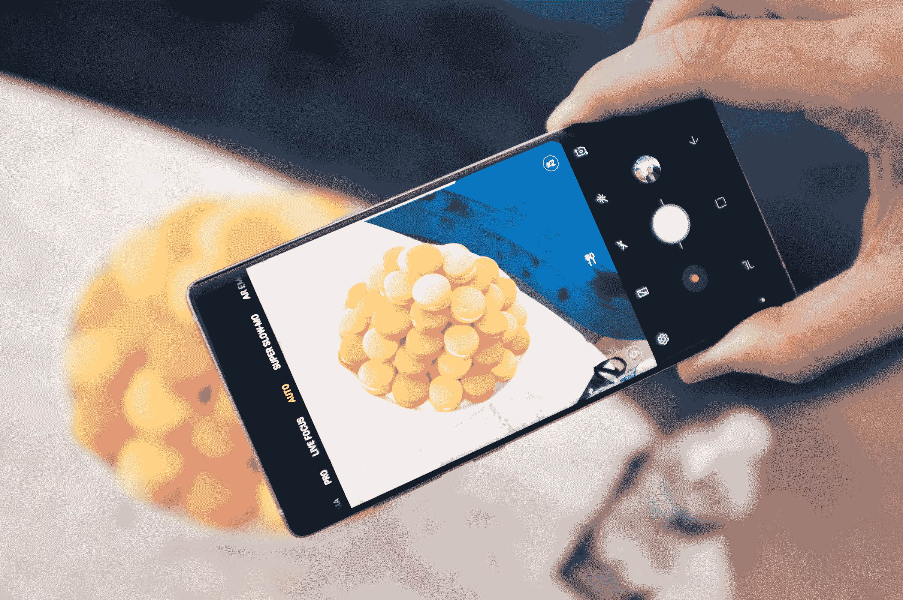
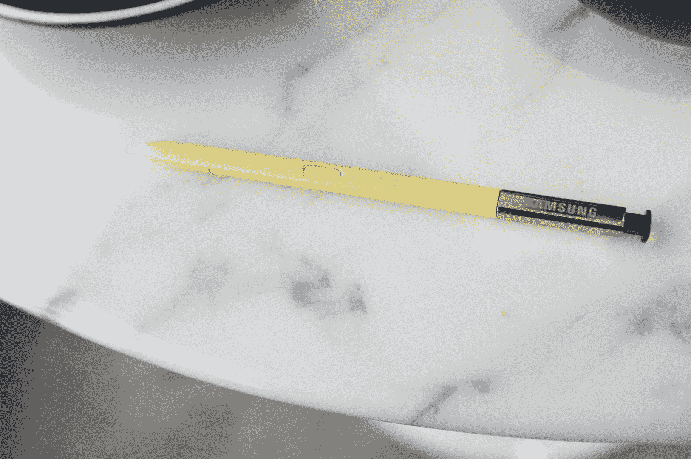
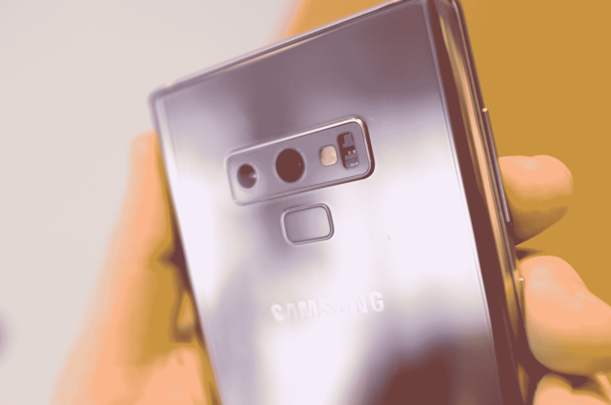

# 这是 Galaxy Note 9 

> 原文：<https://web.archive.org/web/https://techcrunch.com/2018/08/09/this-is-the-samsung-galaxy-note-9/>

关于 Galaxy Note 9，你所知道的一切……老实说，这是非常正确的。

在这些图片、宣传片、预告片和三星首席执行官 DJ Koh 在公共场合使用这款该死的手机的图片之间，很难摆脱这样一种感觉，即该公司只是接受了泄露，希望在这些(酷热的)夏日发布前制造一点额外的兴奋。

正如所料，这一次美学上几乎没有什么变化——这很好。有几个新的颜色，一个移动的指纹传感器和一个大了几分之一英寸的屏幕，这可能是为什么前面提到的 C 级高管认为他能够不被注意到。当然，这一切都很好——当你在第九代左右的时候，期望每一代产品都有一些激进的设计偏离可能太多了。

[gallery ids="1688763，1688761，1688758，1688765，1688770"]

真的，就像之前的 S9 一样，新的 Note 在任何方面都没有彻底的改变。行业定义的 phablet 的最新版本更侧重于基本面。老实说，对于像三星这样经常感觉完全专注于花里胡哨的公司来说，这是一个受欢迎的变化。更大的存储空间，更好的摄像头，改进的 S-Pen 和更大的电池都是这次的亮点。

当然，这并不是说没有新的哨子或铃铛。这当然是三星。

在一次简报中，三星将 Note 系列称为“我们的创新品牌”，这是对它通常是第一款获得许多现在标准的 Galaxy 功能的设备的认可——见:Edge 显示屏(弯曲屏幕)、S-Pen、大屏幕、双摄像头。然而，如果有一个新功能脱颖而出，那实际上是更大的电池，现在的测量值为 4,000mAh 小时——比上一代增加了 700mAh。

这当然是个好消息。三星目前没有任何官方的估计时间可供分享，而是仍然称其为“全天”电池——尽管绝大多数用户在标准使用情况下应该可以挤出更多时间。所有这些的真正意义可能不会被任何一个在过去几年里对移动行业稍加关注的人所遗忘。

Note 9 标志着自 Note 7 的锂离子爆炸导致该公司两次单独召回以来，电池容量首次显著增加。很自然，三星在这一点上采取了攻势，指出当 Note 7 的字面意义和象征意义烟消云散时，该公司制定了八点安全检查。该公司让这款手机接受了 UL 的外部审查。

“我们想做的是随时调整创新方法，”三星产品战略和营销总监告诉 TechCrunch，“所以这是增加电池以满足消费者需求的正确时间。”

当然，该公司必须考虑电池燃烧的实际问题，以及过快推进产能极限的可能性。毕竟，人们普遍认为该公司在这一点上飞得离太阳太近了。因此，最近几款 Galaxy 手机的电池寿命停滞不前。

正如今天活动的初始邀请函所示，S-Pen 这次也受到了很多人的喜爱，这是自 2011 年触控笔问世以来最重要的升级。最明显的区别:引人注目的新颜色。邀请函上的图像确实是一个黄色霓虹灯的特写镜头。还有一个紫色的——每个写在屏幕外备忘录上的颜色都与他们的设计相匹配。

然而，真正的区别在于 S-Pen 内置了蓝牙低能耗功能，这使得它可以充当遥控器。当然，这需要电池，所以触控笔现在包括一个超级电容器，当它在插槽中时可以充电。三星表示，充电 40 秒后，它应该可以待机 30 分钟左右。当然，里程会有所不同，但考虑到它在不使用时会有效地充电，这应该不是问题。

新的 S-Pen 可以用来控制相机、幻灯片和音乐播放等。在 Spotify 和谷歌音乐中，点击一次按钮就可以播放/暂停，点击两次按钮就可以播放。没有背面，但是一个按钮只能做这么多。在照片模式下，它可以用作快门，双击可以翻转相机进行自拍。

该功能在发布时将只适用于选定数量的应用程序，但该公司将向开发者开放 SDK。在设置中还会有一些自定义级别，所以用户可以指定不同的功能。

以下是您正在使用的摄像机硬件:

*   后置:双摄像头，带双 OIS(光学防抖)
*   广角:超高速双像素 12MP 自动对焦，F1.5/F2.4，OIS
*   长焦:1200 万像素自动对焦，F2.4，OIS
*   2 倍光学变焦，高达 10 倍数码变焦
*   前置:800 万像素自动对焦，F1.7

然而，成像方面最大的变化是软件。场景优化器类似于我们在 HTC 等公司最近的旗舰产品上看到的技术。该系统使用机载人工智能程序(不需要云连接)来确定你正在拍摄的照片。总共有 20 个类别，包括夜晚、雪、街景、鸟类、室内、文字、食物、宠物、鲜花和日落。一旦系统决定拍摄什么，它就会相应地调整白平衡、颜色和饱和度。

在一次短暂的动手操作中，我只能在有限的几个物体上尝试，但它在鲜花和一盘食物上效果很好，在这个过程中真正突出了颜色。你实际上不能手动控制系统来选择上述 20 个场景中的一个，但是如果你得到一个假阳性，你可以关闭它。

更引人注目的是缺陷检测，它会指出你什么时候搞砸了。如果照片模糊，如果屏幕上有污点，如果对象眨眼，或者背光使一切看起来很糟糕，系统会通知你。

具体来说，我们说的是 2960×1440 (516ppi)显示屏，八核骁龙 845 和 6 或 8GB 内存，运行 Android Oreo。

哦，还有储藏室。Note 9 配备了标准的 128GB 内存。如果你真的想全力以赴，还有一个 512GB 版本，正如三星所说，当你考虑到可扩展的 512GB microSD 时，这款设备“准备好 1TB”，这是一款中端智能手机的价格(PNY 的现在是 350 美元)。哦，说到钱。

深呼吸。

三星早些时候曾表示，它将试图控制这一产品的成本。也许是下一代。128GB 的型号售价为 999.99 美元。512GB 版本将花费你 1249.99 美元。两者都将于 8 月 24 日开始发售，预购从 8 月 10 日开始。后者将限于“选定的零售点和运营商站点，包括美国电话电报公司、T-Mobile、威瑞森和美国移动电话公司。

Note 9 有海洋蓝和薰衣草紫两种颜色，分别配有紫色和黄色手写笔。是的，有一个耳机插孔。