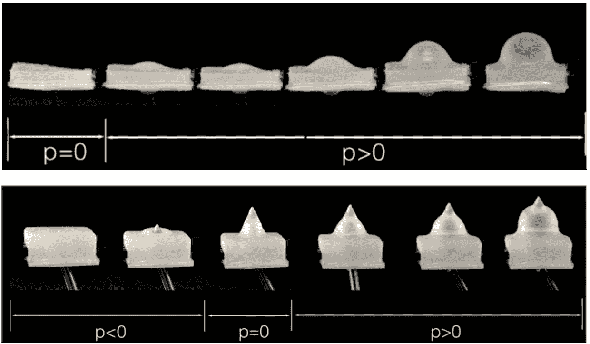
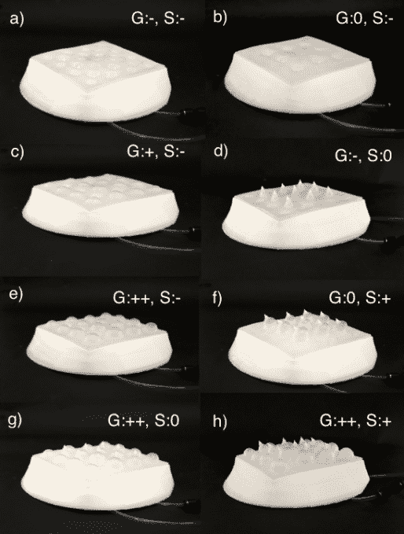

# 这个快乐的小机器人让人起鸡皮疙瘩 

> 原文：<https://web.archive.org/web/https://techcrunch.com/2018/05/16/this-jolly-little-robot-gets-goosebumps/>

# 这个快乐的小机器人让人起鸡皮疙瘩

康奈尔大学的研究人员制造了一个可以通过触摸表达情感的小机器人，当它害怕时会发出小脉冲，甚至会起鸡皮疙瘩来表达高兴或兴奋。原型是一个可爱的橡胶皮肤微笑生物，旨在测试触摸作为机器人项目的 I/O 系统。

这个机器人模仿章鱼的皮肤，当受到威胁时，它会变成尖尖的。

研究人员、胡、赵正南、阿比克·维姆和盖伊·霍夫曼创造了这个机器人，以试验机器人互动的新方法。他们将皮肤比作“人类的鸡皮疙瘩、猫脖子上的绒毛、狗的背毛、豪猪的针、河豚的刺或鸟的褶皱羽毛。”

“对人机互动的研究表明，机器人使用非语言行为进行交流的能力会影响他们对人类有用的潜力，还会产生心理影响。其他原因包括让机器人使用非语言行为有助于让它被认为更熟悉，不像机器，”研究人员告诉 IEEE Spectrum 。

这种皮肤有多种配置，由计算机控制的弹性体提供动力，可以按需膨胀和收缩。鸡皮疙瘩会弹出来，与机器人脸上的表情相匹配，让人类更好地理解机器人在抬起小尾巴或颠簸时的“意思”。就我而言，欢迎我们颠簸的机器人霸主。

【YouTube = https://www . YouTube . com/watch？v=-RkCu7-ljmQ]