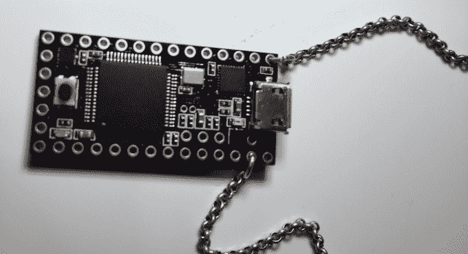

# 这条小小的 USB 项链可以让你的电脑瞬间瘫痪

> 原文：<https://web.archive.org/web/https://techcrunch.com/2014/12/18/this-little-usb-necklace-hacks-your-computer-in-no-time-flat/>

# 这款小小的 USB 项链可以让你的电脑瞬间瘫痪

快！坏人/超级恶棍已经离开房间了！插入一个神秘的设备，当屏幕上的进度条滴答前进时，它将侵入他们的计算机，向观众传达事情正在工作！

这是历史上几乎所有间谍电影的经典场景。然而，在这种情况下，神秘装置是真实的。

Samy Kamkar 是 2006 年征服 MySpace 的大型蠕虫病毒或劫持其他无人机的无人机 [SkyJack](https://web.archive.org/web/20230405192615/https://techcrunch.com/2013/12/04/infamous-hacker-creates-skyjack-to-hunt-hack-and-control-other-drones/) 等项目的开发者，他发布了一段视频，展示了他有时戴在身边的一条特别可笑的“项链”的能力。

https://www.youtube.com/watch?v=aSLEq7-hlmo？开始=49

名为 USBdriveby，它是一个 USB 供电的链上微控制器，用来利用潜伏在计算机 USB 端口中的固有的可怕安全缺陷。在大约 60 秒内，它可以完成一系列令人讨厌的把戏:

*   它从伪装成键盘/鼠标开始。
*   如果你有一个像 Little Snitch 这样的网络监控应用程序在运行，它会使用一系列按键来告诉 Little Snitch 一切正常，并关闭所有警告。
*   它禁用了 OS X 的内置防火墙。
*   它会突然进入你的 DNS 设置，并在黑客的控制下调整它们，允许他们用自己创建的网站替换你试图访问的几乎所有网站。
*   它打开一个后门，然后建立到远程服务器的出站连接，远程服务器可以发送远程命令。因为连接是出站的，所以不需要修改用户的路由器端口转发设置。
*   它会关闭它打开的所有窗口和设置屏幕，在它走向门口时清扫它的脚印。

因此，在 30-60 秒内，这个设备劫持你的机器，禁用许多安全层，清理它造成的混乱，并打开一个远程操作的连接，即使在设备已被删除。这…有点可怕。

虽然上面的视频集中在 OS X，但这里采用的方法并不是苹果平台独有的。Kamkar 说，到目前为止展示的一切都“很容易扩展到 Windows 或*nix”

那么你能做些什么来保护自己免受这样的事情呢？真的不是很多——这就是为什么像这样的攻击和 [BadUSB](https://web.archive.org/web/20230405192615/https://srlabs.de/badusb/) 是如此怪异。这些缺陷中有许多是 USB 协议在数亿台计算机上设计和实现的方式所固有的；除了用水泥填充你的 USB 端口或者永远不要，永远不要*外出时让你的计算机端口无人看管，没有神奇的解决办法。*

 *【via [黑客新闻](https://web.archive.org/web/20230405192615/https://news.ycombinator.com/item?id=8763955)*