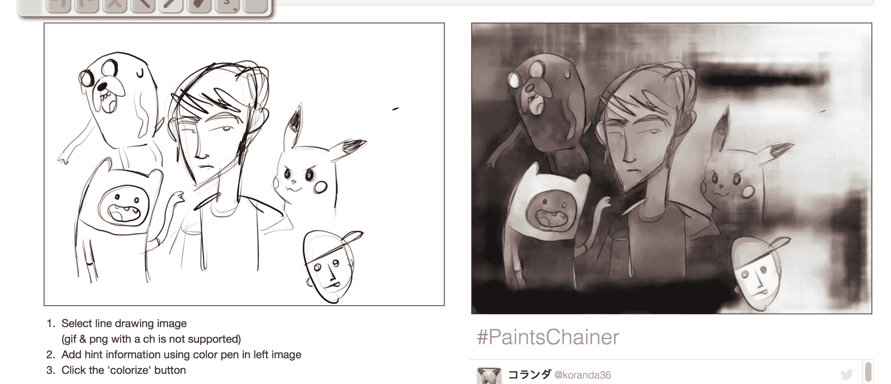

# 这个基于神经网络的软件会自动给你的艺术线条上色

> 原文：<https://web.archive.org/web/https://techcrunch.com/2017/02/02/this-neural-network-based-software-will-automatically-color-in-your-line-art/>

# 这个基于神经网络的软件会自动为你的艺术线条上色

也许你喜欢把素描作为一种爱好，但你并不那么热衷于为作品上色的工作，或者当涉及到数字艺术等式的这一面时，你只是缺乏人才。看看这个基于 Chainer 的工具，Chainer 是一个灵活的神经网络框架，可以支持许多不同的用途。

所谓的 [PaintsChainer 项目](https://web.archive.org/web/20230317015236/http://paintschainer.preferred.tech/)可以用你碰巧使用的任何绘图程序，以多种普通文件格式，包括 JPG、PNG、GIF 甚至 TIFF，创建你的基本艺术线条，然后自动应用颜色，以梦幻般的水彩/彩色铅笔风格，这在数字艺术家中非常流行。

如果任其自生自灭，这个工具会提供有趣的颜色选择。

如果你愿意，你可以让工具自己决定使用什么颜色和在哪里应用它们，但你也可以使用浏览器内的工具栏来给系统提示，就像我在下面的冒险时间船员和皮卡丘上使用更准确的颜色的例子一样。这比试图给自己的艺术线条上色要简单得多，你提供的指导越多，效果越好。

【T2

这个系统在没有任何输入的情况下自己能做的事情仍然令人惊讶，更令人惊讶的是，它只需要一些指导的提示就能做什么。如果你查看 [#PaintsChainer](https://web.archive.org/web/20230317015236/https://twitter.com/hashtag/PaintsChainer) 标签，可以在 Twitter 上看到更多的例子，有更好的原创艺术线条(如下图所示)。