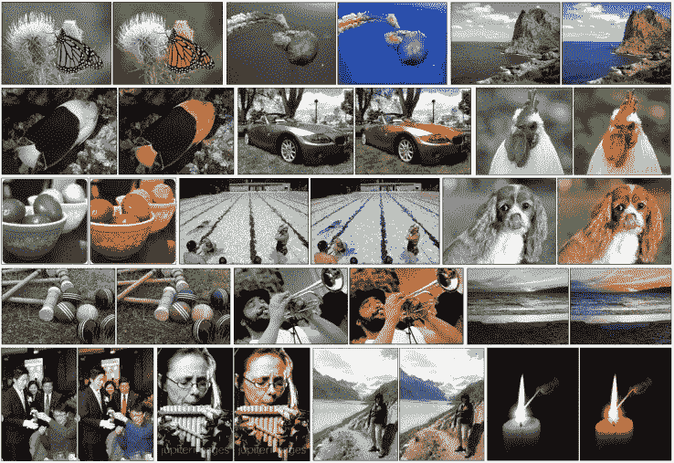
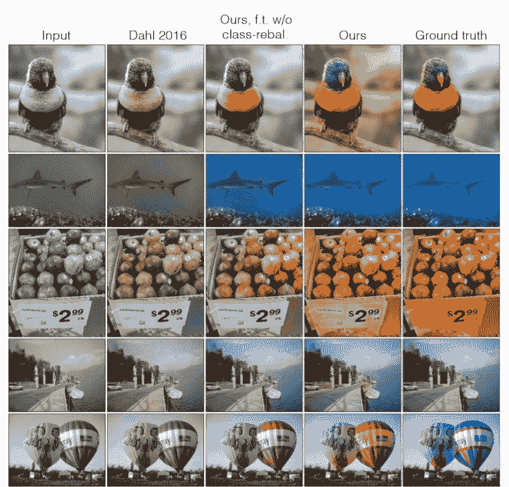

# 这个神经网络将正确的颜色“幻觉”成黑白图片 

> 原文：<https://web.archive.org/web/https://techcrunch.com/2016/03/31/this-neural-network-hallucinates-the-right-colors-into-black-and-white-pictures/>

# 这个神经网络将正确的颜色“幻觉”成黑白图片

如果未来的机器霸主高兴的话，他们现在可能会从他们以前以肉为基础的主人的历史中消除所有的黑白图像。他们所需要的只是来自伯克利计算机科学家张曦轲的这个系统，它允许没有灵魂的硅感觉将颜色“幻觉”成任何单色图像。

它使用所谓的卷积神经网络(实际上是几个)——一种模拟我们大脑中低级视觉系统的计算机视觉系统，以便感知模式和对物体进行分类。谷歌的 DeepDream 可能是最广为人知的例子。通过检查数百万张的图像，张的 CNN 系统可以识别黑白照片中的事物，并按照它认为应该的方式给它们着色。

例如，草具有某些特征——纹理、图像中的常见位置、在草上或附近经常发现的某些其他东西。草通常是绿色的，对吗？所以当网络认为它识别出了草，它就把那个区域涂成绿色。同样的事情也发生在识别某些种类的蝴蝶、建筑材料、花朵、某种狗的鼻子等等。

张的着色过程与其他系统和原始彩色版本(右)比较的例子。

在描述该系统的论文中，张将这种识别和颜色分配过程描述为“幻觉”，实际上，这个术语很贴切:它看到了实际上不存在的东西。这实际上非常类似于我们人类给东西着色的方式:我们将形状和图案与我们之前看到的进行比较，并选择最合适的蜡笔(或十六进制值)。

结果自然是好坏参半(人工智能系统的结果经常如此)，给安塞尔·亚当斯的照片着色的想法令我反感(它们看起来像托马斯·金凯德斯；亨利·卡蒂埃·布列松同样表现不佳)，但实际上，除了成功，很难称之为成功。张和他的同事们通过让人们在单色图像的两个彩色版本之间进行选择来测试该系统的功效:原始图像和神经网络的劳动成果。人们实际上在 20%的情况下选择了后者，这听起来不多，但事实上比以前的彩色化努力要好。

这篇论文有大量的技术信息，但也有很多有趣的例子，比如系统是如何以及何时失败的，什么时候最有说服力，什么时候最没有说服力，等等。查看它(以及它引用的一些其他论文)以获得新的谈话素材，在本周末与你的计算机视觉专家朋友分享。