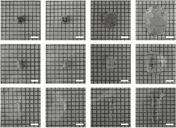
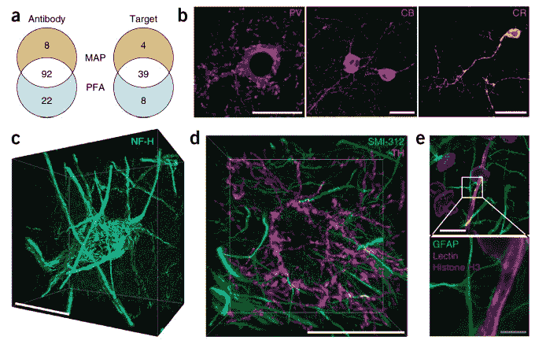

# 这种新的大脑扫描技术简直是在拓展思维 

> 原文：<https://web.archive.org/web/https://techcrunch.com/2016/07/26/this-new-brain-scanning-technique-is-literally-mind-expanding/>

有时候很难区分科学和技术——几乎所有时候都与大脑有关。但麻省理工学院的这项研究极大地改善了对大脑内部网络的扫描，无论是技术、科学还是介于两者之间的领域，这项研究都太酷了，不容错过。

近距离接触神经元和其他脑细胞是一门科学，人们已经研究了一个多世纪。主要的问题是它们太小了，装得太紧了，而且同时连接到这么多地方，以至于很难说出任何东西要去哪里。我们有不同层次的大脑成像方法，但每种方法都有其自身的局限性。

这项新技术解决了几个主要问题。这被称为蛋白质组的放大分析，或(方便地)地图。首席研究员 Kwanghun Chung 的总结听起来好得令人难以置信。

Chung 在麻省理工学院的新闻发布会上说:“我们使用一种化学方法来调整整个大脑的大小，同时保留几乎所有的东西。”。“我们保存蛋白质组(在生物样本中发现的蛋白质的集合)，我们保存纳米尺度的细节，我们还保存全脑的连通性。”

变性和扩张前后的心脏(上)、肺(中)和脊髓组织。

"]让我们稍微扩展一下。组织样本(非活体，天然，来自小鼠)充满了丙烯酰胺聚合物。这些形成了一种非常致密的凝胶——但没有致密到其他化合物无法进入，首先是将蛋白质牢固地附着在凝胶上，然后使它们适合检测。

此时，允许凝胶膨胀，增加到样品原始大小的四到五倍。任何分子科学家都会告诉你，对于成像和操作来说，拥有 800 纳米而不是 200 纳米的东西是一个很大的进步。然而，关键的特征是，这种扩展在某种程度上是非破坏性的，保留了细节但放大了它们。

在那之后，通常的化学和生物标签可以用来染色，或者指示某些类型的细胞，显示它们的轴突延伸到哪里，等等。随后用显微镜进行仔细的 3D 扫描，你会得到一张非常详细的大脑皮层地图。

[https://web.archive.org/web/20221208041745if_/https://www.youtube.com/embed/9ULPT4vYOlg?feature=oembed](https://web.archive.org/web/20221208041745if_/https://www.youtube.com/embed/9ULPT4vYOlg?feature=oembed)

视频

这就像试图辨认写在一个泄气的气球表面的微小字母一样——如果你把它吹大一点，事情会变得更简单。

这个过程比听起来简单，并且不使用任何外来材料或辐射，这使得它对各种类型和预算的研究人员都非常有用。它应该对其他组织也有效！

用荧光蛋白染色标记后的 MAP 处理组织。

它有可能帮助我们在宏观和微观层面上更好地理解真正的神经网络；使用改进信息的模型可能有助于解释我们视觉或认知的某些方面是如何工作的，并告知计算机模型如何模仿它们。

最后，它很酷。生物、化学和数字成像的无缝融合显示了我们的工具和知识在每个领域已经走了多远。事实上，我们可以综合这些学科，创造出像你在上面看到的地图一样有凝聚力的东西…好吧，你看标题。

Chung 等人的研究发表在《自然生物技术》杂志上。