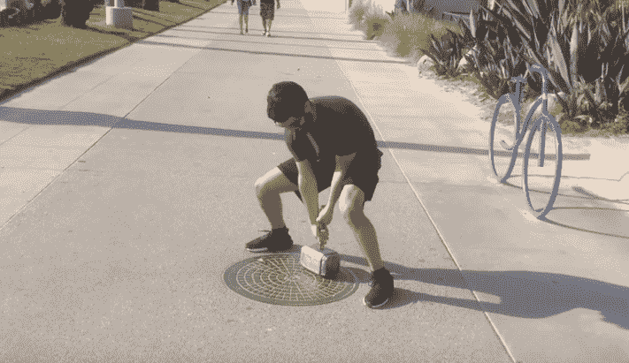

# 这个雷神之锤的复制品只能由其创造者 TechCrunch 举起

> 原文：<https://web.archive.org/web/http://techcrunch.com/2015/10/14/this-replica-of-thors-hammer-can-only-be-lifted-by-its-creator/>

# 这个雷神之锤的复制品只能被它的创造者举起

五万七千部漫威电影之后，你知道交易:雷神有一把锤子(被称为雷神之锤)。只有他能捡起来。对几乎所有其他人来说，甚至是那些理论上比他强壮的人来说，这是不可能的重。

有人把这个概念变成了现实，造出了一个只有主人才能举起的雷神锤。怎么会？磁铁！

[https://web.archive.org/web/20230129085553if_/https://www.youtube.com/embed/0_8Xhzt5YQI?feature=oembed](https://web.archive.org/web/20230129085553if_/https://www.youtube.com/embed/0_8Xhzt5YQI?feature=oembed)

视频

虽然乍一看并不明显，但锤子的手柄上有一个指纹读取器，连接到一个 Arduino Mini，一个大的 ol '电池组和一个强大的电磁铁。

将人造 Mjolnir 放在有磁性的东西上——比如说，地上的一个大金属板——它就会锁定在适当的位置。当上述指纹传感器检测到其创造者的指纹时，磁铁释放，Mjolnir 可以被举起。否则，它不会让步。

*(嗯，大部分时间。支持视频最后那个比疯狂聪明的创造者更聪明的家伙。我不会破坏。)*

挖这种东西？看看这些定制的自动伸展的狼獾爪子。