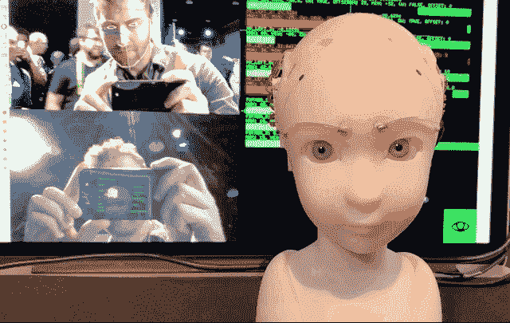

# 这个机器人保持着温柔、令人不安的眼神交流

> 原文：<https://web.archive.org/web/https://techcrunch.com/2018/08/14/this-robot-maintains-tender-unnerving-eye-contact/>

当看起来非常像外星人的机器人被踢和干扰时，人类已经觉得够令人不安的了，所以人们只能想象当他们不间断地进行眼神交流并模仿你的表情，而你却对他们大加辱骂时，情况会有多糟糕。这是我们选择的未来。

模拟情感表达机器人，或称为 SEER，在温哥华的 SIGGRAPH 展出，这绝对是一种体验。这个机器人是由 Takayuki Todo 创造的，是一个小型的人形头和脖子，通过眼神交流和模仿他们的表情来回应最近的人。

这听起来并不多，但是执行起来相当复杂，尽管有一些小故障，SEER 还是设法做到了。

目前它在两种模式之间交替:模仿和眼神交流。当然，这两者都依赖于附近(或者，你可以想象，内置)的摄像头，它可以实时识别和跟踪你的面部特征。

在模仿模式中，观察者的眉毛和眼睑的位置，以及他们的头的位置，都被 SEER 反映出来。它并不完美——它偶尔会因为嘈杂的面部数据而出现异常或振动——但当它工作时，它管理着我给它的一个相当好的版本。自然地，真实的人类更富于表现力，但是这张小脸和它令人毛骨悚然的逼真的眼睛深深地陷入了恐怖的山谷，几乎爬上了远处。

眼神交流模式让机器人自己移动，同时，正如你可能猜到的那样，与最近的人进行不间断的眼神交流。这有点令人毛骨悚然，但不是像某些机器人那样——当你被不适当建模的脸看着时，感觉就像坏 VFX。在这种情况下，你会突然对这个小机器产生惊人的共鸣。

这在很大程度上归功于精致、童真、中性的面部造型和高度逼真的眼睛。如果亚马逊回声有这样的眼睛，你永远不会忘记它在听你说的每一句话。你甚至可以告诉它你的问题。

目前这只是一个艺术项目，但背后的技术肯定是那种你可以期待在不久的将来与虚拟助手等集成的东西。这是好事还是坏事，我想我们会一起发现的。