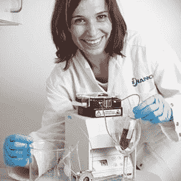

# 这个机器人尝起来比品酒师还好吃 

> 原文：<https://web.archive.org/web/https://techcrunch.com/2014/09/22/this-robot-tastes-better-than-a-wine-critic/>

机器人可能很快就会取代葡萄酒评论家的工作。丹麦的研究人员创造了一种人工舌头，来研究昂贵的葡萄酒是否真的比便宜的好喝。

这项研究首次发表在 ACS Nano 上，声称基于表面等离子共振(SPR)的光学纳米传感器可以辨别你如何体验葡萄酒中的干涩感。他们说，这种纳米传感器可以比最优秀的葡萄酒评论家更好地判断丹宁酸如何影响你的味觉传感器。

有些人可能会说，需要一个人，而不是一个机器人，来发现什么值得一小口。然而，阿豪斯大学的研究人员认为，纳米传感器不受人类批评家的个人偏见的影响。他们也许有道理。让葡萄酒以某种方式品尝有很多因素。从葡萄品种到土壤中的矿物质，再到葡萄接受的阳光种类，每一个季节都会对葡萄酒的味道和气味产生化学影响，即使是同一种葡萄也是如此。

根据 MarketWatch 的数据，[全世界每年买卖超过 314 亿瓶 750 毫升的葡萄酒](https://web.archive.org/web/20221007084228/http://www.winespectator.com/drvinny/show/id/46410)。虽然葡萄酒已经有了一些标准评级，在[葡萄酒名人](https://web.archive.org/web/20221007084228/http://en.wikipedia.org/wiki/List_of_wine_personalities)和他们的推荐中也有相当多的追随者，但每个人对自己喜欢的东西都有不同的品味。这使得在当地杂货店决定哪种酒合适变得特别困难。

博士生 Joana Guerreiro 参与开发了一种传感器，通过使用纳米科学，可以测量我们如何体验葡萄酒的干燥感。照片:奥尔胡斯大学的拉尔斯·克鲁斯。

纳米传感器不会告诉你这种酒有皮革装订的书和红木的味道，而是让你知道这种酒有多涩。它通过测量你口中的分子来做到这一点。

“这种感觉的产生是因为葡萄酒中的有机小分子和你口中的蛋白质之间的相互作用。这种相互作用使蛋白质改变结构并聚集在一起。到目前为止，人们关注的焦点一直是发生在过程后期的聚集现象。

通过传感器，我们开发了一种模拟蛋白质结合和结构变化的方法，即该过程的早期部分。这是一种更灵敏的方法，它能更好地再现涩味的效果，”研究员乔安娜·格雷罗说。

研究人员指出，这种技术并不新，但使用它来创建一个可以测量一种效果而不仅仅是一些分子的传感器才是新的。这项技术不仅可以应用于葡萄酒。

阿豪斯大学在其网站上表示，这台机器背后的科学也可以在分子水平上应用，以开发有针对性的药物。“传感器可用于诊断目的。这项研究的负责人邓肯·萨瑟兰说:“这可能有助于发现甚至预防疾病。