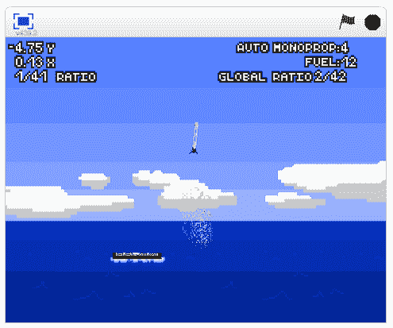
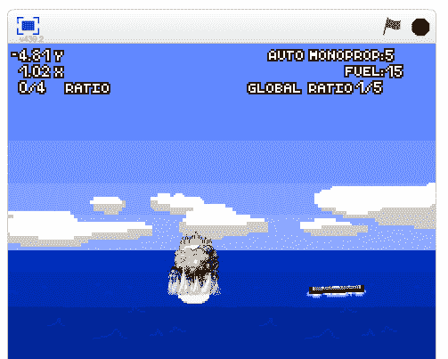

# 尝试自己让 SpaceX 猎鹰 9 号火箭着陆 

> 原文：<https://web.archive.org/web/https://techcrunch.com/2015/09/17/this-spacex-falcon-9-rocket-isnt-going-to-land-itself/>

# 尝试自己着陆 SpaceX 猎鹰 9 号火箭

埃隆·马斯克的 SpaceX 公司正试图发射一艘宇宙飞船，并让火箭安全返回地球。事实证明，这并不容易。而且要花很多钱。现在有一款[网页游戏](https://web.archive.org/web/20221206202615/https://scratch.mit.edu/projects/76866912/)可以让你自己尝试一下。

如果你忘了，以下是现实生活中发生的事情:

[https://web.archive.org/web/20221206202615if_/https://www.youtube.com/embed/BhMSzC1crr0?feature=oembed](https://web.archive.org/web/20221206202615if_/https://www.youtube.com/embed/BhMSzC1crr0?feature=oembed)

视频

觉得很容易吗？[试玩游戏](https://web.archive.org/web/20221206202615/https://scratch.mit.edu/projects/76866912/)。它被恰当地称为“ [SpaceX 猎鹰 9 号着陆器](https://web.archive.org/web/20221206202615/https://scratch.mit.edu/projects/76866912/)”**剧透预警:**这他妈的不可能。

不仅仅是有点不可能。很多不可能。下面是说明，他们立刻就把我弄糊涂了:

> 游戏的目标是减速并降落在平台上。
> 按空格键改变等级。
> ———————————————
> 你的推进器使用单组元推进剂，主发动机使用发动机燃料。让其中任何一个耗尽都有明显的影响。
> ——————————————————————————————
> 按 H 切换速度矢量。

告诉我们你是否能让该死的火箭着陆。