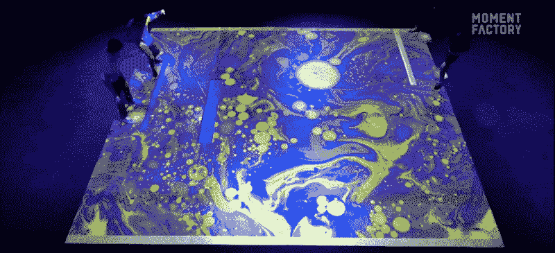

# 这个团队将整个房间变成了一个大型的四人 Pong TechCrunch 游戏

> 原文：<https://web.archive.org/web/https://techcrunch.com/2018/02/13/this-team-turned-an-entire-room-into-a-massive-four-player-game-of-pong/>

# 这个团队把整个房间变成了一个大型的四人乒乓球游戏

已经过去 45 年了(！)自从 Pong 出道以来。在这一点上，你不难找到一个从小玩到大的人。

但他们大概没这么玩过。

加拿大多媒体工作室 [Moment Factory](https://web.archive.org/web/20221210042551/https://momentfactory.com/lab/grid-public-game) 将 Pong 变成了一个巨大的、充满空间的体验，有点难度:每个球拍由两个人一起控制。

游戏开始时就像你所知道的 Pong 一样，一个球在 40×60 的游戏空间中来回呼啸而过。然而，当你来回截击它时，挑战随之而来:球加速，分成两半，球变大/变小，等等。

视觉效果从上方投射到地板上，激光雷达传感器(你会看到那个绑在自动驾驶汽车上的大旋转罐)检测玩家在空间中的位置。

那么，在哪里可以自己玩呢？不幸的是，可能…目前还没有。虽然 Moment Factory 在蒙特利尔的视频制图会议上公开展示了它，但[听起来像是](https://web.archive.org/web/20221210042551/https://momentfactory.com/lab/grid-public-game)游戏现在要回到他们的实验室了。与此同时，他们暗示其他街机风格的实验正在进行中。

[via [Engadget](https://web.archive.org/web/20221210042551/https://www.engadget.com/2018/02/12/giant-pong-using-self-driving-tech/)