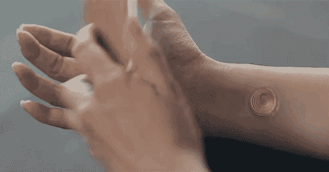

# 摩托罗拉，VivaLnk 做了一个临时纹身，可以不用密码就能解锁智能手机

> 原文：<https://web.archive.org/web/https://techcrunch.com/2014/07/22/this-temporary-tattoo-can-unlock-your-phone/>

# 这个临时纹身可以解锁你的手机

如果不是在七月中旬，我会认为这只是一个聪明的愚人节玩笑。

[摩托罗拉](https://web.archive.org/web/20221206081938/http://www.crunchbase.com/organization/motorola-solutions "Motorola")与一家名为 [VivaLnk](https://web.archive.org/web/20221206081938/http://www.crunchbase.com/organization/vivalnk "VivaLnk") 的公司合作，制作一种可以解锁智能手机的临时纹身，不需要 PIN 码。把它放在你的皮肤上，拿起你的手机，然后砰——手机解锁了。

当你可以像一个时空旅行的空间向导一样解锁手机时，谁还需要手势密码或人脸识别？

【YouTube https://www.youtube.com/watch?v=15uIFmysZV4&w=630&h=354]

那么它是如何工作的呢？这是一个超薄的 NFC 电路，包裹在医用级 3M 粘合剂中，不会(或者至少*不应该*)吓到你的皮肤。

一包 10 英镑的纹身会花掉你 10 美元。摩托罗拉说，这些东西应该经得起游泳和其他锻炼，应该持续五天——所以 10 包最理想的是持续一个半月以上。

在你去订购一包之前，有一个问题:这些纹身*目前只有*适用于摩托罗拉 X(因为没有什么比严重限制潜在客户群更有助于测试古怪的利基产品概念)。如果你有任何其他安卓手机，你就像个傻瓜一样手动解锁手机。

(唉，虽然上面的视频表明他们在这里投入了一些相当认真的设计努力，但纹身最终看起来有点像你想找人检查的痣。)