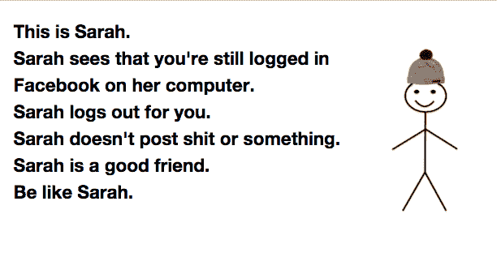
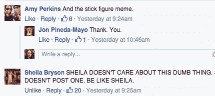

# 为什么简笔画迷因如此迅速地流行起来，为什么我们如此讨厌它

> 原文：<https://web.archive.org/web/https://techcrunch.com/2016/01/25/thisisinternetbelikeinternet/>

# 为什么简笔画迷因流行如此之快，为什么我们如此讨厌它

“[像我一样](https://web.archive.org/web/20230317171430/http://en.blobla.com/bla/be-like-me-be-like-bill?sall=QmUgbGlrZSBEcmV3ISBDbGljayB0byBzZWUgeW91ciBvd24gc3RvcnkuIyMjQ2xpY2sgdG8gc2VlIHlvdXIgb3duIHN0b3J5LiMjI2h0dHA6Ly9nYW1lZmlsZS5ibGNkbi5uZXQvYmVsaWtlbWVlbi9pbWd1cmw%21bmFtZT1EcmV3JmluZGV4PTI2JmdlbmRlcj1tYWxl)”迷因(关于[此处插入姓名]在你的脸书 feed 上爆红的简笔画)是颂扬我们伟大的最新热门病毒——它让你的朋友们烦透了。

据 [BBC](https://web.archive.org/web/20230317171430/http://www.bbc.com/news/blogs-trending-35344300) 报道，这种迷因始于去年年底一个叫比尔的家伙。“像比尔一样”的迷因最近获得了一个专门的脸书页面，并迅速增长到超过 150 万个赞。甚至还有为女士们准备的西班牙语版本的“T4”和“像艾米丽一样”。

但是这个迷因在周末开始在我的脸书 feed(可能也是你的)上爆发，当时一个新创建的[热图生成器](https://web.archive.org/web/20230317171430/http://en.blobla.com/bla/be-like-me-be-like-bill)允许插入你自己的名字而不是比尔的。

这种关注惹恼了很多人，他们突然发现自己的脸书订阅被消极攻击的信息覆盖。这也引发了一种反文化基因"[不要像比尔或艾米丽](https://web.archive.org/web/20230317171430/https://www.facebook.com/OfficialDBLB1/?fref=nf)"

根据“像比尔一样”这一模因的发起人、现居意大利的摩尔多瓦程序员尤金纽·克罗伊托鲁的说法，比尔“只是一个虚构的人物，他用一种有趣而又不失理智的方式传达信息。”他的模因同谋者 Debabrata Nath 也强调说，比尔是为了让我们发笑而存在的，并且“与任何现实生活中的人都没有相似之处。”

在克罗伊托鲁的游戏页面 [Videogamemes](https://web.archive.org/web/20230317171430/https://www.facebook.com/VideogamemesNet/) 上发布了一个类似的简笔画迷因后，他萌生了这个想法。“像比尔一样”的版本被放大了，所以他和纳特在那里做了一个单独的页面。

这两个版本似乎都很受欢迎，但一些媒体称，仅在 48 小时前创建的“像我一样”迷因是覆盖我的订阅源的迷因——它只会突出我们在社交媒体上美化自己的热情。

它的流行是基于我们需要与世界分享我们做对了什么和做错了什么吗？很难说是什么让这个流行起来，或者是什么让任何一个模因像病毒一样传播开来。但可以说的是，这个迷因很可能会像所有其他迷因一样，在下周末结束。那些憎恨者将不得不找一个新的迷因来抱怨。