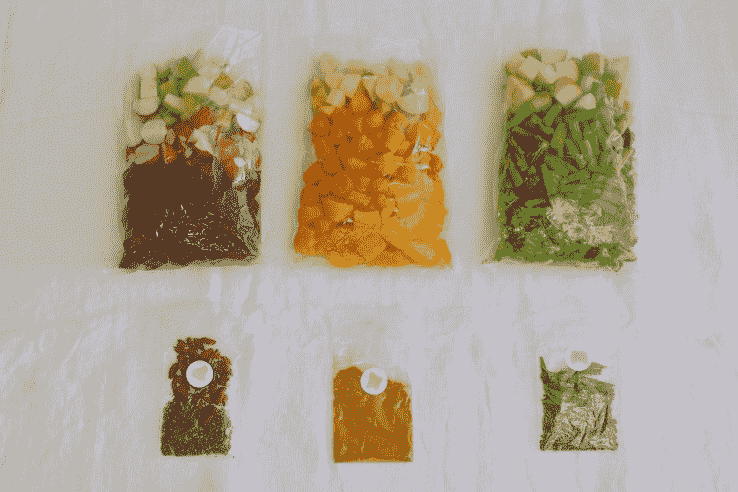

# 蓟推出餐包，在家制作营养婴儿食品 

> 原文：<https://web.archive.org/web/https://techcrunch.com/2017/02/23/thistle-launches-meal-kits-to-make-nutritious-baby-food-at-home/>

送餐创业公司 Thistle 从未涉足制作餐盒的业务，这些餐盒是预先测量好的配料和食谱，可以帮助顾客在家烹饪。这家初创公司的已婚联合创始人阿什温·切里扬和什里·阿夫内里认为，现成的饭菜，即热即食的或者生的即食的，更适合他们忙碌的顾客。他们说，当他们亲自尝试时，餐包感觉像是耗时且令人沮丧的烹饪课。

但这家初创公司破例推出了蓟婴儿餐包，面向那些想在家为婴儿和幼儿制作营养食品的忙碌父母。Avnery 说:“当我成为一个母亲时，我会在杂货店买东西，觉得它们总是不符合我的质量标准。甚至很多更健康的选择都是过度加工，做成泥状，像水一样粘稠。它们尝起来也不像真正的水果或蔬菜。你会想知道它在货架上放了多久，在什么样的条件下。”

*蓟宝贝将有机配料的配方和小袋寄给父母，让他们在家制作婴儿食品。*

蓟婴儿旨在为父母提供自制、有机和无麸质婴儿食品的健康和口味优势，以及为孩子做饭带来的自豪感。Cheriyan 说:“我们认为这可以减少 80%在家做饭的麻烦。而且因为你自己蒸，自己做泥，自己加香料，所以你开始真正了解宝宝的喜好，同时尽早灌输健康的饮食习惯。”蓟专长于植物性成分。它的服务一直是纯素食和素食友好的，尽管他们也提供杂食餐。

蓟婴儿餐包由真空密封袋分配，有机成分，速冻保存风味。父母会打开小袋，按照他们喜欢的方式蒸和捣成泥，然后按照他们或他们的孩子最喜欢的程度添加调料，调料也在膳食包中提供。该公司表示，其价格为每份幼儿或婴儿餐 2 美元。在此之前，这家初创公司正在与一群只接受邀请的订户测试其蓟宝贝服务。从下周开始，任何注册的客户都可以使用蓟宝贝。

*蓟的联合创始人阿什温·切里扬和什里·阿夫内里带着他们的孩子。*

这家初创公司认为其主要竞争对手是杂货店出售的盒装、袋装和罐装婴儿食品。然而，其他一些电子商务食品公司也提供适合儿童的饭菜或套餐。比如达拉斯的 [Lily & Bella](https://web.archive.org/web/20221206062357/https://www.facebook.com/lillyandbella/) 送有机食材和菜谱在家做婴儿食品；总部位于洛杉矶的 [Caer](https://web.archive.org/web/20221206062357/http://www.caer.com/) 提供低糖有机预制婴儿食品；芝加哥的 [NurtureLife](https://web.archive.org/web/20221206062357/https://nurturelife.com/) 提供根据孩子的发育阶段和食物偏好定制的即食餐。

根据最近的尼尔森调查，全球 14%的消费者已经在网上和通过手机购买杂货和家庭用品。整整 30%的客户表示愿意这样做。巨大的婴儿食品和配方奶粉市场有多少份额可能会转向像蓟的电子商务模式，还有待观察。尼尔森估计，该市场目前的年销售额超过 300 亿美元。