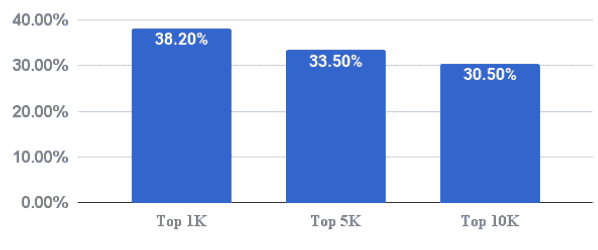

# 成千上万的主要网站正在采取无声的反广告屏蔽措施 

> 原文：<https://web.archive.org/web/https://techcrunch.com/2017/12/27/thousands-of-major-sites-are-taking-silent-anti-ad-blocking-measures/>

众所周知，广告拦截软件正在削弱基于广告的网络商业模式。这引发了一系列反应，从相对礼貌的白名单提问(TechCrunch 就是这么做的)，到动态重新部署广告以避免屏蔽。一项新的研究发现，在网络上排名前 10，000 的网站中，有近三分之一采取了广告拦截措施，许多是无声的，非常复杂的。

看到反广告拦截技术的上升，爱荷华大学和加州大学河滨分校的研究人员[决定对主要网站进行比以前更仔细的审查(PDF)](https://web.archive.org/web/20221222193400/http://homepage.divms.uiowa.edu/~mshafiq/files/adblock-ndss2018.pdf) 。早期的估计主要基于可见或明显的反广告拦截手段，如弹出窗口或破碎内容，表明大约 1%到 5%的流行网站在这样做——但实际数字似乎要高一个数量级。

研究人员多次访问了数千个网站，在浏览器中添加和不添加广告拦截软件。通过比较阻止浏览器和非阻止浏览器的页面的最终呈现代码，他们可以看到页面何时改变了内容或注意到了阻止程序的存在，即使他们没有通知用户。

 正如你在上面看到的，Alexa 测量的前 10，000 个网站中有 30.5%在使用某种广告拦截器检测，前 1，000 个中有 38.2%。(同样，TechCrunch 也在其中，但据我所知，我们只是要求访问者加入白名单。)

> 我们的结果显示，反广告拦截器比之前报道的更加普遍…我们的假设是，比之前报道的更多的网站“担心”广告拦截器，但许多网站尚未对广告拦截用户采取报复行动。

事实证明，许多广告提供商正在以脚本的形式提供反屏蔽技术，这些脚本产生各种类似广告的“诱饵”内容——例如，图像或元素的命名和标记方式会触发广告拦截器，从而向网站通风报信。阻止的模式，例如不加载任何标记为“banner_ad”的 div，而是加载描述中带有“banner”的图像，进一步阐明了浏览器所实施的广告阻止的类型和深度。

网站可以出于自己的目的(也许是为了衡量回应的必要性)简单地记录下来，或者以被检测到的广告拦截器不会捕捉到的方式重新部署广告。

除了检测广告商正在采取的这些新的和越来越常见的措施，研究人员还提出了一些方法，使当前的广告拦截器能够继续发挥预期的作用。

一种方法是动态重写检查拦截器的 JavaScript 代码，迫使它认为没有拦截器。然而，这可能会破坏一些网站，这些网站看起来好像没有拦截器，但实际上却有。

第二种方法识别“诱饵”内容，但未能阻止它，使网站认为浏览器中没有阻止程序，因此正常呈现广告——除非真正的广告*将被*阻止。

这当然会引起广告商新的甚至更复杂的措施，等等。正如该文件得出的结论:

> 为了长期保持对出版商和广告商的压力，我们认为在迅速升级的技术军备竞赛中，广告拦截器与反广告拦截器保持同步至关重要。我们的工作是朝着这个方向迈出的重要一步。

该研究已提交 2018 年 2 月的网络和分布式系统安全研讨会审议。